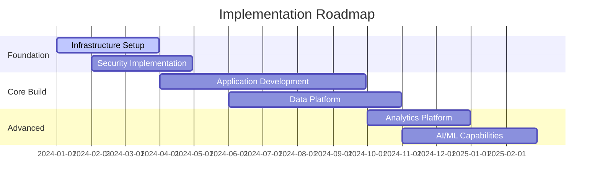
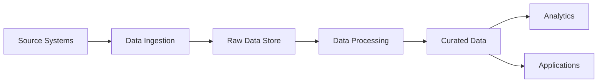

# Implementation Roadmap Template

## Executive Summary
- **Roadmap Date**: [Date]
- **Program Owner**: [Name/Role]
- **Scope**: [Implementation scope]
- **Duration**: [Total timeline]
- **Total Investment**: $[Amount]
- **Expected ROI**: [ROI and timeline]

## Strategic Context

### Business Objectives
1. **Primary Objective**: [Objective]
   - **Success Criteria**: [Measurable outcomes]
   - **Business Value**: $[Value] by [Date]

2. **Secondary Objectives**:
   - [Objective 1]: [Success criteria]
   - [Objective 2]: [Success criteria]

### Implementation Principles
1. **Risk Mitigation**: [Low-risk, incremental approach]
2. **Value Realization**: [Early and continuous value delivery]
3. **Business Continuity**: [Minimal disruption to operations]
4. **Agile Delivery**: [Iterative and adaptive approach]

## Implementation Phases Overview

### Phase Summary
| Phase | Duration | Objectives | Investment | Key Outcomes |
|-------|----------|------------|------------|--------------|
| Foundation | [Months] | [Objectives] | $[Amount] | [Outcomes] |
| Core Build | [Months] | [Objectives] | $[Amount] | [Outcomes] |
| Advanced Features | [Months] | [Objectives] | $[Amount] | [Outcomes] |
| Optimization | [Months] | [Objectives] | $[Amount] | [Outcomes] |

### Implementation Timeline

## Phase 1: Foundation (Months 1-6)

### Phase Objectives
- [ ] Establish technical foundation
- [ ] Implement core security controls
- [ ] Set up development and deployment pipelines
- [ ] Build team capabilities

### Key Initiatives

#### Initiative 1: Cloud Foundation
- **Owner**: [Team/Role]
- **Duration**: [Months 1-3]
- **Budget**: $[Amount]

##### Deliverables
| Deliverable | Completion Date | Success Criteria | Owner |
|-------------|----------------|------------------|-------|
| Cloud Landing Zone | [Date] | [Criteria] | [Team] |
| Network Architecture | [Date] | [Criteria] | [Team] |
| Identity & Access Management | [Date] | [Criteria] | [Team] |

##### Tasks and Timeline
- **Month 1**:
  - [ ] Cloud account setup and governance
  - [ ] Network design and implementation
  - [ ] Security baseline configuration
- **Month 2**:
  - [ ] Identity provider integration
  - [ ] Multi-factor authentication rollout
  - [ ] Access control policies
- **Month 3**:
  - [ ] Monitoring and logging setup
  - [ ] Backup and disaster recovery
  - [ ] Security testing and validation

#### Initiative 2: Development Platform
- **Owner**: [Team/Role]
- **Duration**: [Months 2-4]
- **Budget**: $[Amount]

##### Key Components
- **CI/CD Pipeline**: [Technology and configuration]
- **Development Environment**: [Setup and tools]
- **Testing Framework**: [Automated testing strategy]
- **Code Quality Gates**: [Quality standards and enforcement]

##### Implementation Steps
1. **Week 1-2**: CI/CD platform setup
2. **Week 3-4**: Development environment configuration
3. **Week 5-8**: Testing framework implementation
4. **Week 9-12**: Integration and validation

#### Initiative 3: Data Foundation
- **Owner**: [Team/Role]
- **Duration**: [Months 3-6]
- **Budget**: $[Amount]

### Phase 1 Success Criteria
- [ ] Cloud infrastructure operational
- [ ] Security controls validated
- [ ] Development pipeline functional
- [ ] Team trained and productive

### Phase 1 Risks and Mitigations
| Risk | Impact | Probability | Mitigation | Owner |
|------|--------|-------------|------------|-------|
| [Cloud setup delays] | [High] | [Medium] | [Mitigation strategy] | [Owner] |

## Phase 2: Core Build (Months 7-12)

### Phase Objectives
- [ ] Develop core business applications
- [ ] Implement data integration
- [ ] Deploy initial user-facing features
- [ ] Establish operational processes

### Key Initiatives

#### Initiative 1: Application Development
- **Owner**: [Team/Role]
- **Duration**: [Months 7-10]
- **Budget**: $[Amount]

##### Application Portfolio
| Application | Technology | Timeline | Dependencies | Team Size |
|-------------|------------|----------|--------------|-----------|
| [User Portal] | [Tech Stack] | [Timeline] | [Dependencies] | [Size] |
| [API Services] | [Tech Stack] | [Timeline] | [Dependencies] | [Size] |
| [Admin Console] | [Tech Stack] | [Timeline] | [Dependencies] | [Size] |

##### Development Approach
- **Methodology**: [Agile/Scrum/SAFe]
- **Sprint Duration**: [Duration]
- **Release Strategy**: [Continuous/Scheduled]
- **Quality Assurance**: [Testing approach]

#### Initiative 2: Data Platform Implementation
- **Owner**: [Team/Role]
- **Duration**: [Months 8-11]
- **Budget**: $[Amount]

##### Data Pipeline Architecture

##### Implementation Milestones
| Milestone | Date | Deliverables | Acceptance Criteria |
|-----------|------|--------------|-------------------|
| [Data Ingestion] | [Date] | [Components] | [Criteria] |
| [Data Processing] | [Date] | [Components] | [Criteria] |
| [Analytics Ready] | [Date] | [Components] | [Criteria] |

### Integration and Testing Strategy
#### Integration Points
- **System Integrations**: [List of integrations]
- **Data Integrations**: [Data flow mapping]
- **Third-party Integrations**: [External services]

#### Testing Approach
- **Unit Testing**: [Coverage and automation]
- **Integration Testing**: [Strategy and tools]
- **Performance Testing**: [Load and stress testing]
- **User Acceptance Testing**: [Business validation]

### Phase 2 Success Criteria
- [ ] Core applications deployed
- [ ] Data platform operational
- [ ] User acceptance achieved
- [ ] Performance targets met

## Phase 3: Advanced Features (Months 13-18)

### Phase Objectives
- [ ] Deploy advanced analytics capabilities
- [ ] Implement AI/ML features
- [ ] Enhance user experience
- [ ] Optimize performance

### Key Initiatives

#### Initiative 1: Analytics Platform
- **Owner**: [Team/Role]
- **Duration**: [Months 13-16]
- **Budget**: $[Amount]

##### Analytics Capabilities
| Capability | Technology | Use Case | Timeline |
|------------|------------|----------|----------|
| [Real-time Analytics] | [Technology] | [Use case] | [Timeline] |
| [Predictive Analytics] | [Technology] | [Use case] | [Timeline] |
| [Self-service BI] | [Technology] | [Use case] | [Timeline] |

#### Initiative 2: AI/ML Platform
- **Owner**: [Team/Role]
- **Duration**: [Months 14-18]
- **Budget**: $[Amount]

##### ML Use Cases
1. **Use Case 1**: [Description]
   - **Data Requirements**: [Data needed]
   - **Model Type**: [ML approach]
   - **Expected Outcome**: [Business value]

2. **Use Case 2**: [Description]
   - **Data Requirements**: [Data needed]
   - **Model Type**: [ML approach]
   - **Expected Outcome**: [Business value]

### Phase 3 Success Criteria
- [ ] Analytics platform deployed
- [ ] ML models in production
- [ ] User adoption targets met
- [ ] ROI objectives achieved

## Phase 4: Optimization (Months 19-24)

### Phase Objectives
- [ ] Optimize system performance
- [ ] Reduce operational costs
- [ ] Enhance security posture
- [ ] Implement continuous improvement

### Optimization Areas
#### Performance Optimization
- **Application Performance**: [Optimization strategies]
- **Database Performance**: [Tuning and scaling]
- **Infrastructure Optimization**: [Resource optimization]

#### Cost Optimization
- **Cloud Cost Management**: [Cost reduction strategies]
- **License Optimization**: [Software licensing review]
- **Operational Efficiency**: [Process automation]

#### Security Enhancement
- **Advanced Threat Protection**: [Enhanced security measures]
- **Compliance Automation**: [Compliance improvements]
- **Security Monitoring**: [Enhanced monitoring]

## Resource Planning

### Team Structure
#### Core Team
| Role | FTE | Skills Required | Internal/External |
|------|-----|----------------|-------------------|
| [Program Manager] | [1.0] | [Skills] | [Internal] |
| [Solution Architect] | [1.0] | [Skills] | [External] |
| [Development Lead] | [1.0] | [Skills] | [Internal] |
| [DevOps Engineer] | [2.0] | [Skills] | [Mixed] |

#### Extended Team (By Phase)
| Phase | Role | FTE | Duration | Cost |
|-------|------|-----|----------|------|
| [Foundation] | [Cloud Architect] | [1.0] | [6 months] | $[Cost] |
| [Core Build] | [Developers] | [4.0] | [6 months] | $[Cost] |

### Budget Breakdown
#### Investment by Phase
| Phase | Personnel | Technology | Services | Total |
|-------|-----------|------------|----------|-------|
| Foundation | $[Amount] | $[Amount] | $[Amount] | $[Amount] |
| Core Build | $[Amount] | $[Amount] | $[Amount] | $[Amount] |
| Advanced | $[Amount] | $[Amount] | $[Amount] | $[Amount] |
| Optimization | $[Amount] | $[Amount] | $[Amount] | $[Amount] |
| **Total** | **$[Amount]** | **$[Amount]** | **$[Amount]** | **$[Amount]** |

#### Technology Investments
| Category | Technology | Cost | Timeline | Justification |
|----------|------------|------|----------|---------------|
| [Cloud Platform] | [Platform] | $[Cost] | [Timeline] | [Justification] |
| [Development Tools] | [Tools] | $[Cost] | [Timeline] | [Justification] |

## Risk Management

### Program Risks
| Risk | Category | Impact | Probability | Mitigation Strategy | Owner |
|------|----------|--------|-------------|-------------------|-------|
| [Resource availability] | [Resource] | [High] | [Medium] | [Strategy] | [Owner] |
| [Technology complexity] | [Technical] | [Medium] | [High] | [Strategy] | [Owner] |

### Risk Mitigation Plans
#### High-Priority Risks
1. **Risk**: [Description]
   - **Impact**: [Business impact]
   - **Mitigation**: [Detailed mitigation plan]
   - **Contingency**: [Backup plan]
   - **Monitoring**: [Risk indicators]

### Dependency Management
#### Critical Dependencies
| Dependency | Type | Impact | Mitigation | Owner |
|------------|------|--------|------------|-------|
| [External vendor] | [External] | [High] | [Alternative plans] | [Owner] |

## Change Management

### Organizational Impact
#### Affected Stakeholders
| Stakeholder Group | Impact Level | Change Required | Support Needed |
|-------------------|--------------|-----------------|----------------|
| [End Users] | [High] | [New processes] | [Training] |
| [IT Operations] | [High] | [New tools] | [Upskilling] |

### Change Management Plan
#### Training Strategy
- **Training Needs Assessment**: [Process and timeline]
- **Training Development**: [Content and delivery methods]
- **Training Delivery**: [Schedule and approach]
- **Support and Reinforcement**: [Ongoing support plan]

#### Communication Plan
| Stakeholder | Frequency | Method | Message | Owner |
|-------------|-----------|--------|---------|-------|
| [Executive] | [Monthly] | [Dashboard] | [Progress update] | [PM] |
| [End Users] | [Bi-weekly] | [Newsletter] | [Change updates] | [Change Mgr] |

## Governance and Oversight

### Governance Structure
#### Steering Committee
- **Chair**: [Executive Sponsor]
- **Members**: [Key stakeholders]
- **Meeting Frequency**: [Monthly/Quarterly]
- **Decision Authority**: [Scope of authority]

#### Program Management Office
- **Program Manager**: [Name/Role]
- **Responsibilities**: [Key responsibilities]
- **Reporting**: [Reporting structure and frequency]

### Quality Gates
#### Phase Gate Reviews
| Gate | Criteria | Reviewers | Decision Points |
|------|----------|-----------|-----------------|
| [Foundation Complete] | [Criteria] | [Reviewers] | [Go/No-go criteria] |
| [Core Build Complete] | [Criteria] | [Reviewers] | [Go/No-go criteria] |

### Success Measurement

#### Program KPIs
| KPI | Baseline | Target | Measurement | Frequency |
|-----|----------|--------|-------------|-----------|
| [Project Timeline] | [Baseline] | [On-time] | [Project tracking] | [Weekly] |
| [Budget Performance] | [Budget] | [Within 5%] | [Financial tracking] | [Monthly] |
| [Quality Metrics] | [Baseline] | [Target] | [Quality measures] | [Per release] |

#### Business Value Metrics
| Metric | Baseline | Target | Timeline | Measurement Method |
|--------|----------|--------|----------|-------------------|
| [Cost Reduction] | [Current cost] | [Target savings] | [By end Year 1] | [Financial analysis] |
| [Efficiency Gain] | [Current process time] | [Target time] | [6 months post-deployment] | [Process measurement] |

## Post-Implementation

### Transition to Operations
#### Knowledge Transfer
- **Documentation**: [Complete system documentation]
- **Training**: [Operations team training]
- **Support**: [Support model and procedures]

#### Operational Readiness
- [ ] Operations procedures documented
- [ ] Support team trained
- [ ] Monitoring and alerting configured
- [ ] Incident response procedures established

### Continuous Improvement
#### Optimization Opportunities
- **Performance Monitoring**: [Ongoing optimization]
- **Cost Management**: [Regular cost reviews]
- **Feature Enhancement**: [User feedback integration]

#### Future Roadmap
- **Next Phase Planning**: [Future enhancements]
- **Technology Evolution**: [Technology refresh planning]
- **Business Growth**: [Scaling for growth]

## Appendices

### Detailed Project Plans
- [ ] Phase 1 detailed work breakdown
- [ ] Phase 2 detailed work breakdown
- [ ] Phase 3 detailed work breakdown
- [ ] Phase 4 detailed work breakdown

### Technical Specifications
- [ ] Architecture specifications
- [ ] Infrastructure requirements
- [ ] Integration specifications
- [ ] Security requirements

### Templates and Tools
- [ ] Project management templates
- [ ] Testing templates
- [ ] Documentation templates
- [ ] Change management tools

---
**Roadmap Created By**: [Name]  
**Date**: [Date]  
**Approved By**: [Executive Sponsor]  
**Next Review**: [Date]