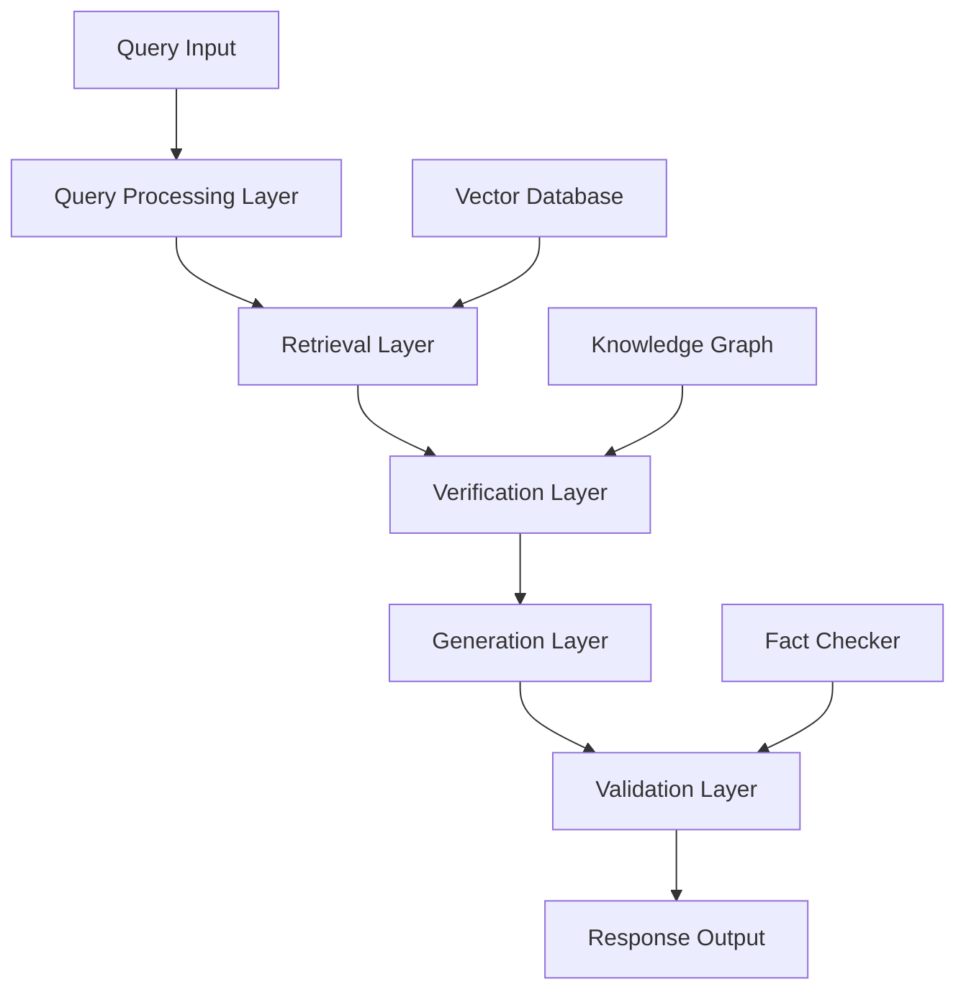
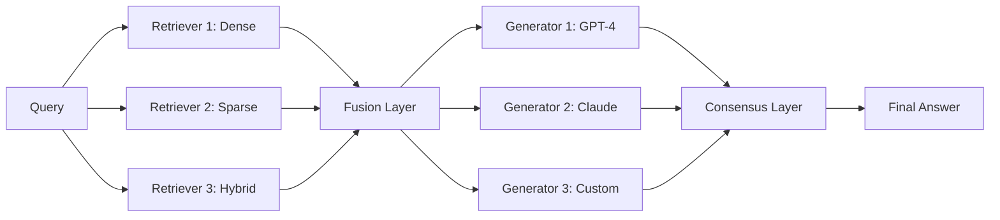
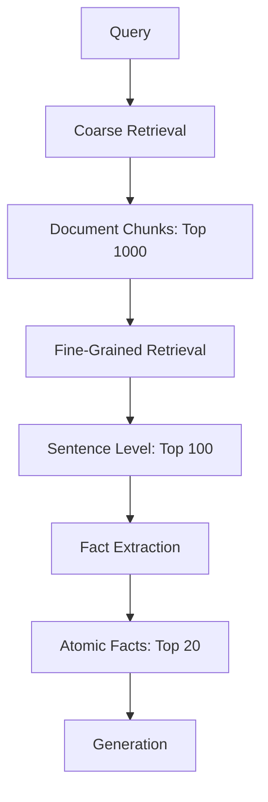
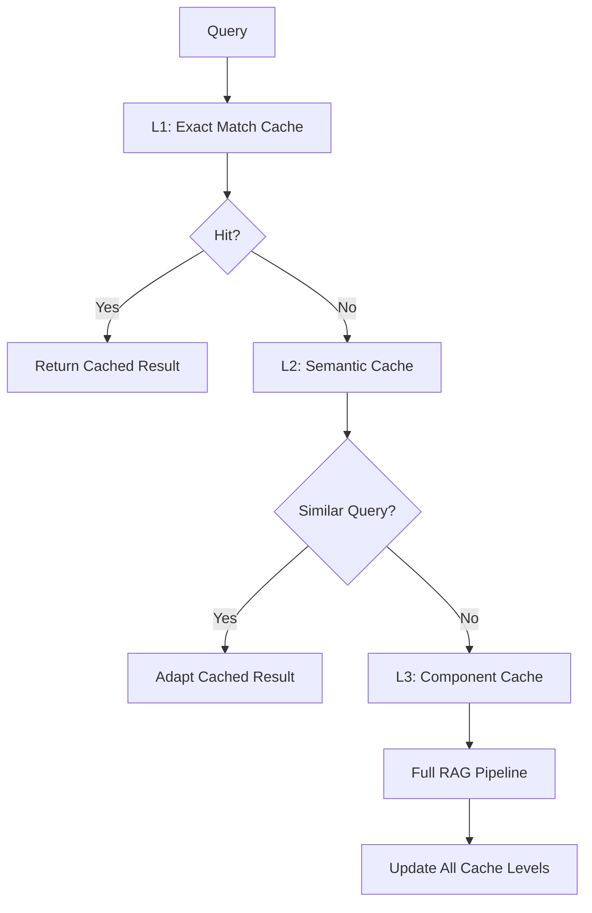

# RAG Implementation Architecture Analysis
*High-Accuracy Retrieval-Augmented Generation Systems*

## Executive Summary

This analysis examines architectural approaches for implementing RAG (Retrieval-Augmented Generation) systems that guarantee correctness and high accuracy. The focus is on technical implementation patterns, verification mechanisms, and design strategies that ensure reliable, fact-based responses.

## 1. Core Architecture Patterns

### 1.1 Layered Architecture for Accuracy



**Key Components:**
- **Query Processing**: Intent classification, query expansion, disambiguation
- **Retrieval Layer**: Multi-stage retrieval with ranking algorithms
- **Verification Layer**: Fact-checking and source validation
- **Generation Layer**: Context-aware response generation
- **Validation Layer**: Response accuracy verification

### 1.2 Ensemble Architecture Pattern



**Benefits:**
- Reduced hallucination through multiple validation paths
- Higher recall through diverse retrieval strategies
- Improved robustness against individual component failures

### 1.3 Feedback Loop Architecture

```python
class FeedbackRAGSystem:
    def __init__(self):
        self.retriever = MultiStageRetriever()
        self.generator = VerifyingGenerator()
        self.validator = FactValidator()
        self.memory = EpisodicMemory()
    
    def generate_with_feedback(self, query):
        # Initial generation
        retrieved_docs = self.retriever.retrieve(query)
        initial_answer = self.generator.generate(query, retrieved_docs)
        
        # Validation and feedback loop
        validation_result = self.validator.validate(initial_answer, retrieved_docs)
        
        if not validation_result.is_valid:
            # Re-retrieve with refined query
            refined_query = self.refine_query(query, validation_result.issues)
            refined_docs = self.retriever.retrieve(refined_query)
            final_answer = self.generator.generate(refined_query, refined_docs)
        else:
            final_answer = initial_answer
        
        # Store successful patterns
        self.memory.store_successful_pattern(query, final_answer, validation_result)
        
        return final_answer
```

## 2. Vector Database Configurations for Accuracy

### 2.1 Multi-Index Strategy

**Configuration Pattern:**
```yaml
vector_database:
  primary_index:
    type: "dense_embeddings"
    model: "text-embedding-ada-002"
    dimensions: 1536
    similarity_metric: "cosine"
    
  secondary_index:
    type: "sparse_embeddings"
    model: "bm25"
    boosting_factor: 1.2
    
  semantic_index:
    type: "sentence_transformers"
    model: "all-mpnet-base-v2"
    dimensions: 768
    
  metadata_index:
    type: "faceted"
    fields: ["source", "date", "confidence", "domain"]
```

### 2.2 Hierarchical Retrieval Architecture



**Implementation Benefits:**
- Reduces noise in generation context
- Enables fact-level verification
- Improves retrieval precision

### 2.3 Confidence-Weighted Retrieval

```python
class ConfidenceWeightedRetriever:
    def retrieve_with_confidence(self, query, k=10):
        # Multi-stage retrieval with confidence scoring
        candidates = self.semantic_search(query, k=k*3)
        
        scored_candidates = []
        for candidate in candidates:
            confidence_score = self.calculate_confidence(candidate, query)
            scored_candidates.append({
                'document': candidate,
                'confidence': confidence_score,
                'retrieval_score': candidate.score
            })
        
        # Combine retrieval score with confidence
        final_scores = [
            (doc['retrieval_score'] * doc['confidence'], doc)
            for doc in scored_candidates
        ]
        
        return [doc for _, doc in sorted(final_scores, reverse=True)[:k]]
    
    def calculate_confidence(self, document, query):
        # Factors affecting confidence
        source_authority = self.get_source_authority(document.source)
        recency_factor = self.calculate_recency(document.date)
        fact_density = self.calculate_fact_density(document.content)
        
        return (source_authority * 0.4 + 
                recency_factor * 0.3 + 
                fact_density * 0.3)
```

## 3. Advanced Retrieval Algorithms

### 3.1 Multi-Stage Retrieval Pipeline

**Stage 1: Broad Retrieval**
- Use dense embeddings for semantic similarity
- Retrieve top 1000 candidates
- Apply basic filtering (date, domain, language)

**Stage 2: Refined Retrieval**
- Apply sparse retrieval (BM25) on candidates
- Cross-encoder re-ranking
- Reduce to top 100 candidates

**Stage 3: Precision Retrieval**
- Fact-level extraction and scoring
- Dependency analysis between facts
- Final top-k selection with diversity

```python
class MultiStageRetriever:
    def __init__(self):
        self.dense_retriever = DenseRetriever()
        self.sparse_retriever = SparseRetriever()
        self.cross_encoder = CrossEncoder()
        self.fact_extractor = FactExtractor()
    
    def retrieve(self, query, k=10):
        # Stage 1: Broad semantic retrieval
        broad_candidates = self.dense_retriever.search(query, k=1000)
        
        # Stage 2: Sparse refinement
        refined_candidates = self.sparse_retriever.rerank(
            query, broad_candidates, k=100
        )
        
        # Stage 3: Cross-encoder precision
        precise_candidates = self.cross_encoder.rerank(
            query, refined_candidates, k=50
        )
        
        # Stage 4: Fact-level extraction
        fact_candidates = []
        for doc in precise_candidates:
            facts = self.fact_extractor.extract_facts(doc, query)
            for fact in facts:
                fact_candidates.append({
                    'document': doc,
                    'fact': fact,
                    'relevance': self.calculate_fact_relevance(fact, query)
                })
        
        # Stage 5: Final selection with diversity
        return self.select_diverse_facts(fact_candidates, k)
```

### 3.2 Query Understanding and Expansion

```python
class IntelligentQueryProcessor:
    def process_query(self, raw_query):
        processed_query = {
            'original': raw_query,
            'intent': self.classify_intent(raw_query),
            'entities': self.extract_entities(raw_query),
            'expanded_terms': self.expand_query(raw_query),
            'constraints': self.identify_constraints(raw_query),
            'expected_answer_type': self.predict_answer_type(raw_query)
        }
        
        return processed_query
    
    def classify_intent(self, query):
        # Classify query intent for retrieval strategy
        intents = {
            'factual': 0.0,
            'analytical': 0.0,
            'comparative': 0.0,
            'procedural': 0.0,
            'definitional': 0.0
        }
        
        # Use classification model or rule-based approach
        return self.intent_classifier.predict(query)
    
    def expand_query(self, query):
        # Query expansion strategies
        expanded = {
            'synonyms': self.get_synonyms(query),
            'related_concepts': self.get_related_concepts(query),
            'domain_terms': self.get_domain_specific_terms(query),
            'temporal_variants': self.get_temporal_variants(query)
        }
        
        return expanded
```

## 4. Answer Generation with Verification

### 4.1 Constrained Generation Architecture

```python
class VerifyingGenerator:
    def __init__(self):
        self.llm = LanguageModel()
        self.fact_checker = FactChecker()
        self.citation_manager = CitationManager()
    
    def generate_with_verification(self, query, retrieved_docs):
        # Extract verifiable claims from documents
        claims = self.extract_claims(retrieved_docs)
        verified_claims = self.fact_checker.verify_claims(claims)
        
        # Generate answer with constraints
        generation_prompt = self.build_constrained_prompt(
            query, verified_claims, retrieved_docs
        )
        
        answer = self.llm.generate(generation_prompt, constraints={
            'max_length': 500,
            'must_cite': True,
            'factual_only': True,
            'uncertainty_explicit': True
        })
        
        # Post-generation verification
        answer_claims = self.extract_claims([answer])
        verification_result = self.verify_answer_claims(
            answer_claims, verified_claims
        )
        
        if not verification_result.all_verified:
            # Iterative refinement
            return self.refine_answer(answer, verification_result)
        
        return self.add_citations(answer, retrieved_docs)
```

### 4.2 Multi-Model Consensus

```python
class ConsensusGenerator:
    def __init__(self):
        self.models = [
            GPT4Model(),
            ClaudeModel(),
            CustomModel()
        ]
        self.consensus_engine = ConsensusEngine()
    
    def generate_consensus_answer(self, query, retrieved_docs):
        # Generate answers from multiple models
        answers = []
        for model in self.models:
            answer = model.generate(query, retrieved_docs)
            confidence = model.estimate_confidence(answer)
            answers.append({
                'answer': answer,
                'model': model.name,
                'confidence': confidence
            })
        
        # Find consensus or identify disagreements
        consensus_result = self.consensus_engine.find_consensus(answers)
        
        if consensus_result.has_consensus:
            return consensus_result.consensus_answer
        else:
            # Handle disagreement
            return self.resolve_disagreement(answers, query, retrieved_docs)
```

## 5. Caching Strategies for Consistency

### 5.1 Multi-Level Cache Architecture



**Implementation:**
```python
class MultiLevelCache:
    def __init__(self):
        self.exact_cache = ExactMatchCache(ttl=3600)  # 1 hour
        self.semantic_cache = SemanticCache(similarity_threshold=0.95)
        self.component_cache = ComponentCache()
    
    def get_or_compute(self, query, compute_func):
        # L1: Exact match
        exact_result = self.exact_cache.get(query)
        if exact_result:
            return exact_result
        
        # L2: Semantic similarity
        similar_query, cached_result = self.semantic_cache.get_similar(query)
        if similar_query:
            adapted_result = self.adapt_cached_result(
                cached_result, query, similar_query
            )
            self.exact_cache.set(query, adapted_result)
            return adapted_result
        
        # L3: Component-level caching
        retrieval_key = self.generate_retrieval_key(query)
        cached_docs = self.component_cache.get_retrieval(retrieval_key)
        
        if cached_docs:
            # Use cached retrieval, compute generation
            result = compute_func(query, cached_docs, use_cached_retrieval=True)
        else:
            # Full computation
            result = compute_func(query)
        
        # Update all cache levels
        self.update_caches(query, result)
        return result
```

### 5.2 Consistency Management

```python
class ConsistencyManager:
    def __init__(self):
        self.version_tracker = VersionTracker()
        self.invalidation_engine = InvalidationEngine()
        self.consistency_checker = ConsistencyChecker()
    
    def ensure_consistency(self, query, cached_result):
        # Check if underlying data has changed
        data_version = self.version_tracker.get_current_version()
        cache_version = cached_result.version
        
        if data_version > cache_version:
            # Check what specifically changed
            changes = self.version_tracker.get_changes_since(cache_version)
            
            # Determine if changes affect this cached result
            affects_result = self.consistency_checker.check_relevance(
                changes, cached_result
            )
            
            if affects_result:
                # Invalidate and recompute
                self.invalidation_engine.invalidate(query)
                return None
        
        return cached_result
```

## 6. Real-Time Fact-Checking Integration

### 6.1 Continuous Verification Pipeline

```python
class ContinuousFactChecker:
    def __init__(self):
        self.knowledge_base = LiveKnowledgeBase()
        self.fact_validators = [
            DatabaseValidator(),
            WebValidator(),
            ExpertValidator()
        ]
        self.uncertainty_quantifier = UncertaintyQuantifier()
    
    def verify_continuously(self, generated_answer):
        # Extract verifiable claims
        claims = self.extract_verifiable_claims(generated_answer)
        
        verification_results = []
        for claim in claims:
            # Parallel verification across multiple sources
            futures = []
            for validator in self.fact_validators:
                future = validator.verify_async(claim)
                futures.append(future)
            
            # Collect results
            results = [f.result() for f in futures]
            consensus_result = self.aggregate_verification_results(results)
            
            # Quantify uncertainty
            uncertainty = self.uncertainty_quantifier.quantify(
                claim, consensus_result
            )
            
            verification_results.append({
                'claim': claim,
                'verified': consensus_result.is_verified,
                'confidence': consensus_result.confidence,
                'uncertainty': uncertainty,
                'sources': consensus_result.sources
            })
        
        return VerificationReport(verification_results)
```

### 6.2 Real-Time Knowledge Updates

```python
class LiveKnowledgeIntegrator:
    def __init__(self):
        self.change_detector = ChangeDetector()
        self.update_processor = UpdateProcessor()
        self.impact_analyzer = ImpactAnalyzer()
    
    def integrate_live_updates(self):
        # Monitor multiple knowledge sources
        changes = self.change_detector.detect_changes([
            'wikipedia_updates',
            'news_feeds',
            'academic_papers',
            'government_data'
        ])
        
        for change in changes:
            # Process and validate the change
            processed_update = self.update_processor.process(change)
            
            # Analyze impact on existing knowledge
            impact = self.impact_analyzer.analyze_impact(processed_update)
            
            # Update knowledge base and invalidate affected caches
            self.knowledge_base.update(processed_update)
            self.invalidate_affected_caches(impact.affected_queries)
            
            # Notify dependent systems
            self.notify_systems(impact)
```

## 7. Performance Optimization Patterns

### 7.1 Asynchronous Processing Pipeline

```python
import asyncio
from concurrent.futures import ThreadPoolExecutor

class AsyncRAGPipeline:
    def __init__(self):
        self.executor = ThreadPoolExecutor(max_workers=10)
    
    async def process_query_async(self, query):
        # Parallel processing of independent components
        retrieval_task = asyncio.create_task(
            self.async_retrieve(query)
        )
        
        preprocessing_task = asyncio.create_task(
            self.async_preprocess(query)
        )
        
        # Wait for retrieval and preprocessing
        retrieved_docs, processed_query = await asyncio.gather(
            retrieval_task, preprocessing_task
        )
        
        # Parallel generation and verification
        generation_task = asyncio.create_task(
            self.async_generate(processed_query, retrieved_docs)
        )
        
        verification_task = asyncio.create_task(
            self.async_verify_docs(retrieved_docs)
        )
        
        generated_answer, verification_result = await asyncio.gather(
            generation_task, verification_task
        )
        
        # Final validation
        final_answer = await self.async_validate_answer(
            generated_answer, verification_result
        )
        
        return final_answer
```

### 7.2 Resource Optimization

```python
class ResourceOptimizer:
    def __init__(self):
        self.memory_monitor = MemoryMonitor()
        self.compute_scheduler = ComputeScheduler()
        self.cache_optimizer = CacheOptimizer()
    
    def optimize_resource_usage(self, query_complexity):
        # Dynamic resource allocation based on query complexity
        if query_complexity == 'simple':
            return {
                'retrieval_depth': 'shallow',
                'generation_length': 'short',
                'verification_level': 'basic',
                'cache_priority': 'high'
            }
        elif query_complexity == 'complex':
            return {
                'retrieval_depth': 'deep',
                'generation_length': 'detailed',
                'verification_level': 'comprehensive',
                'cache_priority': 'medium'
            }
        else:  # adaptive
            system_load = self.memory_monitor.get_system_load()
            return self.compute_scheduler.optimize_for_load(system_load)
```

## 8. Monitoring and Observability

### 8.1 Comprehensive Metrics Collection

```python
class RAGMetrics:
    def __init__(self):
        self.metrics_collector = MetricsCollector()
        self.alerting_system = AlertingSystem()
    
    def collect_pipeline_metrics(self, query, result, execution_time):
        metrics = {
            # Accuracy metrics
            'factual_accuracy': self.calculate_factual_accuracy(result),
            'citation_accuracy': self.validate_citations(result),
            'hallucination_rate': self.detect_hallucinations(result),
            
            # Performance metrics
            'total_latency': execution_time,
            'retrieval_latency': result.timing.retrieval,
            'generation_latency': result.timing.generation,
            'verification_latency': result.timing.verification,
            
            # Quality metrics
            'relevance_score': self.calculate_relevance(query, result),
            'completeness_score': self.assess_completeness(query, result),
            'clarity_score': self.assess_clarity(result),
            
            # System metrics
            'memory_usage': self.get_memory_usage(),
            'cache_hit_rate': self.get_cache_metrics(),
            'error_rate': self.get_error_rate()
        }
        
        self.metrics_collector.record(metrics)
        self.check_and_alert(metrics)
```

## 9. Implementation Roadmap

### Phase 1: Core Infrastructure (Weeks 1-4)
1. **Vector Database Setup**
   - Configure multi-index strategy
   - Implement hierarchical retrieval
   - Set up confidence scoring

2. **Basic RAG Pipeline**
   - Query processing
   - Retrieval algorithms
   - Generation with citations

### Phase 2: Accuracy Enhancement (Weeks 5-8)
1. **Verification Systems**
   - Fact-checking integration
   - Multi-model consensus
   - Uncertainty quantification

2. **Caching Strategy**
   - Multi-level cache implementation
   - Consistency management
   - Performance optimization

### Phase 3: Advanced Features (Weeks 9-12)
1. **Real-time Integration**
   - Live knowledge updates
   - Continuous verification
   - Dynamic adaptation

2. **Monitoring & Optimization**
   - Comprehensive metrics
   - Performance tuning
   - Error handling

## 10. Key Success Metrics

### Accuracy Metrics
- **Factual Accuracy**: >95% verifiable claims correct
- **Hallucination Rate**: <2% false information
- **Citation Accuracy**: >98% valid source references

### Performance Metrics
- **Response Latency**: <3 seconds for complex queries
- **Cache Hit Rate**: >70% for similar queries
- **System Uptime**: >99.9% availability

### Quality Metrics
- **Relevance Score**: >90% relevant to query intent
- **Completeness**: >85% complete answers
- **User Satisfaction**: >4.5/5.0 rating

## Conclusion

This architectural analysis provides a comprehensive framework for implementing high-accuracy RAG systems. The key to success lies in the multi-layered verification approach, intelligent caching strategies, and continuous monitoring of both accuracy and performance metrics.

The proposed architecture emphasizes:
1. **Accuracy through verification** - Multiple validation layers
2. **Performance through optimization** - Caching and async processing
3. **Reliability through monitoring** - Comprehensive observability
4. **Scalability through design** - Modular, extensible architecture

Implementation should follow the phased approach, starting with core infrastructure and gradually adding advanced features while maintaining rigorous testing and validation throughout the process.