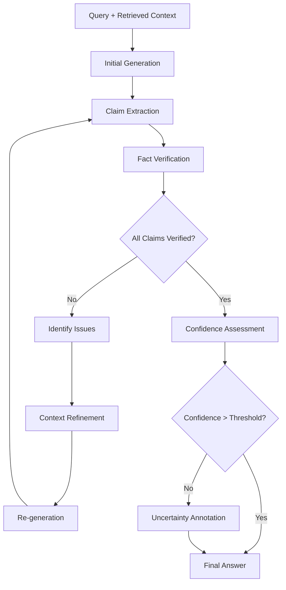

# Answer Generation with Verification Loops

## Overview

This document provides detailed implementation guidance for answer generation systems with built-in verification loops to ensure accuracy and reliability. The focus is on creating systems that can validate their own outputs and iteratively improve response quality.

## 1. Verification Loop Architecture

### 1.1 Multi-Stage Verification Pipeline



### 1.2 Core Implementation

```python
class VerificationLoopGenerator:
    def __init__(self):
        self.generator = LanguageModel()
        self.claim_extractor = ClaimExtractor()
        self.fact_verifier = FactVerifier()
        self.confidence_assessor = ConfidenceAssessor()
        self.context_refiner = ContextRefiner()
        self.max_iterations = 3
    
    def generate_with_verification(self, query, retrieved_docs):
        """
        Generate answer with iterative verification loops
        """
        context = self.prepare_context(retrieved_docs)
        
        for iteration in range(self.max_iterations):
            # Generate answer
            answer = self.generator.generate(query, context)
            
            # Extract verifiable claims
            claims = self.claim_extractor.extract_claims(answer)
            
            # Verify claims
            verification_results = self.verify_claims(claims, context)
            
            # Check if all claims are verified
            if self.all_claims_verified(verification_results):
                confidence = self.confidence_assessor.assess(answer, verification_results)
                return self.finalize_answer(answer, confidence, verification_results)
            
            # Refine context based on verification issues
            context = self.context_refiner.refine(
                context, verification_results, query
            )
        
        # If max iterations reached, return with uncertainty markers
        return self.handle_unverified_answer(answer, verification_results)
    
    def verify_claims(self, claims, context):
        """
        Verify extracted claims against available context and external sources
        """
        verification_results = []
        
        for claim in claims:
            # Multi-source verification
            internal_verification = self.verify_against_context(claim, context)
            external_verification = self.verify_against_external_sources(claim)
            
            # Combine verification results
            combined_result = self.combine_verification_results(
                internal_verification, external_verification
            )
            
            verification_results.append({
                'claim': claim,
                'verified': combined_result.verified,
                'confidence': combined_result.confidence,
                'sources': combined_result.sources,
                'issues': combined_result.issues
            })
        
        return verification_results
    
    def verify_against_context(self, claim, context):
        """
        Verify claim against provided context documents
        """
        # Extract relevant passages for the claim
        relevant_passages = self.find_relevant_passages(claim, context)
        
        if not relevant_passages:
            return VerificationResult(
                verified=False,
                confidence=0.0,
                reason="No supporting context found"
            )
        
        # Use entailment model to check if passages support the claim
        entailment_scores = []
        for passage in relevant_passages:
            score = self.entailment_model.predict(passage, claim)
            entailment_scores.append(score)
        
        # Calculate overall verification confidence
        max_entailment = max(entailment_scores) if entailment_scores else 0.0
        
        return VerificationResult(
            verified=max_entailment > 0.8,
            confidence=max_entailment,
            sources=relevant_passages,
            reason=f"Entailment score: {max_entailment}"
        )
    
    def verify_against_external_sources(self, claim):
        """
        Verify claim against external knowledge sources
        """
        # Query knowledge bases
        knowledge_results = self.knowledge_base.query(claim)
        
        if knowledge_results:
            return VerificationResult(
                verified=knowledge_results.confidence > 0.7,
                confidence=knowledge_results.confidence,
                sources=knowledge_results.sources,
                reason="External knowledge base verification"
            )
        
        # If no knowledge base results, use web search verification
        web_results = self.web_verifier.verify(claim)
        
        return VerificationResult(
            verified=web_results.verified,
            confidence=web_results.confidence,
            sources=web_results.sources,
            reason="Web search verification"
        )
```

### 1.3 Advanced Claim Extraction

```python
class AdvancedClaimExtractor:
    def __init__(self):
        self.ner_model = NamedEntityRecognizer()
        self.dependency_parser = DependencyParser()
        self.claim_classifier = ClaimClassifier()
        self.factuality_detector = FactualityDetector()
    
    def extract_claims(self, text):
        """
        Extract verifiable claims from generated text
        """
        # Sentence segmentation
        sentences = self.segment_sentences(text)
        
        claims = []
        for sentence in sentences:
            # Check if sentence contains factual claims
            if self.factuality_detector.is_factual(sentence):
                # Extract atomic claims from complex sentences
                atomic_claims = self.extract_atomic_claims(sentence)
                
                for claim in atomic_claims:
                    claim_info = {
                        'text': claim,
                        'type': self.classify_claim_type(claim),
                        'entities': self.ner_model.extract_entities(claim),
                        'confidence': self.estimate_claim_confidence(claim),
                        'verifiable': self.is_verifiable(claim)
                    }
                    
                    if claim_info['verifiable']:
                        claims.append(claim_info)
        
        return claims
    
    def extract_atomic_claims(self, sentence):
        """
        Break down complex sentences into atomic, verifiable claims
        """
        # Use dependency parsing to identify claim boundaries
        parsed = self.dependency_parser.parse(sentence)
        
        # Identify main clauses and subordinate clauses
        clauses = self.identify_clauses(parsed)
        
        atomic_claims = []
        for clause in clauses:
            # Check if clause can stand alone as a claim
            if self.can_standalone_claim(clause):
                atomic_claim = self.reconstruct_claim(clause, parsed)
                atomic_claims.append(atomic_claim)
        
        return atomic_claims
    
    def classify_claim_type(self, claim):
        """
        Classify the type of claim for appropriate verification strategy
        """
        claim_types = {
            'factual_statement': self.is_factual_statement(claim),
            'numerical_claim': self.is_numerical_claim(claim),
            'causal_claim': self.is_causal_claim(claim),
            'comparative_claim': self.is_comparative_claim(claim),
            'temporal_claim': self.is_temporal_claim(claim),
            'definitional_claim': self.is_definitional_claim(claim)
        }
        
        # Return the claim type with highest confidence
        return max(claim_types.items(), key=lambda x: x[1])[0]
    
    def is_verifiable(self, claim):
        """
        Determine if a claim is verifiable against external sources
        """
        # Check for subjective language
        if self.contains_subjective_language(claim):
            return False
        
        # Check for vague or ambiguous terms
        if self.contains_vague_terms(claim):
            return False
        
        # Check for proper nouns or specific entities
        entities = self.ner_model.extract_entities(claim)
        if not any(entity.type in ['PERSON', 'ORG', 'GPE', 'DATE'] for entity in entities):
            return False
        
        return True
```

## 2. Multi-Model Ensemble Generation

### 2.1 Ensemble Architecture

```python
class MultiModelEnsemble:
    def __init__(self):
        self.models = {
            'gpt4': GPT4Model(),
            'claude': ClaudeModel(), 
            'palm': PaLMModel(),
            'custom': CustomModel()
        }
        self.consensus_engine = ConsensusEngine()
        self.quality_assessor = QualityAssessor()
        
    def generate_ensemble_answer(self, query, retrieved_docs):
        """
        Generate answers from multiple models and find consensus
        """
        # Generate from all models in parallel
        model_outputs = {}
        
        with ThreadPoolExecutor(max_workers=len(self.models)) as executor:
            futures = {}
            
            for model_name, model in self.models.items():
                future = executor.submit(
                    self.generate_with_model, model, query, retrieved_docs
                )
                futures[model_name] = future
            
            # Collect results
            for model_name, future in futures.items():
                try:
                    output = future.result(timeout=30)  # 30 second timeout
                    model_outputs[model_name] = output
                except Exception as e:
                    self.logger.error(f"Model {model_name} failed: {e}")
                    model_outputs[model_name] = None
        
        # Analyze outputs for consensus
        consensus_result = self.find_consensus(model_outputs, query)
        
        return consensus_result
    
    def generate_with_model(self, model, query, retrieved_docs):
        """
        Generate answer with individual model including confidence estimation
        """
        # Generate multiple samples for confidence estimation
        samples = []
        for _ in range(3):  # Generate 3 samples
            sample = model.generate(query, retrieved_docs, temperature=0.7)
            samples.append(sample)
        
        # Select best sample and estimate confidence
        best_sample = self.select_best_sample(samples)
        confidence = self.estimate_model_confidence(samples)
        
        return {
            'answer': best_sample,
            'confidence': confidence,
            'model': model.name,
            'samples': samples
        }
    
    def find_consensus(self, model_outputs, query):
        """
        Find consensus among model outputs or identify disagreements
        """
        valid_outputs = {k: v for k, v in model_outputs.items() if v is not None}
        
        if len(valid_outputs) < 2:
            # Not enough models for consensus
            if valid_outputs:
                single_output = list(valid_outputs.values())[0]
                return ConsensusResult(
                    answer=single_output['answer'],
                    consensus_type='single_model',
                    confidence=single_output['confidence'],
                    agreement_score=1.0
                )
            else:
                return ConsensusResult(
                    answer="Unable to generate reliable answer",
                    consensus_type='failure',
                    confidence=0.0,
                    agreement_score=0.0
                )
        
        # Extract claims from each model's output
        model_claims = {}
        for model_name, output in valid_outputs.items():
            claims = self.claim_extractor.extract_claims(output['answer'])
            model_claims[model_name] = claims
        
        # Find agreement on claims
        agreement_analysis = self.analyze_claim_agreement(model_claims)
        
        if agreement_analysis.high_agreement:
            # High agreement - synthesize consensus answer
            consensus_answer = self.synthesize_consensus_answer(
                valid_outputs, agreement_analysis
            )
            
            return ConsensusResult(
                answer=consensus_answer,
                consensus_type='high_agreement',
                confidence=agreement_analysis.confidence,
                agreement_score=agreement_analysis.score
            )
        
        elif agreement_analysis.partial_agreement:
            # Partial agreement - highlight areas of agreement and uncertainty
            consensus_answer = self.synthesize_partial_consensus(
                valid_outputs, agreement_analysis
            )
            
            return ConsensusResult(
                answer=consensus_answer,
                consensus_type='partial_agreement',
                confidence=agreement_analysis.confidence,
                agreement_score=agreement_analysis.score,
                disagreements=agreement_analysis.disagreements
            )
        
        else:
            # Low agreement - report disagreement
            return self.handle_disagreement(valid_outputs, agreement_analysis)
    
    def analyze_claim_agreement(self, model_claims):
        """
        Analyze agreement between claims from different models
        """
        all_claims = []
        claim_sources = {}
        
        # Collect all claims with their sources
        for model_name, claims in model_claims.items():
            for claim in claims:
                claim_text = claim['text']
                all_claims.append(claim_text)
                
                if claim_text not in claim_sources:
                    claim_sources[claim_text] = []
                claim_sources[claim_text].append(model_name)
        
        # Group similar claims
        claim_groups = self.group_similar_claims(all_claims)
        
        # Analyze agreement for each claim group
        agreement_results = []
        for group in claim_groups:
            group_agreement = len(set(claim_sources[claim] for claim in group))
            agreement_results.append({
                'claims': group,
                'agreement_level': group_agreement / len(self.models),
                'supporting_models': len(set(sum([claim_sources[claim] for claim in group], [])))
            })
        
        # Calculate overall agreement metrics
        high_agreement_claims = [
            result for result in agreement_results 
            if result['agreement_level'] >= 0.8
        ]
        
        partial_agreement_claims = [
            result for result in agreement_results 
            if 0.5 <= result['agreement_level'] < 0.8
        ]
        
        low_agreement_claims = [
            result for result in agreement_results 
            if result['agreement_level'] < 0.5
        ]
        
        overall_agreement_score = sum(
            result['agreement_level'] for result in agreement_results
        ) / len(agreement_results) if agreement_results else 0.0
        
        return AgreementAnalysis(
            high_agreement=len(high_agreement_claims) >= len(agreement_results) * 0.7,
            partial_agreement=len(partial_agreement_claims) >= len(agreement_results) * 0.5,
            confidence=overall_agreement_score,
            score=overall_agreement_score,
            agreed_claims=high_agreement_claims,
            disputed_claims=low_agreement_claims,
            disagreements=low_agreement_claims
        )
```

### 2.2 Consensus Synthesis

```python
class ConsensusAnswerSynthesizer:
    def __init__(self):
        self.text_merger = TextMerger()
        self.fact_reconciler = FactReconciler()
        self.uncertainty_handler = UncertaintyHandler()
    
    def synthesize_consensus_answer(self, model_outputs, agreement_analysis):
        """
        Synthesize a consensus answer from multiple model outputs
        """
        # Extract high-confidence agreed-upon facts
        consensus_facts = self.extract_consensus_facts(agreement_analysis.agreed_claims)
        
        # Organize facts by topic/theme
        organized_facts = self.organize_facts_by_theme(consensus_facts)
        
        # Generate coherent answer structure
        answer_structure = self.create_answer_structure(organized_facts)
        
        # Synthesize final answer
        synthesized_answer = self.text_merger.merge_structured_content(
            answer_structure
        )
        
        # Add confidence indicators
        final_answer = self.add_confidence_indicators(
            synthesized_answer, agreement_analysis
        )
        
        return final_answer
    
    def synthesize_partial_consensus(self, model_outputs, agreement_analysis):
        """
        Synthesize answer when there's partial agreement between models
        """
        # Start with agreed-upon facts
        consensus_parts = self.extract_consensus_facts(agreement_analysis.agreed_claims)
        
        # Handle disputed claims
        disputed_parts = []
        for dispute in agreement_analysis.disputed_claims:
            dispute_resolution = self.resolve_dispute(dispute, model_outputs)
            disputed_parts.append(dispute_resolution)
        
        # Combine consensus and resolved disputes
        combined_content = self.combine_consensus_and_disputes(
            consensus_parts, disputed_parts
        )
        
        # Add uncertainty markers for unresolved disputes
        final_answer = self.uncertainty_handler.add_uncertainty_markers(
            combined_content, agreement_analysis.disagreements
        )
        
        return final_answer
    
    def resolve_dispute(self, dispute, model_outputs):
        """
        Resolve disputes between models using additional evidence
        """
        dispute_claims = dispute['claims']
        
        # Gather additional evidence for disputed claims
        additional_evidence = {}
        for claim in dispute_claims:
            evidence = self.gather_additional_evidence(claim)
            additional_evidence[claim] = evidence
        
        # Re-evaluate claims with additional evidence
        resolution_results = {}
        for claim, evidence in additional_evidence.items():
            # Verify claim against additional evidence
            verification_result = self.verify_claim_with_evidence(claim, evidence)
            resolution_results[claim] = verification_result
        
        # Choose resolution strategy based on evidence strength
        strongest_claim = max(
            resolution_results.items(),
            key=lambda x: x[1].confidence
        )
        
        if strongest_claim[1].confidence > 0.8:
            return DisputeResolution(
                resolution='accepted',
                chosen_claim=strongest_claim[0],
                confidence=strongest_claim[1].confidence,
                reasoning=f"Strong evidence support: {strongest_claim[1].evidence}"
            )
        else:
            return DisputeResolution(
                resolution='uncertain',
                alternative_claims=dispute_claims,
                reasoning="Insufficient evidence to resolve dispute"
            )
    
    def add_confidence_indicators(self, answer, agreement_analysis):
        """
        Add confidence indicators to the synthesized answer
        """
        confidence_level = agreement_analysis.confidence
        
        if confidence_level >= 0.9:
            confidence_phrase = "Based on strong consensus among multiple sources"
        elif confidence_level >= 0.7:
            confidence_phrase = "Based on general agreement among sources"
        elif confidence_level >= 0.5:
            confidence_phrase = "Based on partial agreement among sources"
        else:
            confidence_phrase = "Based on limited consensus among sources"
        
        # Add confidence indicators to specific claims
        marked_answer = self.mark_claim_confidence(answer, agreement_analysis)
        
        # Add overall confidence statement
        final_answer = f"{marked_answer}\n\nConfidence: {confidence_phrase} (Score: {confidence_level:.2f})"
        
        return final_answer
```

## 3. Real-Time Fact Checking Integration

### 3.1 Live Fact Checking Pipeline

```python
class LiveFactChecker:
    def __init__(self):
        self.fact_databases = [
            WikidataAPI(),
            DBpediaAPI(),
            FactualAPI()
        ]
        self.web_searcher = WebSearcher()
        self.source_credibility = SourceCredibilityAssessor()
        
    def verify_claim_realtime(self, claim):
        """
        Verify a claim against multiple real-time sources
        """
        verification_tasks = []
        
        # Check against structured knowledge bases
        for db in self.fact_databases:
            task = self.verify_against_knowledge_base(claim, db)
            verification_tasks.append(task)
        
        # Check against recent web sources
        web_task = self.verify_against_web(claim)
        verification_tasks.append(web_task)
        
        # Execute all verification tasks in parallel
        verification_results = self.execute_parallel_verification(verification_tasks)
        
        # Aggregate results
        aggregated_result = self.aggregate_verification_results(
            verification_results, claim
        )
        
        return aggregated_result
    
    def verify_against_knowledge_base(self, claim, knowledge_base):
        """
        Verify claim against structured knowledge base
        """
        # Extract entities and relations from claim
        entities = self.extract_entities(claim)
        relations = self.extract_relations(claim)
        
        # Query knowledge base
        query_results = knowledge_base.query(entities, relations)
        
        if not query_results:
            return VerificationResult(
                source=knowledge_base.name,
                verified=False,
                confidence=0.0,
                evidence=None,
                reason="No relevant information found"
            )
        
        # Check consistency with query results
        consistency_score = self.check_consistency(claim, query_results)
        
        return VerificationResult(
            source=knowledge_base.name,
            verified=consistency_score > 0.8,
            confidence=consistency_score,
            evidence=query_results,
            reason=f"Knowledge base consistency: {consistency_score}"
        )
    
    def verify_against_web(self, claim):
        """
        Verify claim against recent web sources
        """
        # Search for relevant information
        search_results = self.web_searcher.search(claim, num_results=10)
        
        # Filter for credible sources
        credible_results = []
        for result in search_results:
            credibility_score = self.source_credibility.assess(result.url)
            if credibility_score > 0.6:
                credible_results.append({
                    'result': result,
                    'credibility': credibility_score
                })
        
        if not credible_results:
            return VerificationResult(
                source="web_search",
                verified=False,
                confidence=0.0,
                evidence=None,
                reason="No credible sources found"
            )
        
        # Analyze content for claim support
        support_scores = []
        for item in credible_results:
            content = self.extract_content(item['result'])
            support_score = self.calculate_claim_support(claim, content)
            weighted_score = support_score * item['credibility']
            support_scores.append(weighted_score)
        
        # Calculate overall verification score
        if support_scores:
            avg_support = sum(support_scores) / len(support_scores)
            max_support = max(support_scores)
            
            # Use weighted average of average and maximum support
            final_score = (avg_support * 0.6) + (max_support * 0.4)
            
            return VerificationResult(
                source="web_search",
                verified=final_score > 0.7,
                confidence=final_score,
                evidence=credible_results[:3],  # Top 3 sources
                reason=f"Web source support: {final_score}"
            )
        
        return VerificationResult(
            source="web_search",
            verified=False,
            confidence=0.0,
            evidence=None,
            reason="Unable to assess claim support"
        )
```

## 4. Performance Optimization

### 4.1 Caching Strategy for Verified Claims

```python
class VerificationCacheManager:
    def __init__(self):
        self.claim_cache = ClaimCache(max_size=10000, ttl=3600)  # 1 hour TTL
        self.verification_cache = VerificationCache(max_size=5000, ttl=1800)  # 30 min TTL
        self.similarity_engine = ClaimSimilarityEngine()
    
    def get_cached_verification(self, claim):
        """
        Retrieve cached verification result for claim or similar claims
        """
        # Check for exact match
        exact_match = self.verification_cache.get(claim)
        if exact_match and self.is_cache_valid(exact_match):
            return exact_match
        
        # Check for similar claims
        similar_claims = self.similarity_engine.find_similar_claims(
            claim, threshold=0.9, max_results=3
        )
        
        for similar_claim, similarity_score in similar_claims:
            cached_result = self.verification_cache.get(similar_claim)
            if cached_result and self.is_cache_valid(cached_result):
                # Adapt cached result for current claim
                adapted_result = self.adapt_verification_result(
                    cached_result, claim, similar_claim, similarity_score
                )
                
                # Cache the adapted result
                self.verification_cache.set(claim, adapted_result)
                return adapted_result
        
        return None
    
    def cache_verification_result(self, claim, verification_result):
        """
        Cache verification result with appropriate TTL based on claim type
        """
        # Determine TTL based on claim characteristics
        ttl = self.calculate_claim_ttl(claim, verification_result)
        
        # Store in cache
        self.verification_cache.set(claim, verification_result, ttl=ttl)
        
        # Update similarity index
        self.similarity_engine.index_claim(claim, verification_result)
    
    def calculate_claim_ttl(self, claim, verification_result):
        """
        Calculate appropriate TTL for cached verification result
        """
        base_ttl = 3600  # 1 hour default
        
        # Adjust TTL based on claim type and verification confidence
        if self.is_temporal_claim(claim):
            # Temporal claims expire faster
            ttl = base_ttl // 4  # 15 minutes
        elif self.is_numerical_claim(claim):
            # Numerical claims may change
            ttl = base_ttl // 2  # 30 minutes
        elif verification_result.confidence > 0.9:
            # High confidence results can be cached longer
            ttl = base_ttl * 2  # 2 hours
        elif verification_result.confidence < 0.5:
            # Low confidence results expire quickly
            ttl = base_ttl // 4  # 15 minutes
        else:
            ttl = base_ttl
        
        return ttl
```

### 4.2 Async Processing Pipeline

```python
import asyncio
from concurrent.futures import ThreadPoolExecutor

class AsyncVerificationPipeline:
    def __init__(self):
        self.executor = ThreadPoolExecutor(max_workers=8)
        self.semaphore = asyncio.Semaphore(5)  # Limit concurrent verifications
    
    async def verify_claims_async(self, claims):
        """
        Verify multiple claims asynchronously
        """
        verification_tasks = []
        
        for claim in claims:
            task = self.verify_single_claim_async(claim)
            verification_tasks.append(task)
        
        # Execute all verifications with rate limiting
        results = await asyncio.gather(*verification_tasks, return_exceptions=True)
        
        # Process results and handle exceptions
        processed_results = []
        for i, result in enumerate(results):
            if isinstance(result, Exception):
                processed_results.append({
                    'claim': claims[i],
                    'verified': False,
                    'confidence': 0.0,
                    'error': str(result)
                })
            else:
                processed_results.append(result)
        
        return processed_results
    
    async def verify_single_claim_async(self, claim):
        """
        Verify a single claim with rate limiting
        """
        async with self.semaphore:
            # Check cache first
            cached_result = self.cache_manager.get_cached_verification(claim)
            if cached_result:
                return cached_result
            
            # Perform verification
            loop = asyncio.get_event_loop()
            verification_result = await loop.run_in_executor(
                self.executor,
                self.live_fact_checker.verify_claim_realtime,
                claim
            )
            
            # Cache result
            self.cache_manager.cache_verification_result(claim, verification_result)
            
            return verification_result
```

## 5. Quality Metrics and Monitoring

### 5.1 Verification Quality Metrics

```python
class VerificationQualityMonitor:
    def __init__(self):
        self.metrics_collector = MetricsCollector()
        self.quality_assessor = QualityAssessor()
        
    def monitor_verification_quality(self, verification_results, ground_truth=None):
        """
        Monitor and assess the quality of verification results
        """
        metrics = {
            # Accuracy metrics
            'verification_accuracy': self.calculate_verification_accuracy(
                verification_results, ground_truth
            ) if ground_truth else None,
            
            # Confidence metrics
            'avg_confidence': self.calculate_average_confidence(verification_results),
            'confidence_distribution': self.analyze_confidence_distribution(verification_results),
            
            # Coverage metrics
            'verification_coverage': self.calculate_verification_coverage(verification_results),
            'source_diversity': self.calculate_source_diversity(verification_results),
            
            # Performance metrics
            'avg_verification_time': self.calculate_avg_verification_time(verification_results),
            'cache_hit_rate': self.calculate_cache_hit_rate(),
            
            # Quality indicators
            'contradiction_rate': self.detect_contradiction_rate(verification_results),
            'uncertainty_rate': self.calculate_uncertainty_rate(verification_results)
        }
        
        # Store metrics
        self.metrics_collector.record_verification_metrics(metrics)
        
        # Generate alerts if quality issues detected
        self.check_quality_alerts(metrics)
        
        return metrics
    
    def calculate_verification_accuracy(self, verification_results, ground_truth):
        """
        Calculate accuracy of verification results against ground truth
        """
        if not ground_truth:
            return None
        
        correct_verifications = 0
        total_verifications = 0
        
        for result in verification_results:
            claim = result['claim']
            if claim in ground_truth:
                predicted_verified = result['verified']
                actual_verified = ground_truth[claim]
                
                if predicted_verified == actual_verified:
                    correct_verifications += 1
                
                total_verifications += 1
        
        return correct_verifications / total_verifications if total_verifications > 0 else 0.0
    
    def detect_contradiction_rate(self, verification_results):
        """
        Detect rate of contradictory verification results
        """
        contradictions = 0
        total_pairs = 0
        
        # Compare all pairs of claims for potential contradictions
        for i in range(len(verification_results)):
            for j in range(i + 1, len(verification_results)):
                result1 = verification_results[i]
                result2 = verification_results[j]
                
                if self.claims_contradict(result1['claim'], result2['claim']):
                    # Check if both are verified (contradiction)
                    if result1['verified'] and result2['verified']:
                        contradictions += 1
                
                total_pairs += 1
        
        return contradictions / total_pairs if total_pairs > 0 else 0.0
```

## 6. Implementation Checklist

### 6.1 Core Components
- [ ] Claim extractor with atomic claim decomposition
- [ ] Multi-source fact verifier
- [ ] Verification loop generator
- [ ] Multi-model ensemble system
- [ ] Consensus finding algorithm
- [ ] Real-time fact checking pipeline
- [ ] Verification result caching
- [ ] Quality monitoring system

### 6.2 Performance Optimizations
- [ ] Asynchronous verification processing
- [ ] Intelligent caching with TTL
- [ ] Rate limiting for external API calls
- [ ] Batch processing for multiple claims
- [ ] Connection pooling for database queries
- [ ] Result streaming for long verifications

### 6.3 Quality Assurance
- [ ] Comprehensive test suite with ground truth data
- [ ] Benchmarking against known fact-checking datasets
- [ ] A/B testing for different verification strategies
- [ ] Monitoring for accuracy degradation
- [ ] Error analysis and failure mode detection

### 6.4 Monitoring and Observability
- [ ] Real-time verification metrics dashboard
- [ ] Quality trend analysis
- [ ] Performance bottleneck identification
- [ ] Error rate monitoring
- [ ] Cache efficiency tracking

## Conclusion

This implementation provides a robust framework for answer generation with verification loops. Key success factors include:

1. **Multi-layered verification** - Combining multiple verification methods
2. **Iterative refinement** - Using verification results to improve generation
3. **Consensus mechanisms** - Leveraging multiple models for reliability
4. **Performance optimization** - Caching and async processing for scalability
5. **Quality monitoring** - Continuous assessment of verification accuracy

The system should be deployed incrementally, starting with basic verification loops and gradually adding more sophisticated consensus mechanisms and real-time fact checking capabilities.