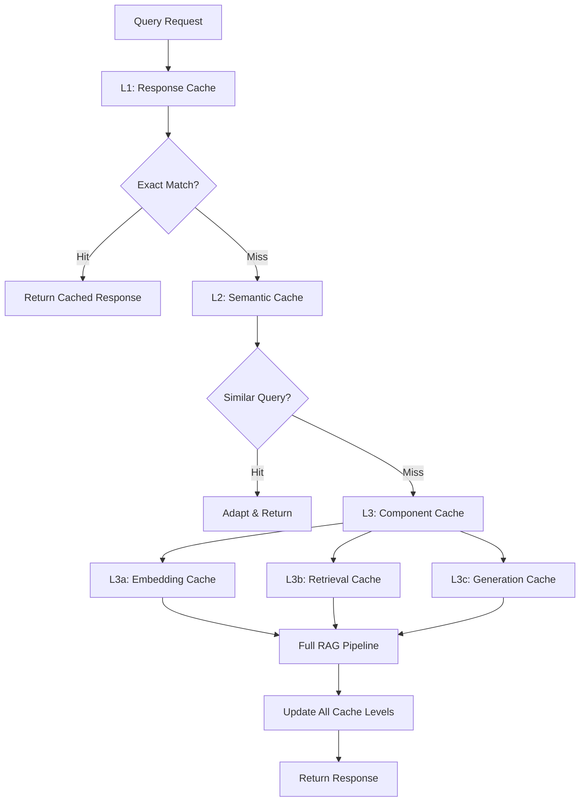

# Advanced Caching Strategies for Consistent RAG Answers

## Overview

This document provides comprehensive caching strategies specifically designed for RAG systems to ensure consistency, performance, and accuracy. The focus is on multi-level caching architectures that maintain data freshness while optimizing response times.

## 1. Multi-Level Cache Architecture

### 1.1 Hierarchical Cache Design



### 1.2 Cache Level Implementations

```python
class MultiLevelRAGCache:
    def __init__(self):
        # L1: Exact response cache
        self.response_cache = ResponseCache(
            max_size=1000,
            ttl=3600,  # 1 hour
            storage_backend='redis'
        )
        
        # L2: Semantic similarity cache
        self.semantic_cache = SemanticCache(
            similarity_threshold=0.95,
            max_size=2000,
            ttl=7200  # 2 hours
        )
        
        # L3: Component caches
        self.embedding_cache = EmbeddingCache(
            max_size=50000,
            ttl=86400  # 24 hours
        )
        
        self.retrieval_cache = RetrievalCache(
            max_size=10000,
            ttl=3600  # 1 hour
        )
        
        self.generation_cache = GenerationCache(
            max_size=5000,
            ttl=1800  # 30 minutes
        )
        
        self.consistency_manager = ConsistencyManager()
        self.cache_optimizer = CacheOptimizer()
    
    async def get_or_compute(self, query, compute_func):
        """
        Main cache lookup and computation method
        """
        # L1: Check exact response cache
        cache_key = self.generate_cache_key(query)
        cached_response = await self.response_cache.get(cache_key)
        
        if cached_response and self.is_cache_valid(cached_response):
            await self.track_cache_hit('L1_response', query)
            return cached_response
        
        # L2: Check semantic cache for similar queries
        similar_result = await self.semantic_cache.find_similar(query)
        if similar_result:
            adapted_response = await self.adapt_cached_response(
                similar_result, query
            )
            
            # Cache the adapted response at L1
            await self.response_cache.set(cache_key, adapted_response)
            await self.track_cache_hit('L2_semantic', query)
            return adapted_response
        
        # L3: Check component caches
        component_cache_result = await self.check_component_caches(query)
        
        if component_cache_result.has_partial_hit:
            # Use cached components and compute missing parts
            response = await self.compute_with_cached_components(
                query, component_cache_result, compute_func
            )
        else:
            # Full computation required
            response = await compute_func(query)
        
        # Update all cache levels
        await self.update_all_caches(query, response, component_cache_result)
        await self.track_cache_miss('full_computation', query)
        
        return response
    
    async def check_component_caches(self, query):
        """
        Check individual component caches
        """
        results = ComponentCacheResult()
        
        # Check embedding cache
        query_embedding = await self.embedding_cache.get(query)
        if query_embedding:
            results.cached_embedding = query_embedding
            results.embedding_hit = True
        
        # Check retrieval cache
        retrieval_key = self.generate_retrieval_key(query)
        cached_docs = await self.retrieval_cache.get(retrieval_key)
        if cached_docs and self.is_retrieval_valid(cached_docs):
            results.cached_documents = cached_docs
            results.retrieval_hit = True
        
        # Check generation cache for similar contexts
        if results.retrieval_hit:
            generation_key = self.generate_generation_key(query, cached_docs)
            cached_generation = await self.generation_cache.get(generation_key)
            if cached_generation:
                results.cached_generation = cached_generation
                results.generation_hit = True
        
        results.has_partial_hit = any([
            results.embedding_hit,
            results.retrieval_hit,
            results.generation_hit
        ])
        
        return results
```

### 1.3 Semantic Cache Implementation

```python
class SemanticCache:
    def __init__(self, similarity_threshold=0.95, max_size=2000, ttl=7200):
        self.similarity_threshold = similarity_threshold
        self.max_size = max_size
        self.ttl = ttl
        
        # Vector index for semantic similarity
        self.query_embedder = SentenceTransformer('all-MiniLM-L6-v2')
        self.vector_index = FaissIndex(dimension=384)
        
        # Storage for cache entries
        self.cache_storage = {}  # query_id -> cache_entry
        self.query_vectors = {}  # query_id -> embedding
        
        # LRU eviction tracker
        self.access_tracker = LRUTracker()
    
    async def find_similar(self, query, top_k=3):
        """
        Find semantically similar cached queries
        """
        # Generate query embedding
        query_embedding = self.query_embedder.encode(query)
        
        # Search for similar queries
        similar_queries = self.vector_index.search(
            query_embedding, 
            k=top_k,
            threshold=self.similarity_threshold
        )
        
        valid_results = []
        for query_id, similarity_score in similar_queries:
            cache_entry = self.cache_storage.get(query_id)
            
            if cache_entry and self.is_entry_valid(cache_entry):
                valid_results.append({
                    'query_id': query_id,
                    'original_query': cache_entry['query'],
                    'response': cache_entry['response'],
                    'similarity': similarity_score,
                    'timestamp': cache_entry['timestamp'],
                    'metadata': cache_entry['metadata']
                })
        
        # Return best match if above threshold
        if valid_results:
            best_match = max(valid_results, key=lambda x: x['similarity'])
            if best_match['similarity'] >= self.similarity_threshold:
                self.access_tracker.update_access(best_match['query_id'])
                return best_match
        
        return None
    
    async def store(self, query, response, metadata=None):
        """
        Store query-response pair in semantic cache
        """
        # Check if cache is full
        if len(self.cache_storage) >= self.max_size:
            await self.evict_lru_entries()
        
        # Generate unique query ID
        query_id = self.generate_query_id(query)
        
        # Generate and store embedding
        query_embedding = self.query_embedder.encode(query)
        self.query_vectors[query_id] = query_embedding
        self.vector_index.add_vector(query_id, query_embedding)
        
        # Store cache entry
        cache_entry = {
            'query': query,
            'response': response,
            'timestamp': time.time(),
            'metadata': metadata or {},
            'access_count': 1
        }
        
        self.cache_storage[query_id] = cache_entry
        self.access_tracker.track_new(query_id)
    
    async def adapt_cached_response(self, cached_result, new_query):
        """
        Adapt cached response for semantically similar query
        """
        original_query = cached_result['original_query']
        cached_response = cached_result['response']
        similarity_score = cached_result['similarity']
        
        # If very high similarity, return cached response as-is
        if similarity_score >= 0.98:
            return cached_response
        
        # For moderate similarity, adapt the response
        adaptation_strategy = self.select_adaptation_strategy(
            original_query, new_query, similarity_score
        )
        
        if adaptation_strategy == 'direct_substitution':
            adapted_response = self.substitute_terms(
                cached_response, original_query, new_query
            )
        elif adaptation_strategy == 'context_adjustment':
            adapted_response = await self.adjust_context(
                cached_response, new_query
            )
        else:
            # Conservative approach - return with similarity note
            adapted_response = f"{cached_response}\n\n*Note: This response was adapted from a similar query with {similarity_score:.2f} confidence.*"
        
        return adapted_response
```

## 2. Consistency Management

### 2.1 Version-Based Consistency

```python
class ConsistencyManager:
    def __init__(self):
        self.version_tracker = VersionTracker()
        self.dependency_graph = DependencyGraph()
        self.invalidation_engine = InvalidationEngine()
        
    async def ensure_cache_consistency(self, cache_key, cached_entry):
        """
        Ensure cached entry is consistent with current data
        """
        # Get current version of underlying data
        current_version = await self.version_tracker.get_current_version()
        cached_version = cached_entry.get('data_version', 0)
        
        if current_version > cached_version:
            # Check what changed since cached version
            changes = await self.version_tracker.get_changes_since(cached_version)
            
            # Determine if changes affect this cache entry
            is_affected = await self.assess_impact(cached_entry, changes)
            
            if is_affected:
                # Invalidate affected cache entries
                await self.invalidate_affected_entries(cache_key, changes)
                return False  # Cache invalid
        
        return True  # Cache valid
    
    async def assess_impact(self, cached_entry, changes):
        """
        Assess if data changes impact a specific cache entry
        """
        impact_score = 0.0
        
        # Extract entities and topics from cached query/response
        cached_entities = self.extract_entities(cached_entry['query'])
        cached_topics = self.extract_topics(cached_entry['response'])
        
        # Check if changes affect extracted entities/topics
        for change in changes:
            change_entities = self.extract_entities(change['affected_content'])
            change_topics = self.extract_topics(change['affected_content'])
            
            # Calculate entity overlap
            entity_overlap = len(set(cached_entities) & set(change_entities))
            topic_overlap = len(set(cached_topics) & set(change_topics))
            
            # Weight by change severity
            change_weight = self.get_change_weight(change['type'])
            
            impact_score += (entity_overlap + topic_overlap) * change_weight
        
        # Return True if impact exceeds threshold
        return impact_score > 0.5
    
    async def invalidate_affected_entries(self, primary_key, changes):
        """
        Invalidate cache entries affected by data changes
        """
        # Find all cache entries that might be affected
        affected_keys = await self.dependency_graph.find_dependent_keys(
            primary_key, changes
        )
        
        # Invalidate in parallel
        invalidation_tasks = []
        for cache_level, keys in affected_keys.items():
            task = self.invalidation_engine.invalidate_batch(cache_level, keys)
            invalidation_tasks.append(task)
        
        await asyncio.gather(*invalidation_tasks)
        
        # Log invalidation for monitoring
        await self.log_invalidation_event(primary_key, affected_keys, changes)
```

### 2.2 Smart Invalidation Strategies

```python
class SmartInvalidationEngine:
    def __init__(self):
        self.invalidation_policies = {}
        self.dependency_analyzer = DependencyAnalyzer()
        self.impact_predictor = ImpactPredictor()
        
    def register_invalidation_policy(self, content_type, policy):
        """
        Register invalidation policy for specific content types
        """
        self.invalidation_policies[content_type] = policy
    
    async def selective_invalidation(self, change_event):
        """
        Perform selective invalidation based on change type and impact
        """
        change_type = change_event['type']
        affected_content = change_event['content']
        
        # Predict impact scope
        impact_prediction = await self.impact_predictor.predict_impact(
            change_event
        )
        
        invalidation_strategy = self.select_invalidation_strategy(
            change_type, impact_prediction
        )
        
        if invalidation_strategy == 'immediate_full':
            # Invalidate all related caches immediately
            await self.invalidate_all_related(affected_content)
            
        elif invalidation_strategy == 'gradual_invalidation':
            # Gradually invalidate over time
            await self.schedule_gradual_invalidation(affected_content, impact_prediction)
            
        elif invalidation_strategy == 'lazy_invalidation':
            # Mark for invalidation but don't remove until next access
            await self.mark_for_lazy_invalidation(affected_content)
            
        else:  # 'selective_invalidation'
            # Invalidate only highly impacted entries
            await self.invalidate_high_impact_entries(affected_content, impact_prediction)
    
    async def invalidate_high_impact_entries(self, affected_content, impact_prediction):
        """
        Invalidate only cache entries with high predicted impact
        """
        high_impact_threshold = 0.7
        
        candidate_entries = await self.find_potentially_affected_entries(affected_content)
        
        invalidation_tasks = []
        for entry in candidate_entries:
            predicted_impact = impact_prediction.get_entry_impact(entry['key'])
            
            if predicted_impact >= high_impact_threshold:
                task = self.invalidate_single_entry(entry)
                invalidation_tasks.append(task)
        
        await asyncio.gather(*invalidation_tasks)
    
    async def schedule_gradual_invalidation(self, affected_content, impact_prediction):
        """
        Schedule gradual invalidation to avoid cache stampede
        """
        affected_entries = await self.find_potentially_affected_entries(affected_content)
        
        # Sort by impact score (highest first)
        sorted_entries = sorted(
            affected_entries,
            key=lambda x: impact_prediction.get_entry_impact(x['key']),
            reverse=True
        )
        
        # Schedule invalidation in batches
        batch_size = 10
        delay_between_batches = 30  # seconds
        
        for i in range(0, len(sorted_entries), batch_size):
            batch = sorted_entries[i:i + batch_size]
            
            # Schedule batch invalidation
            delay = i // batch_size * delay_between_batches
            await self.schedule_delayed_invalidation(batch, delay)
```

## 3. Performance Optimization

### 3.1 Intelligent Prefetching

```python
class IntelligentPrefetcher:
    def __init__(self):
        self.access_pattern_analyzer = AccessPatternAnalyzer()
        self.query_predictor = QueryPredictor()
        self.prefetch_scheduler = PrefetchScheduler()
        
    async def analyze_and_prefetch(self, current_query, user_context):
        """
        Analyze access patterns and prefetch likely next queries
        """
        # Analyze historical access patterns
        access_patterns = await self.access_pattern_analyzer.analyze_patterns(
            user_context
        )
        
        # Predict likely next queries
        predicted_queries = await self.query_predictor.predict_next_queries(
            current_query, access_patterns, top_k=5
        )
        
        # Schedule prefetching for predicted queries
        prefetch_tasks = []
        for predicted_query in predicted_queries:
            if predicted_query['probability'] > 0.3:  # Prefetch threshold
                task = self.schedule_prefetch(predicted_query)
                prefetch_tasks.append(task)
        
        # Execute prefetching in background
        await asyncio.gather(*prefetch_tasks, return_exceptions=True)
    
    async def schedule_prefetch(self, predicted_query):
        """
        Schedule prefetching for a predicted query
        """
        query_text = predicted_query['query']
        probability = predicted_query['probability']
        
        # Check if already cached
        if await self.is_already_cached(query_text):
            return
        
        # Priority based on prediction probability
        priority = self.calculate_prefetch_priority(probability)
        
        # Schedule background computation
        await self.prefetch_scheduler.schedule(
            query_text,
            priority=priority,
            max_delay=300  # 5 minutes max delay
        )
    
    async def background_prefetch_worker(self):
        """
        Background worker for processing prefetch queue
        """
        while True:
            try:
                # Get next prefetch task
                prefetch_task = await self.prefetch_scheduler.get_next_task()
                
                if prefetch_task is None:
                    await asyncio.sleep(10)  # Wait before checking again
                    continue
                
                # Execute prefetch
                query = prefetch_task['query']
                
                # Perform lightweight computation
                result = await self.lightweight_rag_computation(query)
                
                # Store in cache with prefetch marker
                await self.cache_prefetch_result(query, result)
                
                # Mark task as completed
                await self.prefetch_scheduler.mark_completed(prefetch_task['id'])
                
            except Exception as e:
                self.logger.error(f"Prefetch worker error: {e}")
                await asyncio.sleep(5)
```

### 3.2 Cache Warming Strategies

```python
class CacheWarmingManager:
    def __init__(self):
        self.popular_queries_tracker = PopularQueriesTracker()
        self.warming_scheduler = WarmingScheduler()
        self.resource_monitor = ResourceMonitor()
        
    async def schedule_cache_warming(self):
        """
        Schedule cache warming based on popular queries and system resources
        """
        # Get popular queries that aren't cached
        popular_uncached = await self.get_popular_uncached_queries()
        
        # Check system resources
        system_load = await self.resource_monitor.get_system_load()
        
        if system_load < 0.7:  # System not too busy
            # Schedule warming for popular queries
            warming_tasks = []
            
            for query_info in popular_uncached[:10]:  # Top 10 queries
                task = self.warm_cache_for_query(query_info)
                warming_tasks.append(task)
            
            # Execute warming tasks with concurrency limit
            await self.execute_with_concurrency_limit(warming_tasks, limit=3)
    
    async def warm_cache_for_query(self, query_info):
        """
        Warm cache for a specific query
        """
        query = query_info['query']
        expected_frequency = query_info['frequency']
        
        try:
            # Compute result
            result = await self.compute_rag_result(query)
            
            # Store in appropriate cache levels
            await self.store_warming_result(query, result, expected_frequency)
            
            # Log successful warming
            await self.log_warming_success(query, expected_frequency)
            
        except Exception as e:
            # Log warming failure
            await self.log_warming_failure(query, str(e))
    
    async def intelligent_cache_warming(self, time_of_day, day_of_week):
        """
        Perform intelligent cache warming based on temporal patterns
        """
        # Get temporal access patterns
        temporal_patterns = await self.popular_queries_tracker.get_temporal_patterns(
            time_of_day, day_of_week
        )
        
        # Predict queries likely to be popular in next hour
        predicted_popular = await self.predict_popular_queries(temporal_patterns)
        
        # Warm cache for predicted popular queries
        warming_candidates = []
        for query_prediction in predicted_popular:
            if not await self.is_cached(query_prediction['query']):
                warming_candidates.append(query_prediction)
        
        # Execute warming with resource-aware scheduling
        await self.resource_aware_warming(warming_candidates)
    
    async def resource_aware_warming(self, warming_candidates):
        """
        Execute cache warming with resource awareness
        """
        # Monitor system resources continuously
        while warming_candidates:
            current_load = await self.resource_monitor.get_current_load()
            
            if current_load < 0.6:
                # System has capacity, process multiple candidates
                batch_size = 3
                current_batch = warming_candidates[:batch_size]
                warming_candidates = warming_candidates[batch_size:]
                
                # Process batch
                batch_tasks = [
                    self.warm_cache_for_query(candidate) 
                    for candidate in current_batch
                ]
                await asyncio.gather(*batch_tasks, return_exceptions=True)
                
            elif current_load < 0.8:
                # System moderately loaded, process one at a time
                candidate = warming_candidates.pop(0)
                await self.warm_cache_for_query(candidate)
                await asyncio.sleep(5)  # Brief pause
                
            else:
                # System heavily loaded, pause warming
                await asyncio.sleep(30)
```

## 4. Cache Analytics and Optimization

### 4.1 Performance Monitoring

```python
class CachePerformanceMonitor:
    def __init__(self):
        self.metrics_collector = CacheMetricsCollector()
        self.performance_analyzer = PerformanceAnalyzer()
        self.optimization_engine = CacheOptimizationEngine()
        
    async def collect_cache_metrics(self):
        """
        Collect comprehensive cache performance metrics
        """
        metrics = {
            # Hit rate metrics
            'l1_hit_rate': await self.calculate_hit_rate('L1'),
            'l2_hit_rate': await self.calculate_hit_rate('L2'),
            'l3_hit_rate': await self.calculate_hit_rate('L3'),
            'overall_hit_rate': await self.calculate_overall_hit_rate(),
            
            # Performance metrics
            'avg_response_time_cached': await self.get_avg_response_time(cached=True),
            'avg_response_time_uncached': await self.get_avg_response_time(cached=False),
            'cache_lookup_time': await self.get_avg_cache_lookup_time(),
            
            # Memory metrics
            'cache_memory_usage': await self.get_cache_memory_usage(),
            'cache_size_distribution': await self.get_cache_size_distribution(),
            
            # Efficiency metrics
            'invalidation_rate': await self.calculate_invalidation_rate(),
            'cache_staleness_rate': await self.calculate_staleness_rate(),
            'prefetch_success_rate': await self.calculate_prefetch_success_rate(),
            
            # Quality metrics
            'semantic_cache_accuracy': await self.assess_semantic_cache_accuracy(),
            'adaptation_quality': await self.assess_adaptation_quality()
        }
        
        # Store metrics for trend analysis
        await self.metrics_collector.store_metrics(metrics)
        
        # Trigger optimization if needed
        await self.check_optimization_triggers(metrics)
        
        return metrics
    
    async def assess_semantic_cache_accuracy(self):
        """
        Assess accuracy of semantic cache matches
        """
        # Sample recent semantic cache hits
        recent_hits = await self.get_recent_semantic_hits(sample_size=100)
        
        accuracy_scores = []
        for hit in recent_hits:
            original_query = hit['original_query']
            matched_query = hit['matched_query']
            adapted_response = hit['adapted_response']
            
            # Calculate semantic accuracy
            semantic_accuracy = await self.calculate_semantic_accuracy(
                original_query, matched_query, adapted_response
            )
            accuracy_scores.append(semantic_accuracy)
        
        return sum(accuracy_scores) / len(accuracy_scores) if accuracy_scores else 0.0
    
    async def identify_optimization_opportunities(self, metrics):
        """
        Identify opportunities for cache optimization
        """
        opportunities = []
        
        # Low hit rate optimization
        if metrics['overall_hit_rate'] < 0.6:
            opportunities.append({
                'type': 'increase_cache_size',
                'priority': 'high',
                'description': 'Overall hit rate is below optimal threshold'
            })
        
        # High invalidation rate
        if metrics['invalidation_rate'] > 0.2:
            opportunities.append({
                'type': 'optimize_ttl_settings',
                'priority': 'medium',
                'description': 'High invalidation rate suggests suboptimal TTL'
            })
        
        # Semantic cache accuracy issues
        if metrics['semantic_cache_accuracy'] < 0.8:
            opportunities.append({
                'type': 'improve_similarity_threshold',
                'priority': 'medium',
                'description': 'Semantic cache accuracy below acceptable level'
            })
        
        # Memory usage optimization
        if metrics['cache_memory_usage'] > 0.85:
            opportunities.append({
                'type': 'implement_better_eviction',
                'priority': 'high',
                'description': 'Cache memory usage approaching limits'
            })
        
        return opportunities
```

### 4.2 Adaptive Cache Configuration

```python
class AdaptiveCacheOptimizer:
    def __init__(self):
        self.ml_optimizer = MLCacheOptimizer()
        self.config_manager = CacheConfigManager()
        self.performance_predictor = PerformancePredictor()
        
    async def optimize_cache_configuration(self, current_metrics, historical_data):
        """
        Optimize cache configuration based on performance data
        """
        # Train ML model on historical performance
        model = await self.ml_optimizer.train_optimization_model(historical_data)
        
        # Generate configuration candidates
        config_candidates = await self.generate_config_candidates(current_metrics)
        
        # Predict performance for each candidate
        performance_predictions = []
        for config in config_candidates:
            predicted_performance = await model.predict_performance(config)
            performance_predictions.append({
                'config': config,
                'predicted_hit_rate': predicted_performance['hit_rate'],
                'predicted_response_time': predicted_performance['response_time'],
                'predicted_memory_usage': predicted_performance['memory_usage'],
                'optimization_score': self.calculate_optimization_score(predicted_performance)
            })
        
        # Select best configuration
        best_config = max(
            performance_predictions, 
            key=lambda x: x['optimization_score']
        )
        
        # Validate configuration before applying
        if await self.validate_configuration(best_config['config']):
            await self.apply_configuration(best_config['config'])
            return best_config
        else:
            self.logger.warning("Best predicted configuration failed validation")
            return None
    
    async def generate_config_candidates(self, current_metrics):
        """
        Generate candidate cache configurations for testing
        """
        candidates = []
        
        # Current configuration as baseline
        current_config = await self.config_manager.get_current_config()
        candidates.append(current_config)
        
        # Adjust cache sizes based on hit rates
        if current_metrics['overall_hit_rate'] < 0.7:
            # Increase cache sizes
            increased_size_config = current_config.copy()
            increased_size_config['l1_max_size'] = int(current_config['l1_max_size'] * 1.5)
            increased_size_config['l2_max_size'] = int(current_config['l2_max_size'] * 1.3)
            candidates.append(increased_size_config)
        
        # Adjust TTL settings based on staleness
        if current_metrics['cache_staleness_rate'] > 0.1:
            # Reduce TTL values
            reduced_ttl_config = current_config.copy()
            reduced_ttl_config['l1_ttl'] = int(current_config['l1_ttl'] * 0.8)
            reduced_ttl_config['l2_ttl'] = int(current_config['l2_ttl'] * 0.8)
            candidates.append(reduced_ttl_config)
        
        # Adjust semantic similarity threshold
        if current_metrics['semantic_cache_accuracy'] < 0.8:
            # Increase similarity threshold for better accuracy
            higher_threshold_config = current_config.copy()
            higher_threshold_config['semantic_similarity_threshold'] += 0.02
            candidates.append(higher_threshold_config)
        
        # Memory-optimized configuration
        if current_metrics['cache_memory_usage'] > 0.8:
            memory_optimized_config = current_config.copy()
            memory_optimized_config['l1_max_size'] = int(current_config['l1_max_size'] * 0.8)
            memory_optimized_config['enable_compression'] = True
            candidates.append(memory_optimized_config)
        
        return candidates
    
    async def a_b_test_cache_configuration(self, new_config, test_duration_hours=24):
        """
        A/B test a new cache configuration
        """
        # Split traffic between current and new configuration
        current_config = await self.config_manager.get_current_config()
        
        # Start A/B test
        test_id = await self.start_ab_test(
            config_a=current_config,
            config_b=new_config,
            traffic_split=0.5,  # 50/50 split
            duration_hours=test_duration_hours
        )
        
        # Monitor test progress
        test_results = await self.monitor_ab_test(test_id)
        
        # Analyze results
        if test_results['config_b_better'] and test_results['statistical_significance'] > 0.95:
            # New configuration is significantly better
            await self.config_manager.apply_config(new_config)
            return {
                'decision': 'adopt_new_config',
                'improvement': test_results['improvement_percentage'],
                'confidence': test_results['statistical_significance']
            }
        else:
            # Keep current configuration
            return {
                'decision': 'keep_current_config',
                'reason': test_results['reason']
            }
```

## 5. Implementation Guide

### 5.1 Development Phases

**Phase 1: Basic Multi-Level Cache (Week 1-2)**
```python
# Implementation checklist:
basic_cache_components = [
    "✓ L1 Response Cache (Redis)",
    "✓ L2 Semantic Cache (Vector similarity)", 
    "✓ L3 Component Caches (Embedding, Retrieval, Generation)",
    "✓ Basic TTL and LRU eviction",
    "✓ Cache key generation and management",
    "✓ Basic consistency checks"
]
```

**Phase 2: Advanced Features (Week 3-4)**
```python
advanced_features = [
    "✓ Semantic similarity with adaptive thresholds",
    "✓ Version-based consistency management",
    "✓ Smart invalidation strategies",
    "✓ Intelligent prefetching",
    "✓ Cache warming mechanisms",
    "✓ Performance monitoring dashboard"
]
```

**Phase 3: Optimization & Analytics (Week 5-6)**
```python
optimization_features = [
    "✓ ML-based cache optimization",
    "✓ A/B testing for cache configurations", 
    "✓ Real-time performance analytics",
    "✓ Automatic configuration adjustment",
    "✓ Advanced monitoring and alerting",
    "✓ Comprehensive testing suite"
]
```

### 5.2 Configuration Examples

```yaml
# Production cache configuration
cache_config:
  levels:
    l1_response:
      backend: "redis"
      max_size: 1000
      ttl: 3600  # 1 hour
      eviction_policy: "lru"
      
    l2_semantic:
      backend: "faiss_redis"
      max_size: 2000
      ttl: 7200  # 2 hours
      similarity_threshold: 0.95
      embedding_model: "all-MiniLM-L6-v2"
      
    l3_components:
      embedding_cache:
        backend: "redis"
        max_size: 50000
        ttl: 86400  # 24 hours
        
      retrieval_cache:
        backend: "redis"
        max_size: 10000
        ttl: 3600  # 1 hour
        
      generation_cache:
        backend: "redis"
        max_size: 5000
        ttl: 1800  # 30 minutes

  consistency:
    enable_version_tracking: true
    invalidation_strategy: "selective"
    consistency_check_interval: 300  # 5 minutes
    
  optimization:
    enable_prefetching: true
    enable_cache_warming: true
    enable_adaptive_config: true
    optimization_interval: 3600  # 1 hour
    
  monitoring:
    collect_metrics: true
    metrics_interval: 60  # 1 minute
    alert_thresholds:
      hit_rate_min: 0.6
      response_time_max: 2000  # ms
      memory_usage_max: 0.85
```

## 6. Success Metrics

### 6.1 Performance Metrics
- **Cache Hit Rate**: Target >70% overall
- **Response Time Improvement**: 3-5x faster for cached queries
- **Memory Efficiency**: <85% of allocated cache memory
- **Consistency Rate**: >99% cache consistency

### 6.2 Quality Metrics
- **Semantic Cache Accuracy**: >85% appropriate matches
- **Invalidation Precision**: <5% false invalidations
- **Prefetch Success**: >40% prefetched content accessed
- **Cache Staleness**: <2% stale responses served

## Conclusion

This comprehensive caching strategy provides a robust foundation for consistent, high-performance RAG systems. The multi-level architecture, combined with intelligent consistency management and adaptive optimization, ensures both speed and accuracy in retrieval-augmented generation scenarios.

Key implementation priorities:
1. Start with basic multi-level caching
2. Add semantic similarity capabilities
3. Implement consistency management
4. Deploy performance monitoring
5. Enable adaptive optimization

The system should scale effectively with usage patterns while maintaining response quality through intelligent cache management and real-time optimization.