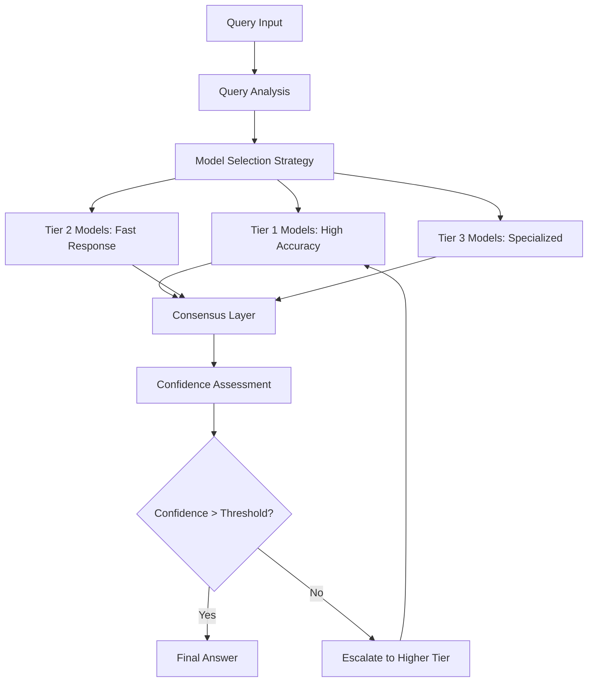

# Multi-Model Ensemble RAG Implementation

## Overview

This document provides comprehensive implementation guidance for multi-model ensemble approaches in RAG systems. The focus is on combining multiple language models, retrievers, and verification systems to achieve superior accuracy and reliability compared to single-model approaches.

## 1. Ensemble Architecture Patterns

### 1.1 Hierarchical Ensemble Pattern



### 1.2 Core Ensemble Implementation

```python
class MultiModelEnsembleRAG:
    def __init__(self):
        # Model tiers with different capabilities
        self.tier_1_models = {
            'gpt4_turbo': GPT4TurboModel(temperature=0.1),
            'claude_3_opus': Claude3OpusModel(temperature=0.1),
            'gemini_ultra': GeminiUltraModel(temperature=0.1)
        }
        
        self.tier_2_models = {
            'gpt3_5_turbo': GPT35TurboModel(temperature=0.2),
            'claude_3_haiku': Claude3HaikuModel(temperature=0.2),
            'llama2_70b': Llama2_70BModel(temperature=0.2)
        }
        
        self.specialized_models = {
            'medical_llm': MedicalSpecializedModel(),
            'financial_llm': FinancialSpecializedModel(),
            'technical_llm': TechnicalSpecializedModel()
        }
        
        # Ensemble components
        self.retrieval_ensemble = RetrievalEnsemble()
        self.consensus_engine = ConsensusEngine()
        self.confidence_estimator = ConfidenceEstimator()
        self.model_router = ModelRouter()
        
    async def generate_ensemble_answer(self, query, context=None):
        """
        Generate answer using multi-model ensemble approach
        """
        # Analyze query to determine optimal model selection
        query_analysis = await self.analyze_query(query, context)
        
        # Route to appropriate models based on query characteristics
        selected_models = self.model_router.select_models(query_analysis)
        
        # Perform ensemble retrieval
        retrieved_docs = await self.retrieval_ensemble.retrieve(query)
        
        # Generate answers from selected models in parallel
        model_outputs = await self.parallel_generation(
            query, retrieved_docs, selected_models
        )
        
        # Find consensus or handle disagreement
        consensus_result = await self.consensus_engine.find_consensus(
            model_outputs, query_analysis
        )
        
        # Estimate confidence and validate
        final_result = await self.validate_and_finalize(
            consensus_result, query_analysis
        )
        
        return final_result
    
    async def parallel_generation(self, query, retrieved_docs, selected_models):
        """
        Generate answers from multiple models in parallel
        """
        generation_tasks = []
        
        for model_name, model in selected_models.items():
            task = self.generate_with_model(
                model, model_name, query, retrieved_docs
            )
            generation_tasks.append(task)
        
        # Execute all generations with timeout
        results = await asyncio.gather(
            *generation_tasks, 
            return_exceptions=True,
            timeout=30.0
        )
        
        # Process results and handle exceptions
        model_outputs = {}
        for i, (model_name, _) in enumerate(selected_models.items()):
            result = results[i]
            if isinstance(result, Exception):
                self.logger.error(f"Model {model_name} failed: {result}")
                model_outputs[model_name] = None
            else:
                model_outputs[model_name] = result
        
        return model_outputs
    
    async def generate_with_model(self, model, model_name, query, retrieved_docs):
        """
        Generate answer with individual model including uncertainty estimation
        """
        # Generate multiple samples for uncertainty estimation
        samples = []
        sample_count = 3 if model_name in self.tier_1_models else 2
        
        for i in range(sample_count):
            sample = await model.generate_async(
                query=query,
                context=retrieved_docs,
                temperature=0.1 + (i * 0.1),  # Slight temperature variation
                max_tokens=500
            )
            samples.append(sample)
        
        # Analyze samples for consistency
        consistency_score = self.calculate_sample_consistency(samples)
        
        # Select best sample
        best_sample = await self.select_best_sample(samples, query)
        
        # Estimate model-specific confidence
        model_confidence = await self.estimate_model_confidence(
            model_name, best_sample, samples, consistency_score
        )
        
        return {
            'model': model_name,
            'answer': best_sample,
            'samples': samples,
            'consistency_score': consistency_score,
            'model_confidence': model_confidence,
            'generation_metadata': {
                'timestamp': time.time(),
                'model_version': model.version,
                'context_length': len(retrieved_docs)
            }
        }
```

### 1.3 Advanced Consensus Mechanisms

```python
class AdvancedConsensusEngine:
    def __init__(self):
        self.claim_analyzer = ClaimAnalyzer()
        self.fact_verifier = FactVerifier()
        self.disagreement_resolver = DisagreementResolver()
        self.confidence_calibrator = ConfidenceCalibrator()
        
    async def find_consensus(self, model_outputs, query_analysis):
        """
        Find consensus among model outputs using advanced algorithms
        """
        valid_outputs = {k: v for k, v in model_outputs.items() if v is not None}
        
        if len(valid_outputs) < 2:
            return await self.handle_single_model_response(valid_outputs, query_analysis)
        
        # Extract and analyze claims from each model
        model_claims = {}
        for model_name, output in valid_outputs.items():
            claims = await self.claim_analyzer.extract_claims(output['answer'])
            model_claims[model_name] = {
                'claims': claims,
                'confidence': output['model_confidence'],
                'consistency': output['consistency_score']
            }
        
        # Perform claim-level consensus analysis
        claim_consensus = await self.analyze_claim_consensus(model_claims)
        
        # Determine consensus strategy based on agreement level
        if claim_consensus.high_agreement:
            return await self.synthesize_high_agreement_response(
                valid_outputs, claim_consensus
            )
        elif claim_consensus.partial_agreement:
            return await self.handle_partial_agreement(
                valid_outputs, claim_consensus
            )
        else:
            return await self.resolve_major_disagreement(
                valid_outputs, claim_consensus, query_analysis
            )
    
    async def analyze_claim_consensus(self, model_claims):
        """
        Analyze consensus at the claim level across models
        """
        # Collect all unique claims
        all_claims = []
        claim_support = {}  # claim -> list of supporting models
        
        for model_name, model_data in model_claims.items():
            for claim in model_data['claims']:
                claim_text = claim['text']
                if claim_text not in claim_support:
                    claim_support[claim_text] = []
                    all_claims.append(claim)
                
                # Weight support by model confidence and consistency
                support_weight = (
                    model_data['confidence'] * 0.6 + 
                    model_data['consistency'] * 0.4
                )
                
                claim_support[claim_text].append({
                    'model': model_name,
                    'weight': support_weight,
                    'confidence': claim['confidence']
                })
        
        # Analyze agreement levels for each claim
        consensus_analysis = []
        for claim in all_claims:
            claim_text = claim['text']
            supporters = claim_support[claim_text]
            
            # Calculate weighted support score
            total_weight = sum(s['weight'] for s in supporters)
            avg_confidence = sum(s['confidence'] for s in supporters) / len(supporters)
            
            consensus_analysis.append({
                'claim': claim,
                'support_weight': total_weight,
                'support_count': len(supporters),
                'avg_confidence': avg_confidence,
                'supporters': supporters,
                'agreement_level': self.categorize_agreement_level(
                    len(supporters), total_weight, len(model_claims)
                )
            })
        
        # Overall consensus metrics
        high_agreement_claims = [c for c in consensus_analysis if c['agreement_level'] == 'high']
        partial_agreement_claims = [c for c in consensus_analysis if c['agreement_level'] == 'partial']
        disputed_claims = [c for c in consensus_analysis if c['agreement_level'] == 'disputed']
        
        return ClaimConsensusResult(
            high_agreement=len(high_agreement_claims) >= len(consensus_analysis) * 0.7,
            partial_agreement=len(partial_agreement_claims) >= len(consensus_analysis) * 0.4,
            consensus_claims=high_agreement_claims,
            disputed_claims=disputed_claims,
            overall_agreement_score=self.calculate_overall_agreement(consensus_analysis)
        )
    
    async def resolve_major_disagreement(self, model_outputs, claim_consensus, query_analysis):
        """
        Resolve major disagreements between models
        """
        # Strategy 1: Use external fact verification
        external_verification = await self.get_external_verification(
            claim_consensus.disputed_claims
        )
        
        if external_verification.high_confidence_resolution:
            return await self.synthesize_externally_verified_response(
                model_outputs, external_verification
            )
        
        # Strategy 2: Model-specific expertise weighting
        domain_weights = self.calculate_domain_expertise_weights(
            model_outputs.keys(), query_analysis.domain
        )
        
        weighted_consensus = await self.apply_expertise_weighting(
            claim_consensus, domain_weights
        )
        
        if weighted_consensus.sufficient_confidence:
            return await self.synthesize_weighted_response(
                model_outputs, weighted_consensus
            )
        
        # Strategy 3: Transparent disagreement reporting
        return await self.create_disagreement_report(
            model_outputs, claim_consensus, query_analysis
        )
    
    async def create_disagreement_report(self, model_outputs, claim_consensus, query_analysis):
        """
        Create transparent report when models significantly disagree
        """
        disagreement_summary = await self.summarize_disagreements(
            claim_consensus.disputed_claims
        )
        
        # Group models by their positions on key disputed claims
        position_groups = await self.group_models_by_position(
            model_outputs, claim_consensus.disputed_claims
        )
        
        # Generate balanced response that presents multiple perspectives
        balanced_response = await self.generate_balanced_response(
            position_groups, disagreement_summary
        )
        
        return ConsensusResult(
            answer=balanced_response,
            consensus_type='transparent_disagreement',
            confidence=0.4,  # Low confidence due to disagreement
            agreement_score=claim_consensus.overall_agreement_score,
            metadata={
                'disagreement_summary': disagreement_summary,
                'model_positions': position_groups,
                'resolution_strategy': 'transparent_reporting'
            }
        )
```

## 2. Retrieval Ensemble Implementation

### 2.1 Multi-Retriever Architecture

```python
class RetrievalEnsemble:
    def __init__(self):
        # Different retrieval strategies
        self.dense_retriever = DenseRetriever(
            model='text-embedding-3-large',
            index_type='faiss'
        )
        
        self.sparse_retriever = SparseRetriever(
            algorithm='bm25_plus',
            expansion=True
        )
        
        self.hybrid_retriever = HybridRetriever(
            dense_weight=0.6,
            sparse_weight=0.4
        )
        
        self.graph_retriever = GraphRetriever(
            knowledge_graph='wikidata',
            max_hops=2
        )
        
        # Fusion and ranking
        self.result_fusion = ResultFusion()
        self.cross_encoder_reranker = CrossEncoderReranker()
        self.diversity_optimizer = DiversityOptimizer()
        
    async def retrieve(self, query, k=20, strategy='adaptive'):
        """
        Perform ensemble retrieval using multiple strategies
        """
        if strategy == 'adaptive':
            strategy = await self.select_optimal_strategy(query)
        
        # Execute retrieval strategies in parallel
        retrieval_tasks = []
        
        if 'dense' in strategy:
            task = self.dense_retriever.retrieve_async(query, k=k)
            retrieval_tasks.append(('dense', task))
        
        if 'sparse' in strategy:
            task = self.sparse_retriever.retrieve_async(query, k=k)
            retrieval_tasks.append(('sparse', task))
        
        if 'hybrid' in strategy:
            task = self.hybrid_retriever.retrieve_async(query, k=k)
            retrieval_tasks.append(('hybrid', task))
        
        if 'graph' in strategy:
            task = self.graph_retriever.retrieve_async(query, k=k//2)
            retrieval_tasks.append(('graph', task))
        
        # Collect results
        retrieval_results = {}
        for strategy_name, task in retrieval_tasks:
            try:
                results = await task
                retrieval_results[strategy_name] = results
            except Exception as e:
                self.logger.error(f"Retrieval strategy {strategy_name} failed: {e}")
                retrieval_results[strategy_name] = []
        
        # Fuse and rank results
        fused_results = await self.result_fusion.fuse_results(
            retrieval_results, query
        )
        
        # Re-rank with cross-encoder
        reranked_results = await self.cross_encoder_reranker.rerank(
            query, fused_results, top_k=k
        )
        
        # Optimize for diversity
        final_results = await self.diversity_optimizer.optimize_diversity(
            reranked_results, query, diversity_threshold=0.8
        )
        
        return final_results[:k]
    
    async def select_optimal_strategy(self, query):
        """
        Select optimal retrieval strategy based on query characteristics
        """
        query_features = await self.analyze_query_features(query)
        
        strategy_scores = {
            'dense': 0.0,
            'sparse': 0.0,
            'hybrid': 0.0,
            'graph': 0.0
        }
        
        # Score strategies based on query features
        if query_features.has_entities:
            strategy_scores['graph'] += 0.3
            strategy_scores['dense'] += 0.2
        
        if query_features.is_factual:
            strategy_scores['sparse'] += 0.2
            strategy_scores['hybrid'] += 0.3
        
        if query_features.is_semantic:
            strategy_scores['dense'] += 0.4
            strategy_scores['hybrid'] += 0.2
        
        if query_features.is_complex:
            strategy_scores['hybrid'] += 0.3
            # Use multiple strategies for complex queries
            selected_strategies = [
                strategy for strategy, score in strategy_scores.items()
                if score >= 0.2
            ]
        else:
            # Use top-scoring strategy for simple queries
            top_strategy = max(strategy_scores.items(), key=lambda x: x[1])
            selected_strategies = [top_strategy[0]]
        
        return selected_strategies
```

### 2.2 Advanced Result Fusion

```python
class AdvancedResultFusion:
    def __init__(self):
        self.reciprocal_rank_fusion = ReciprocalRankFusion()
        self.weighted_fusion = WeightedFusion()
        self.learning_fusion = LearningToRankFusion()
        self.contextual_fusion = ContextualFusion()
        
    async def fuse_results(self, retrieval_results, query, fusion_method='adaptive'):
        """
        Fuse results from multiple retrieval strategies
        """
        if fusion_method == 'adaptive':
            fusion_method = await self.select_fusion_method(retrieval_results, query)
        
        if fusion_method == 'reciprocal_rank':
            return await self.reciprocal_rank_fusion.fuse(retrieval_results)
        elif fusion_method == 'weighted':
            return await self.weighted_fusion.fuse(retrieval_results, query)
        elif fusion_method == 'learning_to_rank':
            return await self.learning_fusion.fuse(retrieval_results, query)
        else:  # contextual
            return await self.contextual_fusion.fuse(retrieval_results, query)
    
    async def contextual_fusion(self, retrieval_results, query):
        """
        Context-aware fusion that considers query intent and document relevance
        """
        # Analyze query context
        query_context = await self.analyze_query_context(query)
        
        # Score each document from each retriever
        fused_scores = {}
        for strategy_name, documents in retrieval_results.items():
            strategy_weight = self.get_strategy_weight(strategy_name, query_context)
            
            for rank, doc in enumerate(documents):
                doc_id = doc.id
                
                # Base score from retriever
                base_score = doc.score if hasattr(doc, 'score') else 1.0 / (rank + 1)
                
                # Context relevance score
                context_score = await self.calculate_context_relevance(
                    doc, query_context
                )
                
                # Combined score
                combined_score = (base_score * strategy_weight * context_score)
                
                if doc_id not in fused_scores:
                    fused_scores[doc_id] = {
                        'document': doc,
                        'scores': {},
                        'total_score': 0.0
                    }
                
                fused_scores[doc_id]['scores'][strategy_name] = combined_score
                fused_scores[doc_id]['total_score'] += combined_score
        
        # Sort by total score and return
        sorted_docs = sorted(
            fused_scores.values(),
            key=lambda x: x['total_score'],
            reverse=True
        )
        
        return [item['document'] for item in sorted_docs]
    
    async def calculate_context_relevance(self, document, query_context):
        """
        Calculate document relevance based on query context
        """
        relevance_score = 0.0
        
        # Entity overlap
        doc_entities = self.extract_entities(document.content)
        entity_overlap = len(set(query_context.entities) & set(doc_entities))
        relevance_score += entity_overlap * 0.3
        
        # Topic alignment
        doc_topics = self.extract_topics(document.content)
        topic_alignment = self.calculate_topic_similarity(
            query_context.topics, doc_topics
        )
        relevance_score += topic_alignment * 0.4
        
        # Temporal relevance
        if query_context.temporal_constraints:
            temporal_relevance = self.calculate_temporal_relevance(
                document, query_context.temporal_constraints
            )
            relevance_score += temporal_relevance * 0.2
        
        # Source authority
        source_authority = self.get_source_authority(document.source)
        relevance_score += source_authority * 0.1
        
        return min(relevance_score, 1.0)  # Cap at 1.0
```

## 3. Model-Specific Optimization

### 3.1 Dynamic Model Selection

```python
class DynamicModelSelector:
    def __init__(self):
        self.model_capabilities = self.load_model_capabilities()
        self.performance_tracker = ModelPerformanceTracker()
        self.cost_optimizer = CostOptimizer()
        self.latency_tracker = LatencyTracker()
        
    def load_model_capabilities(self):
        """
        Define capabilities and characteristics of each model
        """
        return {
            'gpt4_turbo': {
                'strengths': ['reasoning', 'code', 'analysis'],
                'weaknesses': ['cost', 'speed'],
                'domains': ['general', 'technical', 'scientific'],
                'max_context': 128000,
                'cost_per_token': 0.00003,
                'avg_latency': 3.5
            },
            'claude_3_opus': {
                'strengths': ['reasoning', 'writing', 'analysis'],
                'weaknesses': ['cost', 'availability'],
                'domains': ['general', 'creative', 'analytical'],
                'max_context': 200000,
                'cost_per_token': 0.000015,
                'avg_latency': 4.2
            },
            'gpt3_5_turbo': {
                'strengths': ['speed', 'cost', 'general'],
                'weaknesses': ['complex_reasoning', 'context'],
                'domains': ['general', 'simple_tasks'],
                'max_context': 16000,
                'cost_per_token': 0.0000015,
                'avg_latency': 1.2
            },
            'llama2_70b': {
                'strengths': ['cost', 'privacy', 'customization'],
                'weaknesses': ['accuracy', 'knowledge_cutoff'],
                'domains': ['general', 'privacy_sensitive'],
                'max_context': 4096,
                'cost_per_token': 0.0,
                'avg_latency': 2.1
            }
        }
    
    async def select_optimal_models(self, query_analysis, constraints=None):
        """
        Select optimal models based on query characteristics and constraints
        """
        constraints = constraints or {}
        
        # Score each model for this specific query
        model_scores = {}
        for model_name, capabilities in self.model_capabilities.items():
            score = await self.calculate_model_score(
                model_name, capabilities, query_analysis, constraints
            )
            model_scores[model_name] = score
        
        # Select models based on strategy
        selection_strategy = constraints.get('strategy', 'quality_focused')
        
        if selection_strategy == 'quality_focused':
            # Select top 2-3 highest-scoring models
            top_models = sorted(
                model_scores.items(), 
                key=lambda x: x[1], 
                reverse=True
            )[:3]
            
        elif selection_strategy == 'cost_optimized':
            # Balance quality and cost
            cost_adjusted_scores = {}
            for model_name, score in model_scores.items():
                cost = self.model_capabilities[model_name]['cost_per_token']
                # Penalize high-cost models
                adjusted_score = score / (1 + cost * 10000)
                cost_adjusted_scores[model_name] = adjusted_score
            
            top_models = sorted(
                cost_adjusted_scores.items(),
                key=lambda x: x[1],
                reverse=True
            )[:2]
            
        elif selection_strategy == 'speed_focused':
            # Prioritize low-latency models
            latency_adjusted_scores = {}
            for model_name, score in model_scores.items():
                latency = self.model_capabilities[model_name]['avg_latency']
                # Penalize high-latency models
                adjusted_score = score / (1 + latency * 0.2)
                latency_adjusted_scores[model_name] = adjusted_score
            
            top_models = sorted(
                latency_adjusted_scores.items(),
                key=lambda x: x[1],
                reverse=True
            )[:2]
        
        else:  # 'balanced'
            # Balance quality, cost, and speed
            balanced_scores = await self.calculate_balanced_scores(
                model_scores, query_analysis
            )
            top_models = sorted(
                balanced_scores.items(),
                key=lambda x: x[1],
                reverse=True
            )[:3]
        
        # Return selected models with their configurations
        selected_models = {}
        for model_name, score in top_models:
            if score > 0.3:  # Minimum threshold
                model_config = await self.get_model_configuration(
                    model_name, query_analysis
                )
                selected_models[model_name] = model_config
        
        return selected_models
    
    async def calculate_model_score(self, model_name, capabilities, query_analysis, constraints):
        """
        Calculate score for a model based on query characteristics
        """
        base_score = 0.0
        
        # Domain alignment
        domain_score = 0.0
        if query_analysis.domain in capabilities['domains']:
            domain_score = 1.0
        elif 'general' in capabilities['domains']:
            domain_score = 0.5
        
        base_score += domain_score * 0.3
        
        # Capability alignment
        capability_score = 0.0
        for strength in capabilities['strengths']:
            if strength in query_analysis.required_capabilities:
                capability_score += 0.2
        
        base_score += min(capability_score, 1.0) * 0.4
        
        # Context length requirement
        if query_analysis.estimated_context_length <= capabilities['max_context']:
            context_score = 1.0
        else:
            context_score = 0.0  # Cannot handle this query
        
        base_score += context_score * 0.2
        
        # Historical performance
        historical_performance = await self.performance_tracker.get_performance(
            model_name, query_analysis.domain
        )
        
        base_score += historical_performance * 0.1
        
        return base_score
```

### 3.2 Model Performance Tracking

```python
class ModelPerformanceTracker:
    def __init__(self):
        self.performance_db = PerformanceDatabase()
        self.metrics_calculator = MetricsCalculator()
        self.trend_analyzer = TrendAnalyzer()
        
    async def track_model_performance(self, model_name, query, response, metrics):
        """
        Track performance metrics for a specific model
        """
        performance_record = {
            'model_name': model_name,
            'query_hash': self.hash_query(query),
            'query_characteristics': self.analyze_query_characteristics(query),
            'response_quality': metrics.get('response_quality', 0.0),
            'factual_accuracy': metrics.get('factual_accuracy', 0.0),
            'relevance_score': metrics.get('relevance_score', 0.0),
            'consistency_score': metrics.get('consistency_score', 0.0),
            'latency': metrics.get('latency', 0.0),
            'cost': metrics.get('cost', 0.0),
            'timestamp': time.time()
        }
        
        await self.performance_db.store_record(performance_record)
        
        # Update model performance statistics
        await self.update_model_statistics(model_name, performance_record)
    
    async def get_performance(self, model_name, domain=None, time_window=7*24*3600):
        """
        Get recent performance metrics for a model
        """
        # Query performance records
        recent_records = await self.performance_db.query_records(
            model_name=model_name,
            domain=domain,
            since=time.time() - time_window
        )
        
        if not recent_records:
            return 0.5  # Default neutral score
        
        # Calculate weighted average performance
        total_weight = 0
        weighted_score = 0
        
        for record in recent_records:
            # Weight recent records more heavily
            age_weight = 1.0 - (time.time() - record['timestamp']) / time_window
            
            # Composite performance score
            composite_score = (
                record['response_quality'] * 0.3 +
                record['factual_accuracy'] * 0.3 +
                record['relevance_score'] * 0.2 +
                record['consistency_score'] * 0.2
            )
            
            weighted_score += composite_score * age_weight
            total_weight += age_weight
        
        return weighted_score / total_weight if total_weight > 0 else 0.5
    
    async def compare_model_performance(self, models, domain=None, metric='overall'):
        """
        Compare performance of multiple models
        """
        performance_comparison = {}
        
        for model_name in models:
            if metric == 'overall':
                performance = await self.get_performance(model_name, domain)
            else:
                performance = await self.get_specific_metric_performance(
                    model_name, domain, metric
                )
            
            performance_comparison[model_name] = performance
        
        # Rank models by performance
        ranked_models = sorted(
            performance_comparison.items(),
            key=lambda x: x[1],
            reverse=True
        )
        
        return ranked_models
    
    async def detect_performance_degradation(self, model_name, threshold=0.1):
        """
        Detect if a model's performance is degrading
        """
        # Get recent performance trends
        trend_data = await self.trend_analyzer.analyze_performance_trend(
            model_name, time_window=30*24*3600  # 30 days
        )
        
        if trend_data.trend_direction == 'declining':
            if abs(trend_data.trend_magnitude) > threshold:
                return {
                    'degradation_detected': True,
                    'severity': 'high' if trend_data.trend_magnitude > 0.2 else 'medium',
                    'trend_magnitude': trend_data.trend_magnitude,
                    'recommended_action': 'investigate_and_possibly_exclude'
                }
        
        return {'degradation_detected': False}
```

## 4. Quality Assurance and Validation

### 4.1 Ensemble Quality Metrics

```python
class EnsembleQualityAssurance:
    def __init__(self):
        self.accuracy_evaluator = AccuracyEvaluator()
        self.consistency_checker = ConsistencyChecker()
        self.diversity_analyzer = DiversityAnalyzer()
        self.bias_detector = BiasDetector()
        
    async def evaluate_ensemble_quality(self, ensemble_result, ground_truth=None):
        """
        Comprehensive quality evaluation of ensemble results
        """
        quality_metrics = {}
        
        # Accuracy metrics (if ground truth available)
        if ground_truth:
            accuracy_metrics = await self.accuracy_evaluator.evaluate(
                ensemble_result, ground_truth
            )
            quality_metrics.update(accuracy_metrics)
        
        # Consistency metrics
        consistency_metrics = await self.consistency_checker.check_consistency(
            ensemble_result
        )
        quality_metrics.update(consistency_metrics)
        
        # Diversity metrics
        diversity_metrics = await self.diversity_analyzer.analyze_diversity(
            ensemble_result
        )
        quality_metrics.update(diversity_metrics)
        
        # Bias detection
        bias_metrics = await self.bias_detector.detect_bias(
            ensemble_result
        )
        quality_metrics.update(bias_metrics)
        
        # Overall quality score
        quality_metrics['overall_quality_score'] = self.calculate_overall_quality(
            quality_metrics
        )
        
        return quality_metrics
    
    async def validate_ensemble_configuration(self, ensemble_config):
        """
        Validate ensemble configuration for potential issues
        """
        validation_results = {
            'valid': True,
            'warnings': [],
            'errors': []
        }
        
        # Check model diversity
        model_types = [config['type'] for config in ensemble_config.values()]
        if len(set(model_types)) < 2:
            validation_results['warnings'].append(
                "Low model diversity - consider using different model architectures"
            )
        
        # Check for potential bias amplification
        bias_risk = await self.assess_bias_amplification_risk(ensemble_config)
        if bias_risk > 0.7:
            validation_results['warnings'].append(
                "High bias amplification risk detected"
            )
        
        # Check cost efficiency
        cost_analysis = await self.analyze_cost_efficiency(ensemble_config)
        if cost_analysis['cost_per_quality'] > 1.5:
            validation_results['warnings'].append(
                "Ensemble configuration may be cost-inefficient"
            )
        
        # Check latency requirements
        expected_latency = max([
            config.get('expected_latency', 0) 
            for config in ensemble_config.values()
        ])
        if expected_latency > 10.0:  # 10 seconds threshold
            validation_results['errors'].append(
                "Expected ensemble latency exceeds acceptable threshold"
            )
            validation_results['valid'] = False
        
        return validation_results
```

## 5. Implementation Checklist

### 5.1 Core Components
- [ ] Multi-tier model architecture (Tier 1, 2, specialized)
- [ ] Parallel generation system with timeout handling
- [ ] Advanced consensus engine with claim-level analysis
- [ ] Retrieval ensemble with multiple strategies
- [ ] Dynamic model selection based on query characteristics
- [ ] Model performance tracking and optimization
- [ ] Quality assurance and validation framework

### 5.2 Advanced Features
- [ ] Real-time model performance monitoring
- [ ] Adaptive strategy selection
- [ ] Cost optimization algorithms
- [ ] Bias detection and mitigation
- [ ] A/B testing for ensemble configurations
- [ ] Automated model replacement based on performance
- [ ] Custom domain-specific model integration

### 5.3 Performance Optimization
- [ ] Async parallel processing
- [ ] Model result caching
- [ ] Intelligent model routing
- [ ] Resource usage monitoring
- [ ] Latency optimization
- [ ] Cost tracking and budgeting

## 6. Deployment Strategy

### 6.1 Phased Rollout

**Phase 1: Basic Ensemble (Week 1-2)**
- Implement 2-3 model ensemble
- Basic consensus mechanism
- Simple performance tracking

**Phase 2: Advanced Features (Week 3-4)**
- Add specialized models
- Implement retrieval ensemble
- Deploy quality assurance framework

**Phase 3: Optimization (Week 5-6)**
- Enable adaptive model selection
- Implement cost optimization
- Add comprehensive monitoring

### 6.2 Success Metrics

- **Accuracy Improvement**: 15-25% over single-model baseline
- **Consistency Score**: >90% across ensemble members
- **Cost Efficiency**: <30% cost increase for quality gains
- **Response Time**: <5 seconds for ensemble consensus
- **Model Agreement**: >80% on high-confidence responses

## Conclusion

This multi-model ensemble implementation provides a robust framework for achieving superior RAG performance through intelligent model combination, advanced consensus mechanisms, and continuous optimization. The key to success lies in proper model selection, effective consensus algorithms, and ongoing performance monitoring to ensure the ensemble continues to deliver high-quality, reliable responses.