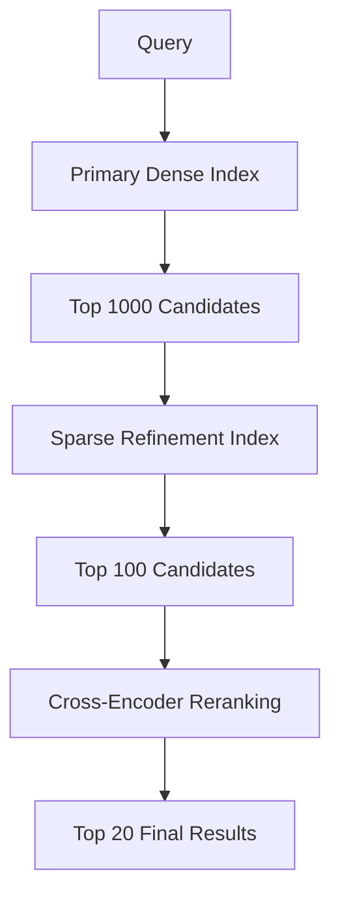

# Vector Database Patterns for High-Accuracy RAG

## Overview

This document details specific vector database configuration patterns optimized for accuracy and performance in RAG systems. These patterns focus on multi-index strategies, advanced retrieval algorithms, and optimization techniques.

## 1. Multi-Index Architecture Patterns

### 1.1 Hierarchical Index Pattern



**Configuration:**
```yaml
hierarchical_indices:
  level_1_dense:
    embedding_model: "text-embedding-3-large"
    dimensions: 3072
    similarity_metric: "cosine"
    index_type: "hnsw"
    hnsw_config:
      m: 16
      ef_construction: 512
      ef_search: 256
    
  level_2_sparse:
    algorithm: "bm25"
    k1: 1.2
    b: 0.75
    enable_stopwords: true
    custom_analyzer: "domain_specific"
    
  level_3_reranker:
    model: "cross-encoder/ms-marco-MiniLM-L-6-v2"
    max_candidates: 100
    batch_size: 32
```

### 1.2 Federated Index Pattern

```python
class FederatedVectorDatabase:
    def __init__(self):
        self.indices = {
            'general': GeneralKnowledgeIndex(),
            'domain_specific': DomainSpecificIndex(),
            'recent': RecentKnowledgeIndex(),
            'authoritative': AuthoritativeSourcesIndex()
        }
        self.fusion_strategy = IndexFusionStrategy()
    
    def federated_search(self, query, domain_hint=None):
        # Determine which indices to query
        active_indices = self.select_indices(query, domain_hint)
        
        # Parallel search across selected indices
        search_results = {}
        for index_name, index in active_indices.items():
            results = index.search(query, k=50)
            search_results[index_name] = {
                'results': results,
                'weight': self.calculate_index_weight(index_name, query)
            }
        
        # Fuse results with weighted scoring
        fused_results = self.fusion_strategy.fuse(search_results)
        return fused_results
    
    def calculate_index_weight(self, index_name, query):
        # Dynamic weighting based on query characteristics
        weights = {
            'general': 0.3,
            'domain_specific': 0.4,
            'recent': 0.2,
            'authoritative': 0.1
        }
        
        # Adjust weights based on query analysis
        query_analysis = self.analyze_query(query)
        
        if query_analysis.requires_recent_info:
            weights['recent'] *= 2.0
        
        if query_analysis.domain == 'technical':
            weights['domain_specific'] *= 1.5
            
        return weights.get(index_name, 0.1)
```

### 1.3 Temporal Index Strategy

```yaml
temporal_indexing:
  time_aware_embeddings:
    include_temporal_features: true
    temporal_decay_factor: 0.95
    time_granularity: "monthly"
    
  time_partitioned_indices:
    recent_index:
      time_range: "last_3_months"
      update_frequency: "daily"
      boost_factor: 1.3
      
    historical_index:
      time_range: "older_than_3_months"
      update_frequency: "weekly"
      boost_factor: 0.8
      
    evergreen_index:
      content_type: "definitional"
      time_sensitivity: false
      boost_factor: 1.1
```

## 2. Advanced Embedding Strategies

### 2.1 Multi-Representation Embeddings

```python
class MultiRepresentationEmbedder:
    def __init__(self):
        self.sentence_embedder = SentenceTransformer('all-mpnet-base-v2')
        self.paragraph_embedder = SentenceTransformer('all-MiniLM-L12-v2')
        self.document_embedder = DocumentTransformer()
        self.entity_embedder = EntityEmbedder()
    
    def create_multi_representation(self, document):
        representations = {
            # Sentence-level embeddings
            'sentences': [
                self.sentence_embedder.encode(sent) 
                for sent in self.split_sentences(document)
            ],
            
            # Paragraph-level embeddings
            'paragraphs': [
                self.paragraph_embedder.encode(para)
                for para in self.split_paragraphs(document)
            ],
            
            # Document-level embedding
            'document': self.document_embedder.encode(document),
            
            # Entity embeddings
            'entities': [
                self.entity_embedder.encode(entity)
                for entity in self.extract_entities(document)
            ]
        }
        
        return representations
    
    def hierarchical_search(self, query, representations, k=10):
        query_embedding = self.sentence_embedder.encode(query)
        
        # Stage 1: Document-level filtering
        doc_scores = cosine_similarity([query_embedding], 
                                     [rep['document'] for rep in representations])
        top_docs = np.argsort(doc_scores[0])[-k*3:]  # Get top 3k documents
        
        # Stage 2: Paragraph-level refinement
        para_candidates = []
        for doc_idx in top_docs:
            for para_emb in representations[doc_idx]['paragraphs']:
                score = cosine_similarity([query_embedding], [para_emb])[0][0]
                para_candidates.append((doc_idx, para_emb, score))
        
        # Stage 3: Sentence-level precision
        sentence_results = []
        top_paras = sorted(para_candidates, key=lambda x: x[2])[-k*2:]
        
        for doc_idx, _, _ in top_paras:
            for sent_emb in representations[doc_idx]['sentences']:
                score = cosine_similarity([query_embedding], [sent_emb])[0][0]
                sentence_results.append((doc_idx, sent_emb, score))
        
        return sorted(sentence_results, key=lambda x: x[2])[-k:]
```

### 2.2 Domain-Adaptive Embeddings

```python
class DomainAdaptiveEmbedder:
    def __init__(self, base_model):
        self.base_model = base_model
        self.domain_adapters = {}
        self.domain_classifier = DomainClassifier()
    
    def adapt_to_domain(self, domain_name, domain_corpus):
        # Create domain-specific adapter
        adapter = DomainAdapter(self.base_model)
        adapter.train(domain_corpus)
        self.domain_adapters[domain_name] = adapter
    
    def encode_with_domain_adaptation(self, text):
        # Classify domain
        domain = self.domain_classifier.classify(text)
        
        # Use appropriate adapter
        if domain in self.domain_adapters:
            adapter = self.domain_adapters[domain]
            return adapter.encode(text)
        else:
            return self.base_model.encode(text)
    
    def multi_domain_search(self, query, domain_specific_indices):
        # Generate embeddings for each potential domain
        domain_embeddings = {}
        for domain in domain_specific_indices.keys():
            if domain in self.domain_adapters:
                embedding = self.domain_adapters[domain].encode(query)
            else:
                embedding = self.base_model.encode(query)
            domain_embeddings[domain] = embedding
        
        # Search in each domain-specific index
        domain_results = {}
        for domain, embedding in domain_embeddings.items():
            index = domain_specific_indices[domain]
            results = index.search(embedding, k=20)
            domain_results[domain] = results
        
        # Fuse results across domains
        return self.fuse_domain_results(domain_results, query)
```

## 3. Retrieval Optimization Patterns

### 3.1 Adaptive Retrieval Strategy

```python
class AdaptiveRetrievalStrategy:
    def __init__(self):
        self.query_analyzer = QueryAnalyzer()
        self.performance_tracker = PerformanceTracker()
        self.strategy_selector = StrategySelector()
    
    def adaptive_retrieve(self, query, k=10):
        # Analyze query characteristics
        query_profile = self.query_analyzer.analyze(query)
        
        # Select optimal retrieval strategy
        strategy = self.strategy_selector.select_strategy(query_profile)
        
        if strategy == 'dense_focused':
            return self.dense_retrieval(query, k)
        elif strategy == 'sparse_broad':
            return self.sparse_retrieval(query, k)
        elif strategy == 'hybrid_balanced':
            return self.hybrid_retrieval(query, k)
        elif strategy == 'multi_stage':
            return self.multi_stage_retrieval(query, k)
        else:
            return self.ensemble_retrieval(query, k)
    
    def dense_retrieval(self, query, k):
        # Optimized for semantic similarity
        embedding = self.embedder.encode(query)
        results = self.vector_index.search(embedding, k=k*2)
        
        # Apply semantic filtering
        filtered_results = self.semantic_filter(query, results)
        return filtered_results[:k]
    
    def hybrid_retrieval(self, query, k):
        # Combine dense and sparse retrieval
        dense_results = self.dense_retrieval(query, k//2)
        sparse_results = self.sparse_retrieval(query, k//2)
        
        # Intelligent fusion
        return self.reciprocal_rank_fusion(dense_results, sparse_results, k)
    
    def reciprocal_rank_fusion(self, list1, list2, k):
        # RRF with dynamic weight adjustment
        rrf_scores = {}
        
        for rank, doc in enumerate(list1):
            rrf_scores[doc.id] = rrf_scores.get(doc.id, 0) + 1/(60 + rank)
        
        for rank, doc in enumerate(list2):
            rrf_scores[doc.id] = rrf_scores.get(doc.id, 0) + 1/(60 + rank)
        
        # Sort by RRF score and return top k
        sorted_docs = sorted(rrf_scores.items(), key=lambda x: x[1], reverse=True)
        return [self.get_document(doc_id) for doc_id, _ in sorted_docs[:k]]
```

### 3.2 Context-Aware Retrieval

```python
class ContextAwareRetriever:
    def __init__(self):
        self.context_tracker = ConversationContextTracker()
        self.relevance_model = RelevanceModel()
        self.query_expander = ContextualQueryExpander()
    
    def retrieve_with_context(self, query, conversation_history=None, k=10):
        # Build context from conversation history
        context = self.context_tracker.build_context(conversation_history)
        
        # Expand query with contextual information
        expanded_query = self.query_expander.expand(query, context)
        
        # Retrieve with context-aware scoring
        candidates = self.base_retrieve(expanded_query, k*3)
        
        # Re-rank with context relevance
        context_scored = []
        for candidate in candidates:
            context_relevance = self.relevance_model.score_relevance(
                candidate, query, context
            )
            candidate.context_score = context_relevance
            context_scored.append(candidate)
        
        # Final ranking combining similarity and context relevance
        final_ranking = sorted(
            context_scored,
            key=lambda x: x.similarity_score * 0.7 + x.context_score * 0.3,
            reverse=True
        )
        
        return final_ranking[:k]
```

## 4. Performance Optimization Patterns

### 4.1 Intelligent Caching Strategy

```python
class IntelligentVectorCache:
    def __init__(self):
        self.embedding_cache = EmbeddingCache(max_size=10000)
        self.result_cache = ResultCache(max_size=5000)
        self.similarity_cache = SimilarityCache()
        self.cache_optimizer = CacheOptimizer()
    
    def cached_search(self, query, k=10):
        # Check for exact query match
        cache_key = self.generate_cache_key(query, k)
        cached_result = self.result_cache.get(cache_key)
        
        if cached_result and self.is_cache_valid(cached_result):
            return cached_result
        
        # Check for similar queries
        similar_queries = self.similarity_cache.find_similar(query, threshold=0.9)
        if similar_queries:
            # Adapt cached result for similar query
            base_result = similar_queries[0]['result']
            adapted_result = self.adapt_cached_result(base_result, query)
            self.result_cache.set(cache_key, adapted_result)
            return adapted_result
        
        # Check for cached embeddings
        query_embedding = self.embedding_cache.get(query)
        if query_embedding is None:
            query_embedding = self.embedder.encode(query)
            self.embedding_cache.set(query, query_embedding)
        
        # Perform search with cached embedding
        results = self.vector_index.search(query_embedding, k)
        
        # Cache the results
        self.result_cache.set(cache_key, results)
        self.similarity_cache.add(query, results)
        
        return results
    
    def optimize_cache_performance(self):
        # Analyze cache performance and optimize
        stats = self.cache_optimizer.analyze_performance()
        
        if stats.hit_rate < 0.6:
            # Increase cache size or adjust similarity threshold
            self.similarity_cache.adjust_threshold(stats.optimal_threshold)
        
        if stats.memory_usage > 0.8:
            # Implement intelligent eviction
            self.cache_optimizer.smart_eviction()
```

### 4.2 Batch Processing Optimization

```python
class BatchVectorProcessor:
    def __init__(self, batch_size=32):
        self.batch_size = batch_size
        self.embedding_model = self.load_embedding_model()
        self.vector_index = self.load_vector_index()
    
    def batch_embed_and_index(self, documents):
        # Process documents in batches for efficiency
        for i in range(0, len(documents), self.batch_size):
            batch = documents[i:i+self.batch_size]
            
            # Batch embedding generation
            texts = [doc.content for doc in batch]
            embeddings = self.embedding_model.encode(texts, batch_size=self.batch_size)
            
            # Batch indexing
            doc_ids = [doc.id for doc in batch]
            self.vector_index.add_batch(embeddings, doc_ids)
        
        # Optimize index after batch insertion
        self.vector_index.optimize()
    
    def batch_search(self, queries, k=10):
        # Generate query embeddings in batch
        query_embeddings = self.embedding_model.encode(queries, batch_size=self.batch_size)
        
        # Batch search
        all_results = self.vector_index.batch_search(query_embeddings, k=k)
        
        # Post-process results
        processed_results = []
        for i, results in enumerate(all_results):
            query = queries[i]
            processed_result = self.post_process_results(query, results)
            processed_results.append(processed_result)
        
        return processed_results
```

## 5. Quality Assurance Patterns

### 5.1 Embedding Quality Validation

```python
class EmbeddingQualityValidator:
    def __init__(self):
        self.quality_metrics = QualityMetrics()
        self.benchmark_queries = self.load_benchmark_queries()
    
    def validate_embedding_quality(self, embedding_model, test_corpus):
        # Test semantic similarity preservation
        similarity_test = self.test_semantic_similarity(embedding_model, test_corpus)
        
        # Test retrieval accuracy
        retrieval_test = self.test_retrieval_accuracy(embedding_model)
        
        # Test domain specificity
        domain_test = self.test_domain_specificity(embedding_model)
        
        # Compile quality report
        quality_report = {
            'semantic_similarity_score': similarity_test.score,
            'retrieval_accuracy': retrieval_test.accuracy,
            'domain_specificity': domain_test.specificity,
            'overall_quality': self.calculate_overall_quality([
                similarity_test.score,
                retrieval_test.accuracy,
                domain_test.specificity
            ])
        }
        
        return quality_report
    
    def test_retrieval_accuracy(self, embedding_model):
        # Use benchmark queries with known relevant documents
        total_queries = len(self.benchmark_queries)
        correct_retrievals = 0
        
        for query_data in self.benchmark_queries:
            query = query_data['query']
            expected_docs = query_data['relevant_docs']
            
            # Perform retrieval
            retrieved_docs = self.retrieve_with_model(embedding_model, query)
            
            # Calculate precision and recall
            precision, recall = self.calculate_precision_recall(
                retrieved_docs, expected_docs
            )
            
            if precision >= 0.8 and recall >= 0.6:
                correct_retrievals += 1
        
        return AccuracyTest(
            accuracy=correct_retrievals / total_queries,
            precision_avg=self.avg_precision,
            recall_avg=self.avg_recall
        )
```

### 5.2 Index Health Monitoring

```python
class IndexHealthMonitor:
    def __init__(self):
        self.health_checker = HealthChecker()
        self.performance_analyzer = PerformanceAnalyzer()
        self.alerting_system = AlertingSystem()
    
    def monitor_index_health(self, index):
        health_metrics = {
            # Data distribution metrics
            'vector_distribution': self.analyze_vector_distribution(index),
            'cluster_cohesion': self.calculate_cluster_cohesion(index),
            'outlier_ratio': self.detect_outlier_ratio(index),
            
            # Performance metrics
            'search_latency': self.measure_search_latency(index),
            'memory_usage': self.get_memory_usage(index),
            'index_size': self.get_index_size(index),
            
            # Quality metrics
            'retrieval_consistency': self.test_retrieval_consistency(index),
            'similarity_accuracy': self.test_similarity_accuracy(index)
        }
        
        # Check for issues
        issues = self.identify_issues(health_metrics)
        
        if issues:
            self.alerting_system.alert(issues)
            return HealthReport(status='WARNING', issues=issues, metrics=health_metrics)
        else:
            return HealthReport(status='HEALTHY', metrics=health_metrics)
    
    def auto_optimize_index(self, index, health_report):
        # Automatic optimization based on health issues
        if 'high_memory_usage' in health_report.issues:
            self.optimize_memory_usage(index)
        
        if 'poor_clustering' in health_report.issues:
            self.rebalance_clusters(index)
        
        if 'high_latency' in health_report.issues:
            self.optimize_search_parameters(index)
```

## 6. Implementation Guidelines

### 6.1 Development Phases

**Phase 1: Basic Vector Infrastructure**
```yaml
week_1_2:
  - Setup vector database (Pinecone/Weaviate/Qdrant)
  - Implement basic embedding pipeline
  - Create simple search functionality
  - Basic performance testing

deliverables:
  - Working vector search API
  - Basic embedding generation pipeline
  - Initial performance benchmarks
```

**Phase 2: Advanced Retrieval**
```yaml
week_3_4:
  - Multi-index architecture implementation
  - Hierarchical retrieval system
  - Query analysis and expansion
  - Basic caching layer

deliverables:
  - Multi-stage retrieval pipeline
  - Query understanding system
  - Performance optimization layer
  - Caching implementation
```

**Phase 3: Quality and Monitoring**
```yaml
week_5_6:
  - Embedding quality validation
  - Index health monitoring
  - Performance optimization
  - Comprehensive testing

deliverables:
  - Quality assurance framework
  - Monitoring dashboard
  - Optimized performance
  - Full test suite
```

### 6.2 Best Practices

1. **Embedding Strategy**
   - Use domain-appropriate models
   - Implement multi-representation approaches
   - Regular quality validation
   - Performance benchmarking

2. **Index Management**
   - Monitor health continuously
   - Implement automatic optimization
   - Plan for scalability
   - Maintain data quality

3. **Performance Optimization**
   - Implement intelligent caching
   - Use batch processing
   - Monitor resource usage
   - Optimize for latency

4. **Quality Assurance**
   - Regular accuracy testing
   - Benchmark against standards
   - Monitor for degradation
   - Implement feedback loops

## Conclusion

These vector database patterns provide a comprehensive foundation for building high-accuracy RAG systems. The key success factors are:

1. **Multi-layered approach** - Combining multiple indices and retrieval strategies
2. **Quality focus** - Continuous monitoring and validation
3. **Performance optimization** - Intelligent caching and batch processing
4. **Adaptive systems** - Dynamic adjustment based on query characteristics

Implementation should prioritize accuracy over speed initially, with performance optimization following once accuracy targets are achieved.