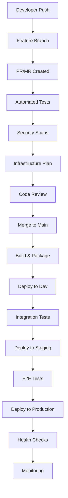

# Modern Web Infrastructure Patterns Research - 2025 Edition

## Executive Summary

This comprehensive research document analyzes the latest patterns and practices in modern web infrastructure for 2025. Our analysis covers seven critical areas: static site hosting (Jamstack/SSG), edge computing and CDN strategies, serverless architectures, container orchestration approaches, multi-region deployment patterns, modern CI/CD pipelines, and Infrastructure as Code (IaC) best practices.

Key findings reveal significant maturation in the infrastructure landscape, with enhanced performance, simplified deployment patterns, and increased automation capabilities across all domains.

## Table of Contents

1. [Static Site Hosting - Jamstack & SSG Evolution](#static-site-hosting)
2. [Edge Computing and CDN Strategies](#edge-computing)
3. [Serverless Architectures](#serverless-architectures)
4. [Container Orchestration Approaches](#container-orchestration)
5. [Multi-Region Deployment Patterns](#multi-region-deployment)
6. [Modern CI/CD Pipelines](#modern-cicd)
7. [Infrastructure as Code Best Practices](#infrastructure-as-code)
8. [Cross-Pattern Analysis and Integration](#cross-pattern-analysis)
9. [Implementation Recommendations](#implementation-recommendations)
10. [Future Trends and Outlook](#future-trends)

---

## Static Site Hosting - Jamstack & SSG Evolution {#static-site-hosting}

### Market Growth and Adoption

The global static hosting services market is experiencing unprecedented growth, projected to expand at a **19.3% CAGR between 2025 and 2031**. This growth is primarily driven by Jamstack adoption coupled with the demand for less resource-intensive hosting solutions.

### Architecture Evolution

#### Core Jamstack Principles (2025 Refinements)
- **JavaScript**: Dynamic functionality layer (React, Vue, Svelte, etc.)
- **APIs**: Server-side operations handled via APIs
- **Markup**: Pre-built static HTML files

The Jamstack architecture has evolved beyond pure static content to embrace hybrid approaches that combine static generation with dynamic capabilities.

#### Performance Benchmarks
Real-world performance improvements documented in 2025:
- **Time to First Byte (TTFB)**: Jamstack sites achieve ~80ms vs ~800ms for traditional server-rendered sites
- **First Contentful Paint**: 50% of Jamstack sites deliver content in less than 1 second
- **Overall Performance**: Order of magnitude improvement in load times

### Static Site Generator Landscape

#### Next.js - The Hybrid Leader
```javascript
// Incremental Static Regeneration (ISR) example
export async function getStaticProps() {
  return {
    props: { data: await fetchData() },
    revalidate: 60, // Re-generate page every 60 seconds
  }
}
```

**Key Features:**
- Incremental Static Regeneration (ISR)
- Hybrid rendering capabilities
- Edge Runtime support
- Built-in optimization features

#### Astro - Island Architecture Pioneer
```astro
---
// Server-side logic runs during build
const posts = await fetchPosts();
---

<div>
  {posts.map(post => (
    <PostCard post={post} client:load />
  ))}
</div>
```

**Innovation:**
- Partial hydration through island architecture
- Framework-agnostic component support
- Zero JavaScript by default
- Optimal performance characteristics

#### Additional Frameworks
- **Gatsby**: Strong CMS integration ecosystem
- **Remix**: Enhanced data loading patterns
- **TanStack Start**: Advanced routing capabilities
- **Qwik**: Resumable applications
- **Docusaurus**: Documentation-focused

### Leading Hosting Platforms

#### Vercel - Edge-First Platform
```yaml
# vercel.json configuration
{
  "functions": {
    "pages/api/**/*.js": {
      "runtime": "edge"
    }
  },
  "regions": ["all"],
  "framework": "nextjs"
}
```

**Capabilities:**
- Global Edge Network
- Serverless computing integration
- Automatic optimization
- Built-in analytics and monitoring

#### Netlify - JAMstack Pioneer
```yaml
# netlify.toml
[build]
  publish = "dist"
  command = "npm run build"

[functions]
  directory = "netlify/functions"

[[redirects]]
  from = "/api/*"
  to = "/.netlify/functions/:splat"
  status = 200
```

**Features:**
- Built-in CI/CD pipelines
- Edge functions support
- Form handling and identity
- Split testing capabilities

#### Azure Static Web Apps
**Enterprise Integration:**
- Azure Functions integration
- Built-in authentication
- Custom domains and SSL
- Staging environments

#### DigitalOcean App Platform
**Developer Experience:**
- Simple deployment process
- Container support
- Database integration
- Affordable pricing tiers

### Sustainability and Efficiency Benefits

Modern static site hosting demonstrates significant environmental benefits:
- **Reduced Server Resources**: Minimal compute requirements
- **CDN Distribution**: Efficient global content delivery
- **Energy Optimization**: Lower overall energy consumption
- **Scalability**: Linear scaling without proportional resource increase

---

## Edge Computing and CDN Strategies {#edge-computing}

### Edge Computing Evolution

Edge computing in 2025 represents a fundamental shift from traditional cloud-centric architectures to distributed computing models that bring processing power closer to end users.

#### Key Characteristics
- **Ultra-low latency**: Sub-10ms response times
- **Geographic distribution**: Processing at 200+ global locations
- **Intelligent routing**: Dynamic traffic optimization
- **Resilient operation**: Autonomous functionality during cloud disconnection

### Edge Function Platforms

#### Cloudflare Workers
```javascript
// Edge function example
export default {
  async fetch(request, env) {
    const start = Date.now();
    
    // Process request at the edge
    const response = await processRequest(request);
    
    // Add performance headers
    response.headers.set('CF-Edge-Duration', Date.now() - start);
    return response;
  }
}
```

**Performance Characteristics:**
- **Runtime**: Chrome V8 directly (not Node.js)
- **Cold Start**: <1ms typical
- **CPU Limits**: 10-50ms depending on plan
- **Global Presence**: 200+ cities worldwide

#### Vercel Edge Functions
```typescript
import { NextRequest, NextResponse } from 'next/server';

export default function middleware(request: NextRequest) {
  // Geographic-based routing
  const country = request.geo?.country;
  const region = getOptimalRegion(country);
  
  return NextResponse.rewrite(
    new URL(`/api/${region}/data`, request.url)
  );
}
```

**Capabilities:**
- TypeScript/JavaScript support
- Next.js integration
- Automatic deployments
- Global distribution

#### AWS Lambda@Edge
```javascript
exports.handler = async (event) => {
  const request = event.Records[0].cf.request;
  
  // Modify request based on location
  if (request.headers['cloudfront-viewer-country'][0].value === 'US') {
    request.origin.s3.domainName = 'us-bucket.s3.amazonaws.com';
  }
  
  return request;
};
```

### CDN Strategy Patterns

#### Multi-CDN Architecture
```yaml
cdn_strategy:
  primary: cloudflare
  secondary: aws_cloudfront
  tertiary: azure_cdn
  
  routing_logic:
    - performance_based: true
    - cost_optimization: true
    - geographic_failover: true
    - real_time_switching: true
```

#### Edge Caching Strategies
```javascript
// Intelligent caching at edge
const cacheStrategy = {
  static: '1y',           // CSS, JS, images
  api_data: '5m',         // API responses
  user_content: '1h',     // User-generated content
  critical_path: '30s',   // Critical API calls
  personalized: 'no-cache' // User-specific content
};
```

### Performance Optimization Techniques

#### Edge-Side Includes (ESI)
```html
<!DOCTYPE html>
<html>
<head>
  <esi:include src="/api/user-data" />
</head>
<body>
  <esi:include src="/fragments/navigation" />
  <esi:include src="/api/personalized-content" />
</body>
</html>
```

#### Service Worker Integration
```javascript
// Advanced service worker for edge integration
self.addEventListener('fetch', event => {
  if (event.request.url.includes('/api/')) {
    event.respondWith(
      handleAPIRequest(event.request)
    );
  }
});

async function handleAPIRequest(request) {
  // Check edge cache first
  const cachedResponse = await caches.match(request);
  if (cachedResponse) return cachedResponse;
  
  // Fetch from nearest edge
  return fetch(request, { cf: { cacheEverything: true } });
}
```

---

## Serverless Architectures {#serverless-architectures}

### Platform Comparison and Evolution

The serverless landscape in 2025 shows significant maturation across all major platforms, with enhanced performance, better developer experience, and tighter edge integration.

#### AWS Lambda - Enterprise Standard
```python
import json
import boto3

def lambda_handler(event, context):
    # Enhanced runtime with container support
    processor = PaymentProcessor()
    
    result = processor.process_payment({
        'amount': event['amount'],
        'currency': event['currency'],
        'method': event['payment_method']
    })
    
    return {
        'statusCode': 200,
        'body': json.dumps(result),
        'headers': {
            'Access-Control-Allow-Origin': '*',
            'Content-Type': 'application/json'
        }
    }
```

**2025 Enhancements:**
- Extended execution durations (up to 60+ minutes)
- Improved cold-start performance
- Native container image support
- Custom runtime capabilities
- Enhanced stateful workflow support

#### Cloudflare Workers - Edge Performance Leader
```javascript
// Rust-compiled WebAssembly for ultra-fast execution
import wasmModule from './payment-processor.wasm';

export default {
  async fetch(request, env) {
    const wasm = await WebAssembly.instantiate(wasmModule);
    
    // Sub-millisecond processing
    const result = wasm.instance.exports.process_payment(
      request.body
    );
    
    return new Response(result, {
      headers: { 'Cache-Control': 'max-age=60' }
    });
  }
}
```

**Performance Profile:**
- **Cold Start**: <1ms typical
- **Execution Limit**: 10-50ms CPU time
- **Memory Limit**: 128MB
- **Global Distribution**: Automatic

#### Vercel Functions - Developer Experience Focus
```typescript
// API route with automatic optimization
import type { NextApiRequest, NextApiResponse } from 'next';

export default async function handler(
  req: NextApiRequest,
  res: NextApiResponse
) {
  // Automatic edge deployment
  const data = await fetchUserData(req.query.id);
  
  res.setHeader('Cache-Control', 's-maxage=300');
  res.json({ data });
}

// Automatic scaling and deployment
export const config = {
  runtime: 'edge',
  regions: ['all'], // Global deployment
};
```

### Serverless Architecture Patterns

#### Event-Driven Architecture
```yaml
# Serverless event flow
payment_flow:
  trigger: api_gateway
  functions:
    - validate_payment:
        runtime: "nodejs18.x"
        timeout: 30
        memory: 512
    - process_payment:
        runtime: "python3.9"
        timeout: 300
        memory: 1024
    - send_notification:
        runtime: "go1.x"
        timeout: 15
        memory: 256
  
  integration:
    - sqs_queue: payment_processing
    - sns_topic: payment_notifications
    - dynamodb: payment_records
```

#### Microservices with Functions
```typescript
// Function composition pattern
export const createOrder = async (orderData: OrderData) => {
  const tasks = await Promise.allSettled([
    validateInventory(orderData.items),
    calculateTax(orderData.shipping),
    processPayment(orderData.payment),
    reserveShipping(orderData.shipping)
  ]);
  
  return {
    orderId: generateOrderId(),
    status: determineOrderStatus(tasks),
    timestamp: Date.now()
  };
};
```

### Use Case Recommendations

#### Ultra-Low Latency Requirements
**Best Choice**: Cloudflare Workers or Lambda@Edge
- Sub-5ms response times
- Global edge deployment
- Minimal cold start impact

#### Complex Processing Workflows
**Best Choice**: AWS Lambda or Google Cloud Functions
- Extended execution times
- Rich integration ecosystem
- Advanced monitoring capabilities

#### Frontend-Integrated APIs
**Best Choice**: Vercel Functions or Netlify Functions
- Seamless framework integration
- Automatic deployment
- Developer-friendly tooling

---

## Container Orchestration Approaches {#container-orchestration}

### Kubernetes Ecosystem Dominance

According to the Cloud Native Computing Foundation (CNCF), **89% of organizations use some form of Kubernetes**, with over 109 available container management tools in the ecosystem.

#### Production-Ready Kubernetes Patterns
```yaml
# Advanced Kubernetes deployment with GitOps
apiVersion: argoproj.io/v1alpha1
kind: Application
metadata:
  name: payment-service
  namespace: argocd
spec:
  project: default
  source:
    repoURL: https://github.com/company/payment-service
    targetRevision: HEAD
    path: k8s
  destination:
    server: https://kubernetes.default.svc
    namespace: payments
  syncPolicy:
    automated:
      prune: true
      selfHeal: true
    syncOptions:
    - CreateNamespace=true
```

#### Multi-Cluster Management
```yaml
# Cluster federation for multi-region deployment
apiVersion: types.kubefed.io/v1beta1
kind: FederatedDeployment
metadata:
  name: payment-api
  namespace: payments
spec:
  template:
    spec:
      replicas: 3
      template:
        spec:
          containers:
          - name: payment-api
            image: payment-api:v1.2.3
            resources:
              requests:
                memory: "256Mi"
                cpu: "250m"
              limits:
                memory: "512Mi"
                cpu: "500m"
  placement:
    clusters:
    - name: us-east-1
    - name: eu-west-1
    - name: ap-southeast-1
```

### Alternative Orchestration Platforms

#### Docker Swarm - Simplified Orchestration
```yaml
# Docker Swarm for smaller deployments
version: '3.8'
services:
  payment-api:
    image: payment-api:latest
    deploy:
      replicas: 3
      update_config:
        parallelism: 1
        delay: 10s
      restart_policy:
        condition: on-failure
      placement:
        constraints:
          - node.role == worker
    networks:
      - payment-network
    secrets:
      - db_password
```

**Use Cases:**
- Small to medium deployments
- Teams seeking Kubernetes alternatives
- Simplified operations requirements

#### HashiCorp Nomad - Multi-Workload Orchestrator
```hcl
job "payment-processor" {
  datacenters = ["dc1", "dc2"]
  type        = "service"
  
  group "api" {
    count = 3
    
    service {
      name = "payment-api"
      port = "http"
      
      check {
        type     = "http"
        path     = "/health"
        interval = "30s"
        timeout  = "2s"
      }
    }
    
    task "payment-api" {
      driver = "docker"
      
      config {
        image = "payment-api:1.2.3"
        ports = ["http"]
      }
      
      resources {
        cpu    = 500
        memory = 512
      }
    }
  }
}
```

**Advantages:**
- Single binary deployment
- Mixed workload support (containers, VMs, binaries)
- Lower operational overhead
- Multi-datacenter native

#### Managed Container Services

##### Amazon ECS/Fargate
```json
{
  "family": "payment-api",
  "networkMode": "awsvpc",
  "requiresCompatibilities": ["FARGATE"],
  "cpu": "512",
  "memory": "1024",
  "executionRoleArn": "arn:aws:iam::account:role/ecsTaskExecutionRole",
  "containerDefinitions": [
    {
      "name": "payment-api",
      "image": "payment-api:latest",
      "portMappings": [
        {
          "containerPort": 3000,
          "protocol": "tcp"
        }
      ],
      "logConfiguration": {
        "logDriver": "awslogs",
        "options": {
          "awslogs-group": "/ecs/payment-api",
          "awslogs-region": "us-east-1",
          "awslogs-stream-prefix": "ecs"
        }
      }
    }
  ]
}
```

##### Azure Container Apps
```yaml
apiVersion: apps/v1alpha1
kind: ContainerApp
metadata:
  name: payment-api
spec:
  configuration:
    secrets:
    - name: "db-connection"
      value: "connection-string"
    ingress:
      external: true
      targetPort: 3000
  template:
    containers:
    - name: payment-api
      image: payment-api:latest
      resources:
        cpu: 0.5
        memory: 1Gi
      env:
      - name: DATABASE_URL
        secretRef: db-connection
    scale:
      minReplicas: 1
      maxReplicas: 10
```

### Multi-Cloud Container Strategies

#### Kubernetes Federation Approach
```yaml
# Cross-cloud cluster management
apiVersion: core.kubefed.io/v1beta1
kind: KubeFedCluster
metadata:
  name: aws-cluster
  namespace: kube-federation-system
spec:
  apiEndpoint: https://aws-k8s.example.com
  caBundle: LS0tLS1CRUdJTi...
  secretRef:
    name: aws-cluster-secret
---
apiVersion: core.kubefed.io/v1beta1
kind: KubeFedCluster
metadata:
  name: azure-cluster
  namespace: kube-federation-system
spec:
  apiEndpoint: https://azure-k8s.example.com
  caBundle: LS0tLS1CRUdJTi...
  secretRef:
    name: azure-cluster-secret
```

#### Service Mesh for Multi-Cloud
```yaml
# Istio service mesh across clusters
apiVersion: networking.istio.io/v1beta1
kind: Gateway
metadata:
  name: payment-gateway
spec:
  selector:
    istio: ingressgateway
  servers:
  - port:
      number: 443
      name: https
      protocol: HTTPS
    tls:
      mode: SIMPLE
      credentialName: payment-cert
    hosts:
    - api.payments.com
---
apiVersion: networking.istio.io/v1beta1
kind: VirtualService
metadata:
  name: payment-routing
spec:
  hosts:
  - api.payments.com
  gateways:
  - payment-gateway
  http:
  - match:
    - headers:
        region:
          exact: "us"
    route:
    - destination:
        host: payment-service.us-cluster.local
  - route:
    - destination:
        host: payment-service.eu-cluster.local
```

---

## Multi-Region Deployment Patterns {#multi-region-deployment}

### Deployment Architecture Patterns

#### Active-Active Pattern
```yaml
# Global active-active configuration
global_deployment:
  regions:
    us_east:
      primary: true
      capacity: 40%
      endpoints:
        - api-us.example.com
      health_check: /health
    eu_west:
      primary: true
      capacity: 35%
      endpoints:
        - api-eu.example.com
      health_check: /health
    ap_southeast:
      primary: true
      capacity: 25%
      endpoints:
        - api-ap.example.com
      health_check: /health
  
  load_balancing:
    strategy: geographic_latency
    failover: automatic
    health_threshold: 2
```

**Implementation with AWS Global Accelerator:**
```json
{
  "Name": "PaymentServiceAccelerator",
  "IpAddressType": "IPV4",
  "Enabled": true,
  "Listeners": [
    {
      "Protocol": "TCP",
      "PortRanges": [{"FromPort": 443, "ToPort": 443}],
      "ClientAffinity": "SOURCE_IP"
    }
  ],
  "EndpointGroups": [
    {
      "ListenerArn": "listener-arn",
      "Region": "us-east-1",
      "EndpointConfigurations": [
        {
          "EndpointId": "alb-us-east-1",
          "Weight": 100,
          "ClientIPPreservationEnabled": true
        }
      ],
      "TrafficDialPercentage": 100.0,
      "HealthCheckGracePeriodSeconds": 30
    }
  ]
}
```

#### Active-Passive with Hot Standby
```yaml
# Disaster recovery configuration
disaster_recovery:
  primary_region: us-east-1
  secondary_region: us-west-2
  
  replication:
    database:
      method: async_replication
      lag_threshold: 30s
      failover_automation: true
    
    storage:
      method: cross_region_replication
      sync_frequency: realtime
      
  monitoring:
    health_checks:
      frequency: 30s
      failure_threshold: 3
      timeout: 10s
    
    failover:
      automatic: true
      rto: 5m  # Recovery Time Objective
      rpo: 1m  # Recovery Point Objective
```

#### Geographic Routing Pattern
```yaml
# DNS-based geographic routing
dns_routing:
  domains:
    api.payments.com:
      type: A
      geolocation_routing:
        - location: "US"
          value: "52.1.1.1"  # US load balancer
          health_check: true
        - location: "EU"
          value: "34.2.2.2"  # EU load balancer
          health_check: true
        - location: "AS"
          value: "13.3.3.3"  # Asia load balancer
          health_check: true
      failover_routing:
        primary: "US"
        secondary: "EU"
```

### Global Load Balancing Solutions

#### Azure Front Door Configuration
```json
{
  "name": "PaymentServiceFrontDoor",
  "properties": {
    "enabledState": "Enabled",
    "frontendEndpoints": [
      {
        "name": "payment-frontend",
        "properties": {
          "hostName": "api.payments.com",
          "sessionAffinityEnabledState": "Disabled"
        }
      }
    ],
    "backendPools": [
      {
        "name": "payment-backends",
        "properties": {
          "backends": [
            {
              "address": "us-payment-api.azurewebsites.net",
              "httpPort": 80,
              "httpsPort": 443,
              "weight": 50,
              "priority": 1,
              "enabledState": "Enabled"
            },
            {
              "address": "eu-payment-api.azurewebsites.net",
              "httpPort": 80,
              "httpsPort": 443,
              "weight": 50,
              "priority": 1,
              "enabledState": "Enabled"
            }
          ],
          "healthProbeSettings": {
            "path": "/health",
            "protocol": "Https",
            "intervalInSeconds": 30
          }
        }
      }
    ]
  }
}
```

#### Google Cloud Load Balancing
```yaml
# Global HTTP(S) Load Balancer
gcp_load_balancer:
  name: payment-global-lb
  backend_services:
    - name: us-backend-service
      backends:
        - group: us-instance-group
          balancing_mode: UTILIZATION
          max_utilization: 0.8
      health_checks:
        - payment-health-check
    - name: eu-backend-service
      backends:
        - group: eu-instance-group
          balancing_mode: UTILIZATION
          max_utilization: 0.8
      health_checks:
        - payment-health-check
  
  url_map:
    default_service: us-backend-service
    path_matchers:
      - name: geographic-matcher
        default_service: us-backend-service
        path_rules:
          - paths: ["/eu/*"]
            service: eu-backend-service
```

### Disaster Recovery Strategies

#### Recovery Time Objectives (RTO) Planning
```yaml
# RTO/RPO matrix by service tier
service_tiers:
  critical:
    rto: 5m
    rpo: 1m
    strategy: hot_standby
    automation: full
    cost_factor: high
  
  important:
    rto: 30m
    rpo: 15m
    strategy: warm_standby
    automation: partial
    cost_factor: medium
  
  standard:
    rto: 4h
    rpo: 1h
    strategy: cold_backup
    automation: minimal
    cost_factor: low
```

#### Automated Failover Implementation
```python
# Disaster recovery automation script
import boto3
import json

class DisasterRecoveryOrchestrator:
    def __init__(self):
        self.route53 = boto3.client('route53')
        self.rds = boto3.client('rds')
        self.ecs = boto3.client('ecs')
    
    def execute_failover(self, region_from, region_to):
        # 1. Promote read replica to primary
        self.promote_database_replica(region_to)
        
        # 2. Update DNS records
        self.update_dns_records(region_to)
        
        # 3. Scale up services in target region
        self.scale_services(region_to, desired_capacity=3)
        
        # 4. Verify health checks
        return self.verify_failover_success(region_to)
    
    def promote_database_replica(self, target_region):
        replica_id = f"payment-db-replica-{target_region}"
        
        response = self.rds.promote_read_replica(
            DBInstanceIdentifier=replica_id
        )
        
        return response
    
    def update_dns_records(self, target_region):
        # Update Route 53 weighted routing
        change_batch = {
            'Comment': f'Failover to {target_region}',
            'Changes': [
                {
                    'Action': 'UPSERT',
                    'ResourceRecordSet': {
                        'Name': 'api.payments.com',
                        'Type': 'A',
                        'SetIdentifier': target_region,
                        'Weight': 100,
                        'TTL': 60,
                        'ResourceRecords': [
                            {'Value': self.get_region_endpoint(target_region)}
                        ]
                    }
                }
            ]
        }
        
        return self.route53.change_resource_record_sets(
            HostedZoneId='Z123456789',
            ChangeBatch=change_batch
        )
```

---

## Modern CI/CD Pipelines {#modern-cicd}

### GitOps-First Methodology

The modern CI/CD landscape in 2025 is characterized by GitOps-first approaches, where Git repositories serve as the single source of truth for both application and infrastructure deployments.

#### GitOps Pipeline Architecture
```yaml
# ArgoCD application configuration
apiVersion: argoproj.io/v1alpha1
kind: Application
metadata:
  name: payment-service
  namespace: argocd
spec:
  project: default
  source:
    repoURL: https://github.com/company/payment-service
    targetRevision: HEAD
    path: k8s
    helm:
      parameters:
      - name: image.tag
        value: "v1.2.3"
      - name: replicas
        value: "3"
  destination:
    server: https://kubernetes.default.svc
    namespace: payments
  syncPolicy:
    automated:
      prune: true
      selfHeal: true
    syncOptions:
    - CreateNamespace=true
    retry:
      limit: 5
      backoff:
        duration: 5s
        factor: 2
        maxDuration: 3m
```

#### Multi-Environment GitOps Flow


### Terraform-Specific CI/CD Patterns

#### Advanced Terraform Automation
```yaml
# GitHub Actions workflow for Terraform
name: Terraform CI/CD
on:
  pull_request:
    paths: ['infrastructure/**']
  push:
    branches: [main]
    paths: ['infrastructure/**']

jobs:
  terraform:
    runs-on: ubuntu-latest
    permissions:
      id-token: write
      contents: read
      pull-requests: write
    
    steps:
    - uses: actions/checkout@v4
    
    - name: Configure AWS credentials
      uses: aws-actions/configure-aws-credentials@v3
      with:
        role-to-assume: ${{ secrets.AWS_ROLE_ARN }}
        aws-region: us-east-1
    
    - name: Setup Terraform
      uses: hashicorp/setup-terraform@v3
      with:
        terraform_version: 1.6.0
    
    - name: Terraform Format Check
      run: terraform fmt -check -recursive
      
    - name: Terraform Validate
      run: terraform validate
    
    - name: Run Security Scans
      uses: aquasecurity/trivy-action@master
      with:
        scan-type: 'config'
        scan-ref: './infrastructure'
    
    - name: Terraform Plan
      run: |
        terraform plan -out=tfplan
        terraform show -json tfplan > plan.json
    
    - name: Cost Estimation
      uses: infracost/infracost-action@v1
      with:
        path: plan.json
        api_key: ${{ secrets.INFRACOST_API_KEY }}
    
    - name: Terraform Apply
      if: github.ref == 'refs/heads/main'
      run: terraform apply -auto-approve tfplan
```

#### Terragrunt for Scale
```hcl
# terragrunt.hcl - DRY infrastructure
terraform {
  source = "../../../modules/eks-cluster"
}

include "root" {
  path = find_in_parent_folders()
}

dependency "vpc" {
  config_path = "../vpc"
}

inputs = {
  cluster_name    = "payment-${local.environment}"
  vpc_id          = dependency.vpc.outputs.vpc_id
  subnet_ids      = dependency.vpc.outputs.private_subnet_ids
  
  node_groups = {
    main = {
      desired_capacity = 3
      max_capacity     = 10
      min_capacity     = 1
      instance_types   = ["t3.medium"]
      
      k8s_labels = {
        Environment = local.environment
        Application = "payments"
      }
    }
  }
}

locals {
  environment = "production"
}
```

### Advanced Pipeline Features

#### Security Integration
```yaml
# Security-first pipeline
security_scanning:
  static_analysis:
    - sonarqube
    - semgrep
    - codeql
  
  dependency_scanning:
    - snyk
    - whitesource
    - dependabot
  
  container_scanning:
    - trivy
    - clair
    - anchore
  
  infrastructure_scanning:
    - checkov
    - tfsec
    - terrascan
  
  policy_enforcement:
    - opa_gatekeeper
    - falco
    - polaris
```

#### Multi-Cloud Deployment Pipeline
```yaml
# Multi-cloud deployment strategy
deploy_targets:
  aws:
    regions: [us-east-1, us-west-2, eu-west-1]
    services: [eks, rds, elasticache]
    
  azure:
    regions: [eastus, westus2, northeurope]
    services: [aks, cosmosdb, redis]
    
  gcp:
    regions: [us-central1, us-west1, europe-west1]
    services: [gke, cloudsql, memorystore]

deployment_order:
  - validate_all_clouds
  - deploy_infrastructure
  - deploy_applications
  - run_cross_cloud_tests
  - update_dns_routing
```

#### Feature Flag Integration
```yaml
# Feature flag driven deployments
feature_deployment:
  canary_deployment:
    enabled: true
    percentage: 10
    success_criteria:
      error_rate: <1%
      response_time: <200ms
      duration: 30m
  
  feature_flags:
    - name: "new_payment_flow"
      environments:
        dev: 100%
        staging: 100%
        production: 0%
      rollout_strategy: gradual
      
    - name: "enhanced_security"
      environments:
        dev: 100%
        staging: 50%
        production: 10%
      rollout_strategy: geographic
```

---

## Infrastructure as Code Best Practices {#infrastructure-as-code}

### Tool Selection Strategy (2025)

The IaC landscape has matured significantly, with clear use cases for different tools based on team needs and technical requirements.

#### Decision Matrix
```yaml
tool_selection_criteria:
  terraform:
    best_for:
      - Multi-cloud deployments
      - Large, complex infrastructures
      - Team with ops focus
    strengths:
      - Mature ecosystem
      - Provider support
      - State management
    use_when:
      - Infrastructure provisioning is primary goal
      - Team prefers declarative HCL syntax
      - Need extensive provider ecosystem

  pulumi:
    best_for:
      - Developer-centric teams
      - Complex logic in infrastructure
      - Integration with application code
    strengths:
      - Real programming languages
      - Better testing capabilities
      - Type safety
    use_when:
      - Team has strong programming background
      - Need complex infrastructure logic
      - Want infrastructure as software approach

  ansible:
    best_for:
      - Configuration management
      - Hybrid cloud/on-prem environments
      - Application deployment
    strengths:
      - Agentless architecture
      - Simple YAML syntax
      - Broad platform support
    use_when:
      - Configuration management is primary need
      - Managing existing infrastructure
      - Team prefers imperative approach
```

### Advanced Terraform Patterns

#### Module-First Architecture
```hcl
# Reusable VPC module
module "vpc" {
  source = "terraform-aws-modules/vpc/aws"
  version = "~> 5.0"
  
  name = var.vpc_name
  cidr = var.vpc_cidr
  
  azs             = data.aws_availability_zones.available.names
  private_subnets = var.private_subnet_cidrs
  public_subnets  = var.public_subnet_cidrs
  
  enable_nat_gateway     = var.enable_nat_gateway
  enable_vpn_gateway     = var.enable_vpn_gateway
  enable_dns_hostnames   = true
  enable_dns_support     = true
  
  tags = merge(
    var.common_tags,
    {
      "kubernetes.io/cluster/${var.cluster_name}" = "shared"
    }
  )
}

# Consumption of module with validation
module "payment_vpc" {
  source = "./modules/vpc"
  
  vpc_name    = "payment-${var.environment}"
  vpc_cidr    = "10.0.0.0/16"
  
  private_subnet_cidrs = [
    "10.0.1.0/24",
    "10.0.2.0/24",
    "10.0.3.0/24"
  ]
  
  public_subnet_cidrs = [
    "10.0.101.0/24",
    "10.0.102.0/24",
    "10.0.103.0/24"
  ]
  
  enable_nat_gateway = var.environment == "production"
  
  common_tags = {
    Environment = var.environment
    Project     = "payments"
    Owner       = "platform-team"
    CostCenter  = "engineering"
  }
}

# Validation rules
variable "environment" {
  description = "Environment name"
  type        = string
  
  validation {
    condition = can(regex("^(dev|staging|prod)$", var.environment))
    error_message = "Environment must be dev, staging, or prod."
  }
}
```

#### State Management Best Practices
```hcl
# Remote state configuration
terraform {
  required_version = ">= 1.6"
  
  required_providers {
    aws = {
      source  = "hashicorp/aws"
      version = "~> 5.0"
    }
  }
  
  backend "s3" {
    bucket         = "company-terraform-state"
    key            = "payments/${var.environment}/terraform.tfstate"
    region         = "us-east-1"
    encrypt        = true
    dynamodb_table = "terraform-locks"
    
    # Workspace-based isolation
    workspace_key_prefix = "payments"
  }
}

# Data source for shared state
data "terraform_remote_state" "vpc" {
  backend = "s3"
  
  config = {
    bucket = "company-terraform-state"
    key    = "networking/${var.environment}/terraform.tfstate"
    region = "us-east-1"
  }
}
```

### Pulumi Advanced Patterns

#### Type-Safe Infrastructure with TypeScript
```typescript
// Pulumi infrastructure with full type safety
import * as aws from "@pulumi/aws";
import * as awsx from "@pulumi/awsx";
import { ComponentResource, ComponentResourceOptions } from "@pulumi/pulumi";

interface PaymentInfrastructureArgs {
    environment: "dev" | "staging" | "prod";
    region: string;
    instanceType?: aws.ec2.InstanceType;
    minSize?: number;
    maxSize?: number;
}

export class PaymentInfrastructure extends ComponentResource {
    public readonly vpc: awsx.ec2.Vpc;
    public readonly cluster: aws.eks.Cluster;
    public readonly database: aws.rds.Instance;
    public readonly loadBalancer: aws.lb.LoadBalancer;
    
    constructor(
        name: string,
        args: PaymentInfrastructureArgs,
        opts?: ComponentResourceOptions
    ) {
        super("custom:PaymentInfrastructure", name, {}, opts);
        
        // Create VPC with validation
        this.vpc = new awsx.ec2.Vpc(`${name}-vpc`, {
            cidrBlock: "10.0.0.0/16",
            numberOfAvailabilityZones: 3,
            subnets: [
                { type: "public", name: "public" },
                { type: "private", name: "private" }
            ],
            tags: {
                Environment: args.environment,
                Project: "payments"
            }
        }, { parent: this });
        
        // Create EKS cluster with proper configuration
        this.cluster = new aws.eks.Cluster(`${name}-cluster`, {
            version: "1.28",
            vpcConfig: {
                subnetIds: [
                    ...this.vpc.privateSubnetIds,
                    ...this.vpc.publicSubnetIds
                ],
                endpointPrivateAccess: true,
                endpointPublicAccess: args.environment === "prod" ? false : true
            },
            tags: {
                Environment: args.environment
            }
        }, { parent: this });
        
        // Managed node group with proper configuration
        new aws.eks.NodeGroup(`${name}-nodes`, {
            clusterName: this.cluster.name,
            nodeRoleArn: this.createNodeRole().arn,
            subnetIds: this.vpc.privateSubnetIds,
            
            instanceTypes: [args.instanceType ?? "t3.medium"],
            scalingConfig: {
                minSize: args.minSize ?? 1,
                maxSize: args.maxSize ?? 10,
                desiredSize: args.environment === "prod" ? 3 : 1
            },
            
            labels: {
                Environment: args.environment,
                NodeGroup: "primary"
            }
        }, { parent: this });
        
        this.registerOutputs();
    }
    
    private createNodeRole(): aws.iam.Role {
        const nodeRole = new aws.iam.Role("node-role", {
            assumeRolePolicy: aws.iam.assumeRolePolicyForPrincipal({
                Service: "ec2.amazonaws.com"
            })
        }, { parent: this });
        
        // Attach required policies
        const policies = [
            "arn:aws:iam::aws:policy/AmazonEKSWorkerNodePolicy",
            "arn:aws:iam::aws:policy/AmazonEKS_CNI_Policy",
            "arn:aws:iam::aws:policy/AmazonEC2ContainerRegistryReadOnly"
        ];
        
        policies.forEach((policy, index) => {
            new aws.iam.RolePolicyAttachment(`node-policy-${index}`, {
                role: nodeRole.name,
                policyArn: policy
            }, { parent: this });
        });
        
        return nodeRole;
    }
}

// Usage with type safety
const paymentInfra = new PaymentInfrastructure("payment-prod", {
    environment: "prod",  // Type checked
    region: "us-east-1",
    instanceType: "t3.large",
    minSize: 3,
    maxSize: 20
});

export const clusterEndpoint = paymentInfra.cluster.endpoint;
export const vpcId = paymentInfra.vpc.vpcId;
```

#### Testing Infrastructure Code
```typescript
// Pulumi testing with proper assertions
import * as pulumi from "@pulumi/pulumi";
import { PaymentInfrastructure } from "./payment-infrastructure";

pulumi.runtime.setMocks({
    newResource: (args: pulumi.runtime.MockResourceArgs): {id: string; state: any} => {
        return {
            id: args.inputs.name + "_id",
            state: args.inputs,
        };
    },
    call: (args: pulumi.runtime.MockCallArgs) => {
        return args.inputs;
    },
});

describe("PaymentInfrastructure", () => {
    let infra: PaymentInfrastructure;
    
    beforeEach(() => {
        infra = new PaymentInfrastructure("test", {
            environment: "dev",
            region: "us-east-1"
        });
    });
    
    it("should create VPC with correct CIDR", async () => {
        const vpcCidr = await infra.vpc.cidrBlock;
        expect(vpcCidr).toBe("10.0.0.0/16");
    });
    
    it("should create private subnets in multiple AZs", async () => {
        const privateSubnets = await infra.vpc.privateSubnetIds;
        expect(privateSubnets).toHaveLength(3);
    });
    
    it("should configure cluster for dev environment", async () => {
        const clusterConfig = await infra.cluster.vpcConfig;
        expect(clusterConfig.endpointPublicAccess).toBe(true);
    });
});
```

### Policy as Code Integration

#### Open Policy Agent (OPA) Rules
```rego
# Terraform policy validation
package terraform.security

# Deny S3 buckets without encryption
deny[msg] {
    resource := input.resource.aws_s3_bucket[name]
    not resource.server_side_encryption_configuration
    msg := sprintf("S3 bucket '%s' must have encryption enabled", [name])
}

# Require specific tags
required_tags := ["Environment", "Owner", "Project"]

deny[msg] {
    resource := input.resource[resource_type][name]
    resource_type != "data"
    
    tag := required_tags[_]
    not resource.tags[tag]
    
    msg := sprintf("Resource '%s.%s' missing required tag: %s", [resource_type, name, tag])
}

# Enforce instance size limits
allowed_instance_types := ["t3.micro", "t3.small", "t3.medium"]

deny[msg] {
    resource := input.resource.aws_instance[name]
    not resource.instance_type in allowed_instance_types
    msg := sprintf("Instance '%s' uses disallowed type: %s", [name, resource.instance_type])
}
```

#### Automated Policy Enforcement
```yaml
# GitHub Actions policy validation
- name: Validate Infrastructure Policies
  uses: open-policy-agent/conftest-action@v0.1
  with:
    files: terraform/plan.json
    policy: policies/terraform
  
- name: Run Checkov Security Scan
  uses: bridgecrewio/checkov-action@master
  with:
    directory: terraform/
    framework: terraform
    quiet: true
    soft_fail: false
    download_external_modules: true
```

---

## Cross-Pattern Analysis and Integration {#cross-pattern-analysis}

### Architectural Integration Points

Modern web infrastructure in 2025 is characterized by the seamless integration of multiple patterns, creating cohesive, performant, and maintainable systems.

#### Full-Stack Integration Example
```yaml
# Complete infrastructure integration
modern_web_stack:
  frontend:
    framework: Next.js
    hosting: Vercel
    cdn: Cloudflare
    edge_functions: true
    static_generation: ISR
  
  api_layer:
    architecture: serverless
    functions: 
      - AWS Lambda (heavy processing)
      - Cloudflare Workers (edge logic)
      - Vercel Functions (API routes)
    gateway: AWS API Gateway
  
  data_layer:
    primary: PostgreSQL (RDS Multi-AZ)
    cache: Redis (ElastiCache)
    search: Elasticsearch (managed)
    files: S3 with CloudFront
  
  infrastructure:
    container_orchestration: EKS
    service_mesh: Istio
    monitoring: Prometheus/Grafana
    logging: ELK Stack
    deployment: GitOps (ArgoCD)
  
  deployment:
    strategy: blue_green
    rollback: automatic
    regions: [us-east-1, eu-west-1, ap-southeast-1]
    load_balancing: AWS Global Accelerator
```

### Performance Optimization Synergies

#### Edge-First Architecture
```typescript
// Integrated edge optimization strategy
interface EdgeOptimizationConfig {
  staticAssets: {
    cdn: 'cloudflare' | 'cloudfront' | 'azure_cdn';
    caching: CacheStrategy;
    compression: boolean;
    imageOptimization: boolean;
  };
  
  dynamicContent: {
    edgeFunctions: EdgeFunction[];
    apiRouting: GeographicRouting;
    dataReplication: RegionalReplication;
  };
  
  monitoring: {
    realUserMonitoring: boolean;
    syntheticTests: SyntheticTestConfig[];
    performanceBudgets: PerformanceBudget[];
  };
}

const edgeConfig: EdgeOptimizationConfig = {
  staticAssets: {
    cdn: 'cloudflare',
    caching: {
      html: '1h',
      css: '1y',
      js: '1y',
      images: '1y',
      api: '5m'
    },
    compression: true,
    imageOptimization: true
  },
  
  dynamicContent: {
    edgeFunctions: [
      {
        name: 'user-personalization',
        regions: ['all'],
        memory: 128,
        timeout: 50
      },
      {
        name: 'a-b-testing',
        regions: ['us', 'eu'],
        memory: 64,
        timeout: 30
      }
    ],
    
    apiRouting: {
      strategy: 'latency_based',
      healthChecks: true,
      failover: 'automatic'
    },
    
    dataReplication: {
      strategy: 'active_active',
      syncInterval: '30s',
      conflictResolution: 'timestamp'
    }
  },
  
  monitoring: {
    realUserMonitoring: true,
    syntheticTests: [
      {
        url: 'https://api.example.com/health',
        frequency: '1m',
        locations: ['us', 'eu', 'ap']
      }
    ],
    performanceBudgets: [
      { metric: 'FCP', threshold: '1.8s' },
      { metric: 'LCP', threshold: '2.5s' },
      { metric: 'CLS', threshold: '0.1' }
    ]
  }
};
```

### Security Integration Patterns

#### Zero Trust Architecture Implementation
```yaml
# Comprehensive zero trust security
zero_trust_architecture:
  network_security:
    service_mesh: istio
    mtls: enforced
    network_policies: strict
    ingress_encryption: tls_1_3
  
  identity_and_access:
    authentication:
      - oauth2_oidc
      - mutual_tls
      - jwt_validation
    authorization:
      - rbac_kubernetes
      - opa_policies
      - attribute_based_access
  
  data_protection:
    encryption_at_rest: aws_kms
    encryption_in_transit: tls_everywhere
    field_level_encryption: sensitive_data
    data_classification: automatic
  
  monitoring_and_compliance:
    security_scanning:
      - container_images
      - infrastructure_code
      - application_dependencies
    audit_logging:
      - api_calls
      - data_access
      - configuration_changes
    compliance_frameworks:
      - soc2
      - pci_dss
      - gdpr
```

#### Implementation Example
```typescript
// Zero trust middleware implementation
export class ZeroTrustMiddleware {
  async authenticate(request: Request): Promise<AuthResult> {
    // Multi-factor authentication
    const tokenValidation = await this.validateJWT(request);
    const certificateValidation = await this.validateClientCert(request);
    const behaviorAnalysis = await this.analyzeBehavior(request);
    
    return {
      authenticated: tokenValidation.valid && certificateValidation.valid,
      riskScore: behaviorAnalysis.riskScore,
      permissions: await this.getPermissions(tokenValidation.user)
    };
  }
  
  async authorize(user: User, resource: string, action: string): Promise<boolean> {
    // Policy-based authorization
    const policies = await this.loadPolicies(user, resource);
    return this.evaluatePolicies(policies, { user, resource, action });
  }
  
  async auditLog(request: Request, response: Response, user: User): Promise<void> {
    const logEntry = {
      timestamp: Date.now(),
      user: user.id,
      action: `${request.method} ${request.url}`,
      outcome: response.status,
      ip: request.headers.get('x-forwarded-for'),
      userAgent: request.headers.get('user-agent'),
      riskScore: await this.calculateRiskScore(request, user)
    };
    
    await this.securityLogger.log(logEntry);
  }
}
```

---

## Implementation Recommendations {#implementation-recommendations}

### Technology Selection Framework

#### Decision Tree for 2025 Infrastructure Choices

```yaml
# Infrastructure decision framework
selection_criteria:
  team_size:
    small_team: # < 10 developers
      recommended:
        hosting: vercel_or_netlify
        backend: serverless_functions
        database: managed_services
        deployment: git_based_automation
      avoid:
        - complex_kubernetes_setup
        - self_managed_infrastructure
        - microservices_overengineering
    
    medium_team: # 10-50 developers
      recommended:
        hosting: cloud_native_platforms
        backend: containerized_services
        orchestration: managed_kubernetes
        deployment: gitops_with_argocd
      considerations:
        - hybrid_serverless_containers
        - managed_databases_with_replicas
        - comprehensive_monitoring
    
    large_team: # 50+ developers
      recommended:
        hosting: multi_cloud_strategy
        backend: microservices_architecture
        orchestration: self_managed_kubernetes
        deployment: enterprise_gitops
      advanced_features:
        - service_mesh_implementation
        - advanced_security_policies
        - multi_region_active_active
```

#### Cost-Performance Matrix

```yaml
# Cost vs Performance analysis
infrastructure_tiers:
  startup: # $500-2000/month
    optimal_stack:
      - frontend: vercel_hobby
      - backend: lambda_or_cloud_run
      - database: planetscale_or_supabase
      - monitoring: basic_cloud_monitoring
    performance_targets:
      - response_time: <500ms
      - uptime: 99.5%
      - global_latency: <2s
  
  growth: # $2000-10000/month
    optimal_stack:
      - frontend: vercel_pro_or_cloudflare
      - backend: ecs_fargate_or_cloud_run
      - database: managed_rds_or_cloud_sql
      - cdn: cloudflare_or_cloudfront
      - monitoring: datadog_or_newrelic
    performance_targets:
      - response_time: <200ms
      - uptime: 99.9%
      - global_latency: <1s
  
  enterprise: # $10000+/month
    optimal_stack:
      - frontend: enterprise_cdn_multi_region
      - backend: kubernetes_multi_cluster
      - database: multi_region_active_active
      - observability: comprehensive_stack
      - security: enterprise_grade
    performance_targets:
      - response_time: <100ms
      - uptime: 99.99%
      - global_latency: <500ms
```

### Migration Strategies

#### Incremental Modernization Approach

```yaml
# Phased migration strategy
migration_phases:
  phase_1_foundation: # Months 1-3
    objectives:
      - establish_cicd_pipeline
      - containerize_applications
      - implement_basic_monitoring
    deliverables:
      - docker_containers_for_all_services
      - automated_build_pipeline
      - basic_health_checks
      - development_environment_parity
    
    risk_mitigation:
      - parallel_old_new_systems
      - gradual_traffic_migration
      - comprehensive_rollback_plan
  
  phase_2_orchestration: # Months 4-6
    objectives:
      - deploy_kubernetes_cluster
      - implement_service_discovery
      - add_load_balancing_and_scaling
    deliverables:
      - managed_kubernetes_cluster
      - ingress_controller_configuration
      - horizontal_pod_autoscaling
      - persistent_volume_management
  
  phase_3_optimization: # Months 7-9
    objectives:
      - implement_edge_computing
      - add_advanced_monitoring
      - optimize_performance
    deliverables:
      - edge_function_deployment
      - comprehensive_observability_stack
      - performance_optimization_results
      - cost_optimization_implementation
  
  phase_4_scale: # Months 10-12
    objectives:
      - multi_region_deployment
      - advanced_security_implementation
      - disaster_recovery_capabilities
    deliverables:
      - active_active_multi_region
      - zero_trust_security_model
      - automated_disaster_recovery
      - compliance_certifications
```

#### Legacy System Integration

```typescript
// Strangler fig pattern implementation
export class ModernizationOrchestrator {
  private legacySystem: LegacyService;
  private modernServices: Map<string, ModernService>;
  private routingConfig: RoutingConfiguration;
  
  async routeRequest(request: Request): Promise<Response> {
    const route = this.determineRoute(request);
    
    switch (route.destination) {
      case 'modern':
        return this.modernServices.get(route.service)?.handle(request);
      
      case 'legacy':
        return this.legacySystem.handle(request);
      
      case 'hybrid':
        return this.handleHybridRequest(request, route);
      
      default:
        throw new Error(`Unknown route destination: ${route.destination}`);
    }
  }
  
  private async handleHybridRequest(request: Request, route: Route): Promise<Response> {
    // Call modern service first
    const modernResult = await this.modernServices.get(route.service)?.handle(request);
    
    // Fallback to legacy if modern fails
    if (!modernResult || !modernResult.ok) {
      console.warn(`Modern service failed, falling back to legacy for ${request.url}`);
      return this.legacySystem.handle(request);
    }
    
    return modernResult;
  }
  
  private determineRoute(request: Request): Route {
    // Feature flag based routing
    const featureFlags = this.getFeatureFlags(request);
    const userSegment = this.getUserSegment(request);
    
    return this.routingConfig.resolve({
      path: new URL(request.url).pathname,
      method: request.method,
      featureFlags,
      userSegment,
      timestamp: Date.now()
    });
  }
}
```

### Operational Excellence Patterns

#### Observability Implementation

```yaml
# Comprehensive observability stack
observability_stack:
  metrics:
    collection:
      - prometheus_for_infrastructure
      - custom_application_metrics
      - business_kpi_tracking
    visualization:
      - grafana_dashboards
      - custom_business_dashboards
      - executive_summary_views
  
  logging:
    collection:
      - structured_json_logging
      - correlation_id_tracking
      - contextual_metadata
    aggregation:
      - elasticsearch_or_loki
      - log_parsing_and_enrichment
      - retention_policies
  
  tracing:
    implementation:
      - opentelemetry_instrumentation
      - distributed_request_tracing
      - performance_bottleneck_identification
    analysis:
      - jaeger_or_zipkin
      - trace_analysis_dashboards
      - automated_anomaly_detection
  
  alerting:
    strategy:
      - sli_based_alerting
      - predictive_alerting
      - escalation_policies
    channels:
      - slack_integration
      - pagerduty_for_critical
      - email_for_informational
```

#### Site Reliability Engineering (SRE) Practices

```python
# SRE automation implementation
class SREAutomation:
    def __init__(self):
        self.sli_calculator = SLICalculator()
        self.error_budget = ErrorBudgetManager()
        self.incident_manager = IncidentManager()
    
    async def calculate_error_budget(self, service: str, timeframe: str) -> ErrorBudget:
        # Calculate current SLI
        current_sli = await self.sli_calculator.calculate(service, timeframe)
        
        # Determine error budget
        slo_target = self.get_slo_target(service)  # e.g., 99.9%
        error_budget_remaining = self.error_budget.calculate_remaining(
            current_sli, slo_target, timeframe
        )
        
        return ErrorBudget(
            service=service,
            slo_target=slo_target,
            current_sli=current_sli,
            budget_remaining=error_budget_remaining,
            budget_consumed_rate=self.error_budget.consumption_rate(service)
        )
    
    async def automated_response(self, alert: Alert) -> ResponseAction:
        # Determine response based on error budget
        error_budget = await self.calculate_error_budget(alert.service, "24h")
        
        if error_budget.budget_remaining < 0.1:  # Less than 10% remaining
            return ResponseAction(
                type="freeze_deployments",
                duration="until_budget_recovery",
                priority="critical",
                notification_channels=["pagerduty", "slack_critical"]
            )
        elif error_budget.budget_remaining < 0.3:  # Less than 30% remaining
            return ResponseAction(
                type="reduce_release_velocity",
                duration="24h",
                priority="warning",
                notification_channels=["slack_alerts"]
            )
        else:
            return ResponseAction(
                type="standard_incident_response",
                priority="info",
                notification_channels=["slack_info"]
            )
```

---

## Future Trends and Outlook {#future-trends}

### Emerging Technologies Impact

#### WebAssembly (WASM) in Infrastructure

WebAssembly is poised to revolutionize infrastructure deployment patterns in 2025 and beyond:

```rust
// WebAssembly edge function example
use wasm_bindgen::prelude::*;
use serde::{Deserialize, Serialize};

#[derive(Deserialize)]
struct RequestData {
    user_id: String,
    action: String,
    timestamp: u64,
}

#[derive(Serialize)]
struct ProcessedResponse {
    result: String,
    processing_time_ms: u64,
    edge_location: String,
}

#[wasm_bindgen]
pub fn process_edge_request(input: &str) -> String {
    let start = js_sys::Date::now() as u64;
    
    let request: RequestData = serde_json::from_str(input).unwrap();
    
    // Ultra-fast processing at the edge
    let result = match request.action.as_str() {
        "authenticate" => validate_user(&request.user_id),
        "authorize" => check_permissions(&request.user_id, &request.action),
        "log" => record_activity(&request),
        _ => "unknown_action".to_string(),
    };
    
    let response = ProcessedResponse {
        result,
        processing_time_ms: js_sys::Date::now() as u64 - start,
        edge_location: get_edge_location(),
    };
    
    serde_json::to_string(&response).unwrap()
}
```

**Key Advantages:**
- **Performance**: Near-native execution speed
- **Security**: Sandboxed execution environment
- **Portability**: Run anywhere with WASM runtime
- **Size**: Compact binary format for fast distribution

#### AI/ML Integration in Infrastructure

```yaml
# AI-driven infrastructure optimization
ai_infrastructure:
  predictive_scaling:
    model: lstm_demand_forecasting
    inputs:
      - historical_traffic_patterns
      - business_calendar_events
      - external_data_sources
    outputs:
      - predicted_load_next_24h
      - recommended_scaling_actions
      - cost_impact_analysis
  
  anomaly_detection:
    model: isolation_forest
    metrics:
      - response_times
      - error_rates
      - resource_utilization
      - business_kpis
    actions:
      - automated_alerts
      - temporary_traffic_reduction
      - emergency_scaling
  
  cost_optimization:
    model: reinforcement_learning
    objectives:
      - minimize_infrastructure_cost
      - maintain_performance_slos
      - optimize_resource_allocation
    feedback_loop:
      - real_time_cost_data
      - performance_metrics
      - business_impact_measurement
```

#### Quantum Computing Implications

While still emerging, quantum computing will impact infrastructure security and optimization:

```yaml
# Quantum-ready security implementation
quantum_security:
  cryptography:
    current: rsa_2048_aes_256
    transition: hybrid_classical_quantum
    target: post_quantum_cryptography
    
  algorithms:
    key_exchange: kyber_768
    digital_signatures: dilithium_3
    hash_functions: sha3_256
    
  migration_timeline:
    phase_1: # 2025-2026
      - assess_quantum_vulnerability
      - implement_crypto_agility
      - begin_hybrid_deployment
    
    phase_2: # 2027-2028
      - full_post_quantum_migration
      - quantum_key_distribution_pilots
      - quantum_random_number_generation
```

### Platform Evolution Predictions

#### Serverless 2.0 - Stateful Functions

```typescript
// Next-generation stateful serverless functions
interface StatefulFunction {
  // Persistent state across invocations
  state: Map<string, any>;
  
  // Event streaming integration
  eventSource: EventStream;
  
  // Long-running workflows
  workflow: WorkflowContext;
  
  // Advanced scaling policies
  scalingPolicy: AdaptiveScalingPolicy;
}

class NextGenServerlessFunction implements StatefulFunction {
  state = new Map();
  
  async process(event: Event, context: Context): Promise<Response> {
    // Access persistent state
    const userSession = this.state.get(`session_${event.userId}`) || {};
    
    // Process with long-running context
    const result = await this.workflow.execute(event, userSession);
    
    // Update persistent state
    this.state.set(`session_${event.userId}`, {
      ...userSession,
      lastActivity: Date.now(),
      processedEvents: (userSession.processedEvents || 0) + 1
    });
    
    return result;
  }
}
```

#### Infrastructure as Software Evolution

```typescript
// Infrastructure defined as application code
import { defineInfrastructure, DeploymentTarget } from 'next-gen-iac';

export default defineInfrastructure({
  name: 'payment-system',
  
  // Type-safe configuration with validation
  config: {
    environment: process.env.NODE_ENV as 'dev' | 'staging' | 'prod',
    region: 'us-east-1',
    scalingProfile: 'cost-optimized',
  },
  
  // Declarative resource definition
  resources: {
    database: {
      type: 'postgresql',
      size: (config) => config.environment === 'prod' ? 'large' : 'small',
      replication: (config) => config.environment === 'prod' ? 'multi-region' : 'single-region',
      backup: 'automated',
    },
    
    compute: {
      type: 'containerized',
      orchestrator: 'kubernetes',
      scaling: 'demand-based',
      deployment: 'blue-green',
    },
    
    networking: {
      loadBalancer: 'global',
      cdn: 'enabled',
      security: 'zero-trust',
    },
  },
  
  // Built-in testing and validation
  tests: [
    {
      name: 'infrastructure-validation',
      type: 'integration',
      assertions: [
        'database.connectivity === "healthy"',
        'loadBalancer.responseTime < 100',
        'security.compliance.includes("SOC2")',
      ],
    },
  ],
  
  // Deployment policies
  policies: {
    costLimit: '$10000/month',
    securityRequirements: ['encryption-at-rest', 'mTLS'],
    performanceTargets: {
      responseTime: '<200ms',
      availability: '99.9%',
    },
  },
});
```

#### Edge-Native Architecture

```yaml
# Complete edge-native application architecture
edge_native_architecture:
  compute_distribution:
    edge_functions: # < 1ms latency
      - authentication
      - authorization  
      - request_routing
      - a_b_testing
      - personalization
    
    regional_functions: # < 10ms latency
      - business_logic
      - data_processing
      - integrations
      - notifications
    
    central_functions: # < 100ms latency
      - heavy_computation
      - batch_processing
      - reporting
      - administration
  
  data_distribution:
    edge_cache: # Global
      - user_sessions
      - static_content
      - configuration
      - feature_flags
    
    regional_storage: # Multi-region
      - transactional_data
      - user_content
      - application_state
    
    central_storage: # Single region
      - analytics_data
      - audit_logs
      - backups
      - archives
  
  intelligence_distribution:
    edge_ai: # Lightweight models
      - fraud_detection
      - content_filtering
      - recommendation_engines
    
    regional_ai: # Medium models  
      - natural_language_processing
      - image_processing
      - predictive_analytics
    
    central_ai: # Heavy models
      - machine_learning_training
      - deep_analytics
      - model_optimization
```

### Sustainability and Green Computing

#### Carbon-Aware Infrastructure

```typescript
// Carbon-aware deployment and scaling
interface CarbonAwareConfig {
  carbonIntensityThreshold: number; // gCO2/kWh
  preferredRegions: string[];
  scalingPolicy: 'performance' | 'carbon' | 'balanced';
  offsetting: boolean;
}

class CarbonAwareOrchestrator {
  async selectOptimalRegion(workload: Workload): Promise<string> {
    const carbonIntensity = await this.getCarbonIntensity();
    const performanceMetrics = await this.getPerformanceMetrics();
    
    // Score regions based on carbon and performance
    const regionScores = this.regions.map(region => ({
      region,
      carbonScore: this.calculateCarbonScore(carbonIntensity[region]),
      performanceScore: this.calculatePerformanceScore(performanceMetrics[region]),
      cost: this.calculateCost(region, workload)
    }));
    
    // Multi-objective optimization
    return this.selectOptimalRegion(regionScores, {
      carbonWeight: 0.4,
      performanceWeight: 0.4,
      costWeight: 0.2
    });
  }
  
  async scheduleWorkload(workload: Workload): Promise<ScheduleDecision> {
    const carbonForecast = await this.getCarbonForecast(24); // Next 24 hours
    
    // Find optimal time window with lowest carbon intensity
    const optimalWindow = carbonForecast.reduce((best, current) => 
      current.carbonIntensity < best.carbonIntensity ? current : best
    );
    
    if (workload.priority === 'deferrable' && optimalWindow.startTime > Date.now()) {
      return {
        action: 'defer',
        scheduledTime: optimalWindow.startTime,
        expectedCarbonSaving: this.calculateCarbonSaving(workload, optimalWindow)
      };
    }
    
    return {
      action: 'execute_now',
      region: await this.selectOptimalRegion(workload),
      carbonOffset: await this.calculateRequiredOffset(workload)
    };
  }
}
```

#### Green Infrastructure Patterns

```yaml
# Sustainable infrastructure practices
green_infrastructure:
  energy_efficiency:
    compute_optimization:
      - right_sizing_algorithms
      - workload_consolidation
      - idle_resource_shutdown
      - renewable_energy_scheduling
    
    cooling_efficiency:
      - liquid_cooling_systems
      - free_air_cooling
      - intelligent_temperature_management
      - waste_heat_recovery
  
  carbon_measurement:
    metrics_collection:
      - real_time_energy_consumption
      - carbon_intensity_tracking
      - scope_1_2_3_emissions
      - supply_chain_carbon_footprint
    
    reporting:
      - carbon_accounting_dashboard
      - sustainability_kpis
      - regulatory_compliance_reports
      - stakeholder_communication
  
  circular_economy:
    hardware_lifecycle:
      - extend_equipment_lifespan
      - efficient_decommissioning
      - component_recycling
      - refurbishment_programs
    
    software_efficiency:
      - code_optimization_for_efficiency
      - algorithm_carbon_analysis
      - sustainable_architecture_patterns
      - green_software_development_practices
```

---

## Conclusion

The modern web infrastructure landscape of 2025 presents a mature ecosystem with clear patterns and best practices across all major domains. Key trends include:

1. **Edge-First Computing**: Applications increasingly leverage edge computing for ultra-low latency and improved user experience
2. **Hybrid Serverless Models**: Combining serverless functions with containerized services for optimal performance and cost
3. **GitOps Maturity**: Infrastructure and application deployments fully automated through Git-based workflows
4. **Zero Trust Security**: Security models built into infrastructure foundations rather than added as afterthoughts
5. **Sustainability Focus**: Carbon-aware computing and green infrastructure practices becoming standard requirements
6. **AI-Driven Operations**: Machine learning integration for predictive scaling, cost optimization, and anomaly detection

Organizations adopting these modern patterns report significant improvements in developer productivity, system reliability, security posture, and operational efficiency. The key to success lies in incremental adoption, proper tool selection based on team capabilities and requirements, and maintaining focus on business outcomes rather than technology for its own sake.

The future of web infrastructure continues to evolve toward more intelligent, sustainable, and user-centric architectures that seamlessly blend performance, security, and developer experience.

---

*Document compiled by Infrastructure Researcher Agent as part of comprehensive architecture research initiative.*  
*Generated: August 7, 2025*  
*Version: 1.0*