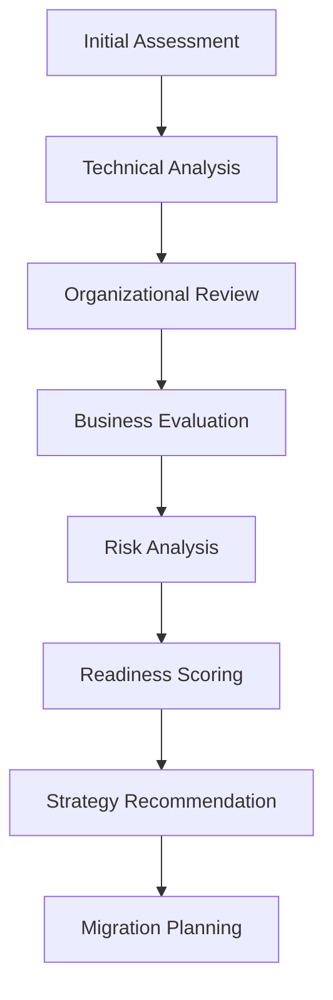

# Migration Readiness Assessment Guide

## Overview

This guide provides a comprehensive framework for assessing the readiness of ASP.NET WebForms applications for migration to modern platforms including ASP.NET Core, Blazor, or other contemporary web frameworks. The assessment evaluates technical, organizational, and business readiness factors to determine optimal migration timing and approach.

## Table of Contents

1. [Assessment Framework](#assessment-framework)
2. [Technical Readiness](#technical-readiness)
3. [Organizational Readiness](#organizational-readiness)
4. [Business Readiness](#business-readiness)
5. [Risk Assessment](#risk-assessment)
6. [Migration Strategy Selection](#migration-strategy-selection)
7. [Readiness Scoring](#readiness-scoring)
8. [Assessment Tools and Checklists](#assessment-tools-and-checklists)

## Assessment Framework

### Multi-Dimensional Readiness Model

Migration readiness is evaluated across four key dimensions:

1. **Technical Readiness** (40% weight)
   - Application architecture and code quality
   - Technology stack compatibility
   - Testing infrastructure and coverage
   - Performance and scalability requirements

2. **Organizational Readiness** (25% weight)
   - Team skills and expertise
   - Development processes and practices
   - Resource availability and allocation
   - Change management capabilities

3. **Business Readiness** (20% weight)
   - Strategic alignment and priorities
   - Budget and timeline constraints
   - Risk tolerance and appetite
   - Business continuity requirements

4. **Risk Assessment** (15% weight)
   - Technical risks and dependencies
   - Business impact and mitigation
   - Regulatory and compliance factors
   - External dependencies and constraints

### Assessment Process Overview



## Technical Readiness

### 1. Application Architecture Assessment

#### 1.1 Code Quality Metrics

**Code Structure Evaluation**:
```yaml
metrics:
  cyclomatic_complexity:
    threshold_good: < 10
    threshold_fair: 10-20
    threshold_poor: > 20
    
  method_length:
    threshold_good: < 20 lines
    threshold_fair: 20-50 lines
    threshold_poor: > 50 lines
    
  class_size:
    threshold_good: < 300 lines
    threshold_fair: 300-500 lines
    threshold_poor: > 500 lines
    
  code_coverage:
    threshold_good: > 70%
    threshold_fair: 40-70%
    threshold_poor: < 40%
```

**Assessment Checklist**:
- [ ] Codebase follows SOLID principles
- [ ] Clear separation of concerns implemented
- [ ] Minimal code duplication (< 5%)
- [ ] Consistent coding standards applied
- [ ] Comprehensive error handling in place
- [ ] Security best practices followed

#### 1.2 Dependency Analysis

**Framework Dependencies**:
```yaml
compatibility_assessment:
  net_framework_version:
    compatible: [4.7.2, 4.8]
    needs_upgrade: [4.0-4.7.1]
    major_work: [2.0-3.5]
    
  third_party_libraries:
    check_core_compatibility: true
    identify_replacements: true
    assess_effort: high/medium/low
    
  custom_components:
    migration_complexity: evaluate
    rewrite_necessity: assess
    alternative_solutions: research
```

**Database Compatibility**:
- [ ] SQL Server version compatibility with .NET Core
- [ ] Entity Framework migration path available
- [ ] Stored procedures and functions compatibility
- [ ] Database schema modernization requirements

#### 1.3 Testing Infrastructure

**Test Coverage Analysis**:
```yaml
testing_readiness:
  unit_tests:
    coverage_percentage: measure
    framework_compatibility: assess
    mocking_strategy: evaluate
    
  integration_tests:
    database_tests: review
    api_tests: inventory
    ui_tests: evaluate
    
  automated_testing:
    ci_cd_pipeline: assess
    test_automation: review
    performance_tests: evaluate
```

### 2. Technology Stack Compatibility

#### 2.1 WebForms Specific Assessment

**WebForms Features Inventory**:
```yaml
webforms_features:
  page_lifecycle:
    complexity: high/medium/low
    replacement_strategy: required
    
  viewstate_usage:
    dependency_level: critical/moderate/minimal
    stateless_conversion: effort_estimate
    
  server_controls:
    custom_controls: inventory
    third_party_controls: compatibility_check
    replacement_options: research
    
  master_pages:
    nesting_complexity: evaluate
    layout_conversion: plan
```

**Migration Compatibility Matrix**:

| Feature | ASP.NET Core | Blazor Server | Blazor WASM | React/Angular |
|---------|--------------|---------------|-------------|---------------|
| Page Lifecycle | ❌ | ⚠️ | ❌ | ❌ |
| ViewState | ❌ | ⚠️ | ❌ | ❌ |
| Server Controls | ❌ | ✅ | ⚠️ | ❌ |
| Master Pages | ❌ | ✅ | ✅ | ❌ |
| User Controls | ❌ | ✅ | ✅ | ⚠️ |
| Code-Behind | ⚠️ | ✅ | ✅ | ❌ |

Legend: ✅ Direct migration possible, ⚠️ Significant changes required, ❌ Complete rewrite needed

#### 2.2 Performance Requirements

**Performance Baseline Assessment**:
```yaml
performance_metrics:
  page_load_times:
    current_baseline: measure
    target_improvement: define
    acceptable_regression: threshold
    
  concurrent_users:
    current_capacity: assess
    growth_requirements: project
    scalability_needs: evaluate
    
  resource_utilization:
    memory_usage: profile
    cpu_consumption: monitor
    database_load: analyze
```

## Organizational Readiness

### 1. Team Skills Assessment

#### 1.1 Technical Skills Matrix

**Current Skill Inventory**:
```yaml
team_skills:
  webforms_expertise:
    expert: count
    proficient: count
    beginner: count
    
  modern_frameworks:
    asp_net_core: skill_level
    blazor: experience
    javascript_spa: proficiency
    cloud_platforms: knowledge
    
  development_practices:
    unit_testing: adoption_level
    ci_cd: experience
    agile_methodologies: maturity
    devops_practices: implementation
```

**Skills Gap Analysis**:
- [ ] Identify critical skill gaps for target platform
- [ ] Assess training requirements and timeline
- [ ] Evaluate need for external expertise or hiring
- [ ] Plan knowledge transfer and mentoring programs

#### 1.2 Team Capacity and Availability

**Resource Assessment**:
```yaml
team_capacity:
  development_team:
    size: count
    availability: percentage
    allocation: dedicated/shared
    
  quality_assurance:
    testing_resources: count
    automation_skills: level
    domain_knowledge: depth
    
  devops_support:
    infrastructure_expertise: level
    deployment_automation: maturity
    monitoring_capabilities: assessment
```

### 2. Development Process Maturity

#### 2.1 Current Process Assessment

**Development Practices Evaluation**:
```yaml
process_maturity:
  version_control:
    system: git/tfs/other
    branching_strategy: assessment
    code_review_process: maturity
    
  build_automation:
    continuous_integration: implemented
    automated_testing: coverage
    deployment_automation: level
    
  quality_assurance:
    code_quality_gates: existence
    static_analysis: usage
    security_scanning: implementation
```

**Process Readiness Checklist**:
- [ ] Version control system supports modern workflows
- [ ] Automated build and deployment pipeline exists
- [ ] Code review process is established and followed
- [ ] Quality gates and automated testing integrated
- [ ] Documentation and knowledge sharing practices
- [ ] Incident response and support processes defined

#### 2.2 Change Management Capabilities

**Organizational Change Assessment**:
- [ ] Previous experience with technology migrations
- [ ] Change management framework and processes
- [ ] Stakeholder communication and buy-in strategies
- [ ] Training and development programs capability
- [ ] Risk mitigation and contingency planning maturity

## Business Readiness

### 1. Strategic Alignment

#### 1.1 Business Objectives Assessment

**Strategic Fit Evaluation**:
```yaml
business_alignment:
  digital_transformation:
    priority_level: high/medium/low
    timeline: urgent/planned/future
    investment_appetite: assessment
    
  technology_modernization:
    business_case: developed
    roi_expectations: defined
    success_metrics: established
    
  competitive_advantage:
    market_pressures: analysis
    innovation_requirements: assessment
    time_to_market: criticality
```

**Business Value Drivers**:
- [ ] Performance and user experience improvements
- [ ] Maintenance cost reduction and efficiency gains
- [ ] Enhanced security and compliance capabilities
- [ ] Scalability and future-proofing benefits
- [ ] Developer productivity and recruitment advantages
- [ ] Integration and ecosystem compatibility

#### 1.2 Budget and Resource Planning

**Financial Readiness Assessment**:
```yaml
budget_planning:
  migration_costs:
    development_effort: estimated
    infrastructure_changes: assessed
    training_and_certification: planned
    external_consulting: budgeted
    
  ongoing_costs:
    licensing_changes: evaluated
    operational_overhead: calculated
    support_and_maintenance: planned
    
  cost_benefit_analysis:
    payback_period: calculated
    roi_timeline: projected
    risk_adjusted_returns: assessed
```

### 2. Timeline and Constraints

#### 2.1 Project Timeline Assessment

**Schedule Constraints Evaluation**:
- [ ] Business-critical deadlines and milestones
- [ ] Regulatory compliance requirements and deadlines
- [ ] Seasonal business patterns and blackout periods
- [ ] Dependency on other projects and initiatives
- [ ] Resource availability and competing priorities

#### 2.2 Business Continuity Requirements

**Operational Constraints**:
```yaml
continuity_requirements:
  uptime_requirements:
    availability_sla: percentage
    maintenance_windows: defined
    disaster_recovery: rto/rpo
    
  data_integrity:
    backup_requirements: specified
    migration_validation: process
    rollback_capabilities: planned
    
  user_impact:
    training_requirements: assessed
    workflow_changes: documented
    support_implications: planned
```

## Risk Assessment

### 1. Technical Risks

#### 1.1 Migration-Specific Risks

**Technical Risk Categories**:

| Risk Category | Probability | Impact | Mitigation Strategy |
|---------------|-------------|--------|-------------------|
| Data Loss/Corruption | Low | Critical | Comprehensive backup and validation |
| Performance Degradation | Medium | High | Performance testing and optimization |
| Feature Parity Issues | High | Medium | Detailed feature mapping and testing |
| Integration Failures | Medium | High | Incremental migration and testing |
| Security Vulnerabilities | Low | Critical | Security review and penetration testing |

#### 1.2 Technology Risks

**Platform and Framework Risks**:
- [ ] Target platform maturity and stability
- [ ] Long-term support and roadmap alignment
- [ ] Community and vendor support availability
- [ ] Learning curve and adoption challenges
- [ ] Performance and scalability characteristics

### 2. Business Risks

#### 2.1 Operational Risks

**Business Impact Assessment**:
```yaml
operational_risks:
  user_disruption:
    probability: assess
    impact: quantify
    mitigation: plan
    
  revenue_impact:
    potential_loss: estimate
    duration: timeline
    recovery_plan: develop
    
  competitive_impact:
    market_position: risk
    customer_satisfaction: impact
    reputation: assessment
```

#### 2.2 Project Delivery Risks

**Delivery Risk Factors**:
- [ ] Scope creep and requirement changes
- [ ] Resource availability and skill constraints
- [ ] Timeline pressures and competing priorities
- [ ] External dependencies and integration points
- [ ] Quality assurance and testing coverage

## Migration Strategy Selection

### Strategy Options Matrix

| Strategy | Effort | Risk | Time | Business Disruption |
|----------|--------|------|------|-------------------|
| **Big Bang** | High | High | Short | High |
| **Strangler Fig** | Medium | Low | Long | Low |
| **Parallel Run** | High | Low | Medium | Low |
| **Gradual Migration** | Medium | Medium | Long | Medium |

### Strategy Selection Criteria

**Big Bang Migration**:
- ✅ Small applications with limited complexity
- ✅ Strong testing infrastructure in place
- ✅ Tolerance for higher risk and potential downtime
- ❌ Large, complex applications
- ❌ Critical business systems with strict uptime requirements

**Strangler Fig Pattern**:
- ✅ Large applications with clear functional boundaries
- ✅ Need to maintain business continuity
- ✅ Gradual team skill development preferred
- ❌ Tightly coupled monolithic applications
- ❌ Short timeline requirements

**Parallel Run Approach**:
- ✅ Critical systems requiring validation
- ✅ High risk tolerance for additional complexity
- ✅ Resources available for dual maintenance
- ❌ Resource-constrained environments
- ❌ Simple applications without complex workflows

## Readiness Scoring

### Scoring Framework

**Dimension Scoring (0-100 scale)**:

```yaml
technical_readiness:
  code_quality: weight_30%
  architecture: weight_25%
  testing: weight_20%
  compatibility: weight_25%

organizational_readiness:
  team_skills: weight_40%
  processes: weight_35%
  capacity: weight_25%

business_readiness:
  alignment: weight_40%
  budget: weight_35%
  timeline: weight_25%

risk_assessment:
  technical_risks: weight_50%
  business_risks: weight_50%
```

### Overall Readiness Classification

**Readiness Levels**:

- **Ready (85-100)**: All dimensions show strong readiness
  - Recommended: Proceed with migration planning
  - Timeline: Immediate to 3 months

- **Mostly Ready (70-84)**: Minor gaps in 1-2 dimensions
  - Recommended: Address gaps, then proceed
  - Timeline: 3-6 months preparation

- **Partially Ready (55-69)**: Significant gaps in multiple dimensions
  - Recommended: Focused improvement program
  - Timeline: 6-12 months preparation

- **Not Ready (40-54)**: Major gaps across dimensions
  - Recommended: Comprehensive readiness program
  - Timeline: 12-18 months preparation

- **Unprepared (<40)**: Fundamental readiness lacking
  - Recommended: Strategic review and planning
  - Timeline: 18+ months preparation

### Readiness Dashboard

```
📊 Migration Readiness Dashboard

Overall Score: 78/100 (Mostly Ready)
├── 🔧 Technical: 82/100 (Ready)
├── 👥 Organizational: 75/100 (Mostly Ready)
├── 💼 Business: 85/100 (Ready)
└── ⚠️ Risk: 65/100 (Moderate Risk)

Top Recommendations:
1. Address testing infrastructure gaps
2. Develop team skills in target platform
3. Finalize budget allocation and timeline
4. Create detailed risk mitigation plan

Next Steps:
□ Complete skill gap analysis
□ Develop training program
□ Create detailed migration plan
□ Establish success metrics
```

## Assessment Tools and Checklists

### Technical Assessment Checklist

```markdown
## Code Quality Assessment
- [ ] Cyclomatic complexity analysis completed
- [ ] Code coverage measurement performed
- [ ] Security vulnerability scan executed
- [ ] Performance baseline established
- [ ] Dependency analysis documented

## Architecture Review
- [ ] Design patterns identified and cataloged
- [ ] Anti-patterns documented with remediation plans
- [ ] Component coupling analysis completed
- [ ] Database schema review performed
- [ ] Integration points mapped and assessed

## Technology Compatibility
- [ ] Framework compatibility matrix completed
- [ ] Third-party library assessment finished
- [ ] Custom component migration plan developed
- [ ] Performance requirements validated
- [ ] Scalability needs assessed
```

### Organizational Assessment Checklist

```markdown
## Team Skills
- [ ] Current skill inventory completed
- [ ] Target skill requirements defined
- [ ] Skills gap analysis documented
- [ ] Training plan developed
- [ ] Resource capacity assessed

## Process Maturity
- [ ] Development practices evaluated
- [ ] Quality assurance processes reviewed
- [ ] DevOps capabilities assessed
- [ ] Change management maturity evaluated
- [ ] Documentation standards reviewed
```

### Business Assessment Checklist

```markdown
## Strategic Alignment
- [ ] Business objectives documented
- [ ] Success criteria defined
- [ ] ROI analysis completed
- [ ] Timeline constraints identified
- [ ] Budget allocation confirmed

## Risk Management
- [ ] Risk register created and maintained
- [ ] Mitigation strategies developed
- [ ] Contingency plans established
- [ ] Business continuity plans reviewed
- [ ] Stakeholder communication plan ready
```

## Automated Assessment Tools

### PowerShell Assessment Script

```powershell
# Migration Readiness Assessment Automation
param(
    [string]$SolutionPath,
    [string]$OutputPath = "assessment-report.json"
)

# Technical assessment automation
$technicalScore = Invoke-TechnicalAssessment -Path $SolutionPath

# Generate readiness report
$readinessReport = @{
    TechnicalScore = $technicalScore
    AssessmentDate = Get-Date
    Recommendations = Get-MigrationRecommendations -Score $technicalScore
}

$readinessReport | ConvertTo-Json -Depth 5 | Out-File $OutputPath
```

### Assessment API Integration

```csharp
// Migration readiness assessment API
public class MigrationReadinessAssessment
{
    public async Task<AssessmentResult> EvaluateReadiness(
        AssessmentRequest request)
    {
        var technicalScore = await assessmentEngine
            .EvaluateTechnicalReadiness(request.ApplicationPath);
            
        var organizationalScore = await assessmentEngine
            .EvaluateOrganizationalReadiness(request.TeamProfile);
            
        var businessScore = await assessmentEngine
            .EvaluateBusinessReadiness(request.BusinessContext);
            
        return new AssessmentResult
        {
            OverallScore = CalculateOverallScore(
                technicalScore, 
                organizationalScore, 
                businessScore),
            Recommendations = GenerateRecommendations(),
            Timeline = EstimateMigrationTimeline()
        };
    }
}
```

## Conclusion

The Migration Readiness Assessment Guide provides a comprehensive framework for evaluating all aspects of migration preparedness. Regular assessment using this guide ensures that migration projects begin with a clear understanding of readiness levels, potential challenges, and required preparation activities.

Successful migration depends not just on technical capabilities, but on organizational readiness, business alignment, and comprehensive risk management. Use this assessment guide to create data-driven migration strategies that maximize success probability while minimizing business disruption.

---

**Version**: 1.0  
**Last Updated**: 2025-08-14  
**Next Review**: 2025-11-14