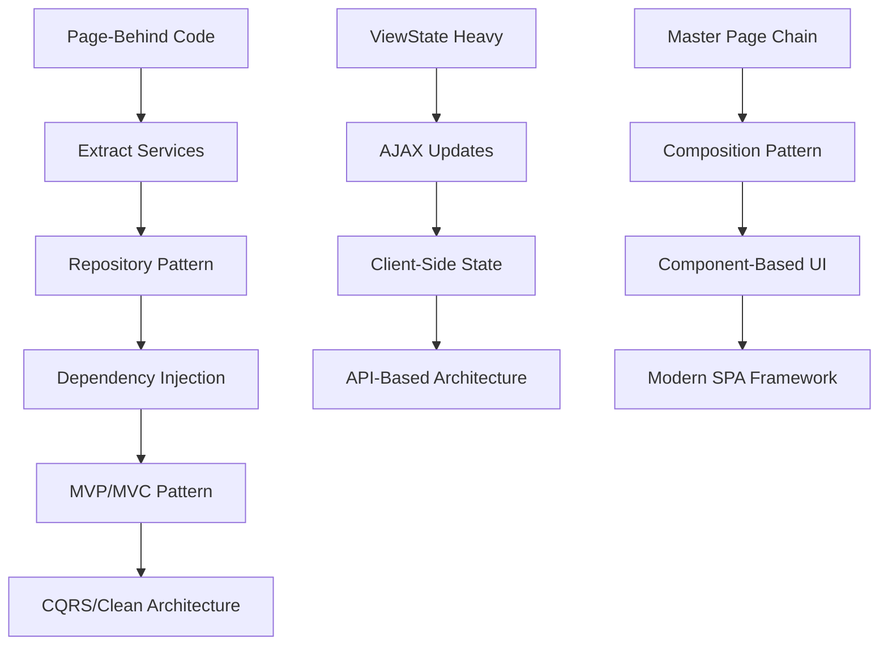

# WebForms Architecture Patterns Catalog

## Overview

This catalog provides a comprehensive reference of architectural patterns commonly found in ASP.NET WebForms applications, ranging from legacy anti-patterns to modern best practices. Each pattern includes identification criteria, assessment guidelines, and modernization recommendations.

## Table of Contents

1. [Pattern Classification System](#pattern-classification-system)
2. [Legacy Patterns](#legacy-patterns)
3. [Transitional Patterns](#transitional-patterns)
4. [Modern Patterns](#modern-patterns)
5. [Anti-Patterns](#anti-patterns)
6. [Pattern Assessment Matrix](#pattern-assessment-matrix)
7. [Modernization Pathways](#modernization-pathways)

## Pattern Classification System

### Classification Criteria

Patterns are classified across multiple dimensions:

- **Maintainability**: How easy is the code to maintain and extend?
- **Testability**: How well does the pattern support unit testing?
- **Performance**: What is the runtime performance impact?
- **Coupling**: How tightly coupled are the components?
- **Complexity**: How complex is the pattern to understand and implement?

### Scoring Scale
- **Excellent (5)**: Best practice, recommended approach
- **Good (4)**: Solid approach with minor limitations
- **Fair (3)**: Acceptable but room for improvement
- **Poor (2)**: Problematic, should be refactored
- **Critical (1)**: Anti-pattern, immediate attention required

## Legacy Patterns

### 1. Page-Behind Code Pattern

**Description**: Business logic embedded directly in page code-behind files.

**Identification Criteria**:
```csharp
public partial class Default : System.Web.UI.Page
{
    protected void Page_Load(object sender, EventArgs e)
    {
        // Direct database calls in page load
        SqlConnection conn = new SqlConnection(connectionString);
        SqlCommand cmd = new SqlCommand("SELECT * FROM Users", conn);
        // ... business logic mixed with UI logic
    }
    
    protected void btnSave_Click(object sender, EventArgs e)
    {
        // Business rules in event handler
        if (txtName.Text.Length > 50)
        {
            // Validation logic
        }
        // Direct data access
        // Email sending logic
        // Business calculations
    }
}
```

**Assessment Metrics**:
- Maintainability: 2/5 (Poor)
- Testability: 1/5 (Critical)
- Performance: 3/5 (Fair)
- Coupling: 1/5 (Critical)
- Complexity: 4/5 (Good - easy to understand initially)

**Refactoring Strategy**:
1. Extract business logic to service classes
2. Implement repository pattern for data access
3. Create dedicated validation classes
4. Use dependency injection for service management

### 2. ViewState Heavy Pattern

**Description**: Excessive reliance on ViewState for maintaining control state and data.

**Identification Criteria**:
```csharp
// Large DataSet in ViewState
ViewState["UserList"] = dataSet;
ViewState["FilterCriteria"] = complexObject;
ViewState["CalculationResults"] = largeArray;

// ViewState size > 100KB typical indicator
// Multiple page postbacks with full ViewState roundtrip
```

**Assessment Metrics**:
- Maintainability: 2/5 (Poor)
- Testability: 2/5 (Poor)
- Performance: 1/5 (Critical)
- Coupling: 3/5 (Fair)
- Complexity: 2/5 (Poor)

**Refactoring Strategy**:
1. Move to stateless design patterns
2. Implement client-side state management
3. Use session state judiciously
4. Adopt AJAX patterns for partial updates

### 3. Master Page Inheritance Chain

**Description**: Complex nested master page hierarchies with tight coupling.

**Identification Criteria**:
```
Site.Master
  └── Section.Master
      └── SubSection.Master
          └── Content.aspx

// Deep inheritance with cross-dependencies
// Shared code in master page code-behind
// Complex property passing between levels
```

**Assessment Metrics**:
- Maintainability: 2/5 (Poor)
- Testability: 2/5 (Poor)
- Performance: 3/5 (Fair)
- Coupling: 1/5 (Critical)
- Complexity: 2/5 (Poor)

**Refactoring Strategy**:
1. Flatten master page hierarchy
2. Extract common functionality to base classes
3. Use composition over inheritance
4. Implement shared components

## Transitional Patterns

### 4. MVP (Model-View-Presenter) Pattern

**Description**: Separation of presentation logic using MVP architectural pattern.

**Implementation Example**:
```csharp
// View Interface
public interface IUserView
{
    string UserName { get; set; }
    string Email { get; set; }
    event EventHandler SaveUser;
    void ShowMessage(string message);
}

// Presenter
public class UserPresenter
{
    private IUserView view;
    private IUserService userService;
    
    public UserPresenter(IUserView view, IUserService userService)
    {
        this.view = view;
        this.userService = userService;
        this.view.SaveUser += OnSaveUser;
    }
    
    private void OnSaveUser(object sender, EventArgs e)
    {
        var user = new User 
        { 
            Name = view.UserName, 
            Email = view.Email 
        };
        userService.SaveUser(user);
        view.ShowMessage("User saved successfully");
    }
}

// Page Implementation
public partial class UserPage : Page, IUserView
{
    private UserPresenter presenter;
    
    protected void Page_Load(object sender, EventArgs e)
    {
        presenter = new UserPresenter(this, new UserService());
    }
    
    public string UserName 
    { 
        get { return txtUserName.Text; } 
        set { txtUserName.Text = value; } 
    }
    
    public event EventHandler SaveUser;
    
    protected void btnSave_Click(object sender, EventArgs e)
    {
        SaveUser?.Invoke(sender, e);
    }
}
```

**Assessment Metrics**:
- Maintainability: 4/5 (Good)
- Testability: 5/5 (Excellent)
- Performance: 4/5 (Good)
- Coupling: 4/5 (Good)
- Complexity: 3/5 (Fair)

### 5. Repository Pattern

**Description**: Data access abstraction layer separating business logic from data persistence.

**Implementation Example**:
```csharp
// Repository Interface
public interface IUserRepository
{
    User GetById(int id);
    IEnumerable<User> GetAll();
    void Add(User user);
    void Update(User user);
    void Delete(int id);
}

// Repository Implementation
public class UserRepository : IUserRepository
{
    private readonly string connectionString;
    
    public UserRepository(string connectionString)
    {
        this.connectionString = connectionString;
    }
    
    public User GetById(int id)
    {
        using (var connection = new SqlConnection(connectionString))
        {
            // Data access implementation
            return connection.QuerySingle<User>(
                "SELECT * FROM Users WHERE Id = @id", 
                new { id });
        }
    }
    
    // Other methods...
}

// Usage in Business Layer
public class UserService
{
    private readonly IUserRepository userRepository;
    
    public UserService(IUserRepository userRepository)
    {
        this.userRepository = userRepository;
    }
    
    public void ProcessUser(int userId)
    {
        var user = userRepository.GetById(userId);
        // Business logic processing
        userRepository.Update(user);
    }
}
```

**Assessment Metrics**:
- Maintainability: 5/5 (Excellent)
- Testability: 5/5 (Excellent)
- Performance: 4/5 (Good)
- Coupling: 5/5 (Excellent)
- Complexity: 4/5 (Good)

## Modern Patterns

### 6. Dependency Injection Pattern

**Description**: Inversion of Control container managing object dependencies.

**Implementation Example**:
```csharp
// Container Configuration
public class DependencyConfig
{
    public static void RegisterDependencies()
    {
        var container = new UnityContainer();
        
        container.RegisterType<IUserRepository, UserRepository>();
        container.RegisterType<IUserService, UserService>();
        container.RegisterType<IEmailService, EmailService>();
        
        DependencyResolver.SetResolver(new UnityDependencyResolver(container));
    }
}

// Base Page with DI Support
public class BasePage : Page
{
    protected T Resolve<T>()
    {
        return DependencyResolver.Current.GetService<T>();
    }
}

// Page Implementation
public partial class UserPage : BasePage
{
    private IUserService userService;
    
    protected void Page_Init(object sender, EventArgs e)
    {
        userService = Resolve<IUserService>();
    }
    
    protected void btnSave_Click(object sender, EventArgs e)
    {
        var user = new User { Name = txtName.Text };
        userService.SaveUser(user);
    }
}
```

**Assessment Metrics**:
- Maintainability: 5/5 (Excellent)
- Testability: 5/5 (Excellent)
- Performance: 4/5 (Good)
- Coupling: 5/5 (Excellent)
- Complexity: 3/5 (Fair)

### 7. CQRS (Command Query Responsibility Segregation)

**Description**: Separate models for reading and writing operations.

**Implementation Example**:
```csharp
// Command Side
public class CreateUserCommand
{
    public string Name { get; set; }
    public string Email { get; set; }
}

public class CreateUserCommandHandler
{
    private readonly IUserRepository repository;
    
    public CreateUserCommandHandler(IUserRepository repository)
    {
        this.repository = repository;
    }
    
    public void Handle(CreateUserCommand command)
    {
        var user = new User 
        { 
            Name = command.Name, 
            Email = command.Email 
        };
        repository.Add(user);
    }
}

// Query Side
public class UserListQuery
{
    public string SearchTerm { get; set; }
    public int PageSize { get; set; }
    public int PageNumber { get; set; }
}

public class UserListQueryHandler
{
    private readonly IUserReadRepository readRepository;
    
    public UserListQueryHandler(IUserReadRepository readRepository)
    {
        this.readRepository = readRepository;
    }
    
    public UserListViewModel Handle(UserListQuery query)
    {
        return readRepository.GetUserList(query);
    }
}
```

**Assessment Metrics**:
- Maintainability: 5/5 (Excellent)
- Testability: 5/5 (Excellent)
- Performance: 5/5 (Excellent)
- Coupling: 5/5 (Excellent)
- Complexity: 2/5 (Poor - high learning curve)

## Anti-Patterns

### 8. God Page Anti-Pattern

**Description**: Single page handling multiple unrelated responsibilities.

**Identification Criteria**:
```csharp
public partial class AdminDashboard : Page
{
    // User management
    protected void btnCreateUser_Click(object sender, EventArgs e) { }
    protected void btnDeleteUser_Click(object sender, EventArgs e) { }
    
    // Report generation
    protected void btnGenerateReport_Click(object sender, EventArgs e) { }
    protected void btnExportData_Click(object sender, EventArgs e) { }
    
    // System configuration
    protected void btnUpdateConfig_Click(object sender, EventArgs e) { }
    protected void btnBackupDatabase_Click(object sender, EventArgs e) { }
    
    // Email management
    protected void btnSendNewsletter_Click(object sender, EventArgs e) { }
    
    // 50+ event handlers, 2000+ lines of code
}
```

**Problems**:
- Single Responsibility Principle violation
- High coupling between unrelated features
- Difficult to test and maintain
- Complex deployment and change management

### 9. Database-in-UI Anti-Pattern

**Description**: Direct database operations embedded in user interface code.

**Identification Criteria**:
```csharp
protected void Page_Load(object sender, EventArgs e)
{
    string sql = "SELECT u.*, r.RoleName FROM Users u " +
                 "JOIN Roles r ON u.RoleId = r.Id " +
                 "WHERE u.IsActive = 1 ORDER BY u.LastName";
                 
    using (SqlConnection conn = new SqlConnection(ConfigurationManager.ConnectionStrings["DB"].ConnectionString))
    {
        SqlDataAdapter adapter = new SqlDataAdapter(sql, conn);
        DataTable dt = new DataTable();
        adapter.Fill(dt);
        
        GridView1.DataSource = dt;
        GridView1.DataBind();
    }
}
```

**Problems**:
- Data access logic mixed with presentation
- SQL injection vulnerabilities
- Tight coupling to database schema
- Impossible to unit test effectively

### 10. Session State Abuse

**Description**: Overuse of session state for application logic and large object storage.

**Identification Criteria**:
```csharp
// Storing large objects in session
Session["CurrentDataSet"] = heavyDataSet;
Session["UserPermissions"] = complexPermissionObject;
Session["CalculationCache"] = largeCacheObject;

// Using session for application flow control
if (Session["Step1Complete"] != null)
{
    if (Session["Step2Complete"] != null)
    {
        // Complex session-based state machine
    }
}
```

**Problems**:
- Memory consumption on server
- Scalability issues with web farms
- Session timeout complications
- Debugging and testing difficulties

## Pattern Assessment Matrix

| Pattern | Maintainability | Testability | Performance | Coupling | Complexity | Overall |
|---------|----------------|-------------|-------------|----------|------------|---------|
| Page-Behind Code | 2 | 1 | 3 | 1 | 4 | 2.2 |
| ViewState Heavy | 2 | 2 | 1 | 3 | 2 | 2.0 |
| Master Page Chain | 2 | 2 | 3 | 1 | 2 | 2.0 |
| MVP Pattern | 4 | 5 | 4 | 4 | 3 | 4.0 |
| Repository Pattern | 5 | 5 | 4 | 5 | 4 | 4.6 |
| Dependency Injection | 5 | 5 | 4 | 5 | 3 | 4.4 |
| CQRS | 5 | 5 | 5 | 5 | 2 | 4.4 |
| God Page | 1 | 1 | 2 | 1 | 1 | 1.2 |
| Database-in-UI | 1 | 1 | 3 | 1 | 3 | 1.8 |
| Session State Abuse | 2 | 2 | 1 | 2 | 2 | 1.8 |

## Modernization Pathways

### Legacy to Modern Migration Path



### Pattern Modernization Priority

1. **Critical (Immediate Action)**:
   - God Page Anti-Pattern
   - Database-in-UI Anti-Pattern
   - Session State Abuse

2. **High Priority (Next Sprint)**:
   - Page-Behind Code Pattern
   - ViewState Heavy Pattern
   - Master Page Chain

3. **Medium Priority (Next Quarter)**:
   - Implement MVP Pattern
   - Add Repository Pattern
   - Introduce Dependency Injection

4. **Low Priority (Future Releases)**:
   - CQRS Implementation
   - Advanced Architectural Patterns
   - Microservices Transition

### Refactoring Strategies

#### Strangler Fig Pattern
```
1. Identify boundaries around legacy code
2. Create new interface matching legacy behavior
3. Implement new functionality behind interface
4. Gradually replace legacy implementation
5. Remove old code when fully replaced
```

#### Branch by Abstraction
```
1. Create abstraction layer over existing code
2. Modify clients to use abstraction
3. Create new implementation behind abstraction
4. Switch abstraction to use new implementation
5. Remove old implementation and unnecessary abstraction
```

## Conclusion

This architecture patterns catalog provides a foundation for assessing and modernizing WebForms applications. Regular pattern assessment ensures that applications evolve toward maintainable, testable, and performant architectures while avoiding common anti-patterns that create technical debt.

Use this catalog in conjunction with the comprehensive assessment methodology to create targeted modernization strategies that address specific architectural challenges in your WebForms applications.

---

**Version**: 1.0  
**Last Updated**: 2025-08-14  
**Next Review**: 2025-11-14