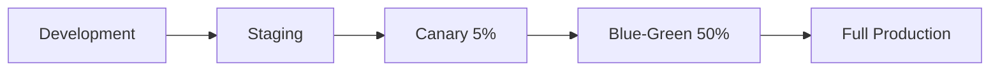

# ASP.NET WebForms to Modern .NET Migration Strategies

## Executive Summary

This comprehensive guide outlines proven strategies for migrating legacy ASP.NET WebForms applications to modern .NET frameworks including ASP.NET Core MVC, Blazor Server/WebAssembly, and hybrid approaches. The strategies presented here are based on current industry best practices, Microsoft recommendations, and real-world case studies from 2024-2025.

## Table of Contents

1. [Migration Overview](#migration-overview)
2. [Migration Paths](#migration-paths)
3. [Incremental Migration Approaches](#incremental-migration-approaches)
4. [Tool-Assisted Migration Options](#tool-assisted-migration-options)
5. [Code Conversion Patterns](#code-conversion-patterns)
6. [Testing Strategies](#testing-strategies)
7. [Risk Mitigation Approaches](#risk-mitigation-approaches)
8. [ROI Analysis Framework](#roi-analysis-framework)
9. [Case Studies and Success Stories](#case-studies-and-success-stories)
10. [Implementation Roadmap](#implementation-roadmap)

## Migration Overview

### Current State of WebForms

**Microsoft's Position (2024-2025):**
- WebForms will NOT be ported to ASP.NET Core
- WebForms applications cannot leverage improvements in .NET Core and later versions
- Organizations must choose between staying on legacy .NET Framework or modernizing

### Key Migration Drivers

1. **Security & Compliance**: Legacy frameworks accumulate security vulnerabilities
2. **Performance**: Modern .NET offers significant performance improvements
3. **Cost Optimization**: Reduced licensing, hosting, and maintenance costs
4. **Developer Productivity**: Access to modern tooling and development practices
5. **Cloud Readiness**: Better containerization and cloud deployment options
6. **Future-Proofing**: Continued Microsoft support and feature development

## Migration Paths

### 1. ASP.NET Core MVC Migration

**Best For:** Applications requiring traditional server-side rendering with clear separation of concerns

**Pros:**
- Familiar MVC pattern for developers
- Strong separation of concerns
- Excellent testability
- Rich ecosystem and tooling
- Cross-platform deployment

**Cons:**
- Significant architectural changes required
- Different request lifecycle than WebForms
- Learning curve for WebForms developers

**Timeline:** 6-18 months depending on application complexity

### 2. Blazor Server Migration

**Best For:** Applications where developers want to retain C# skills and server-side processing

**Pros:**
- Component-based architecture similar to WebForms controls
- Full .NET runtime on server
- Real-time UI updates via SignalR
- Strong debugging capabilities
- Familiar C# development experience

**Cons:**
- Requires constant server connection
- Network latency affects UI responsiveness
- Scalability considerations for high-traffic applications

**Timeline:** 4-12 months depending on application complexity

### 3. Blazor WebAssembly Migration

**Best For:** Applications requiring rich client-side interactions and offline capabilities

**Pros:**
- Client-side execution
- Offline capability
- Reduced server load
- Progressive Web App (PWA) support

**Cons:**
- Larger initial download size
- Limited .NET API surface
- Browser compatibility considerations
- Debugging complexity

**Timeline:** 6-15 months depending on application complexity

### 4. Hybrid/Mixed Approach

**Best For:** Large applications requiring gradual migration or mixed technology requirements

**Pros:**
- Gradual migration reduces risk
- Maintains business continuity
- Allows for technology evaluation
- Preserves existing investments

**Cons:**
- Increased complexity during transition
- Potential integration challenges
- Longer overall migration timeline

**Timeline:** 12-36 months for complete migration

## Incremental Migration Approaches

### 1. Strangler Fig Pattern (Recommended)

The Strangler Fig pattern allows gradual replacement of WebForms pages while maintaining system functionality.

**Implementation Steps:**
1. Set up reverse proxy (IIS or YARP)
2. Create new ASP.NET Core application
3. Migrate individual pages/features
4. Redirect traffic gradually
5. Decommission old components

**Example Configuration:**
```json
{
  "ReverseProxy": {
    "Routes": {
      "modern-route": {
        "ClusterId": "blazor-cluster",
        "Match": {
          "Path": "/modern/{**catch-all}"
        }
      },
      "legacy-route": {
        "ClusterId": "webforms-cluster",
        "Match": {
          "Path": "/{**catch-all}"
        }
      }
    }
  }
}
```

### 2. Side-by-Side Migration

**Microsoft's Recommended Approach:**
- Create new ASP.NET Core project alongside existing WebForms
- Migrate subset of pages first
- Run both applications simultaneously
- Gradually transition users to new application

**Benefits:**
- Minimal risk to production systems
- Allows for thorough testing
- Enables feature comparison
- Provides rollback capability

### 3. System.Web Adapters Approach

**Microsoft's Official Migration Helper:**

```csharp
// Program.cs in ASP.NET Core app
builder.Services.AddSystemWebAdapters()
    .AddHttpApplication<Global>()
    .AddHttpRequestHeaders()
    .AddSession()
    .AddViewState();
```

**Key Adapters:**
- `Microsoft.AspNetCore.SystemWebAdapters` - Core runtime helpers
- `Microsoft.AspNetCore.SystemWebAdapters.FrameworkServices` - Framework app services
- `Microsoft.AspNetCore.SystemWebAdapters.CoreServices` - Core app services

## Tool-Assisted Migration Options

### 1. Microsoft Tools

#### .NET Upgrade Assistant
```bash
# Install the tool
dotnet tool install -g upgrade-assistant

# Analyze project
upgrade-assistant analyze MyWebFormsApp.sln

# Upgrade project
upgrade-assistant upgrade MyWebFormsApp.sln
```

**Capabilities:**
- Project file modernization
- Package reference updates
- Code analysis and recommendations
- Configuration migration assistance

#### Porting Assistant for .NET
- Standalone Windows application and Visual Studio extension
- Comprehensive compatibility analysis
- API replacement suggestions
- Dependency mapping

#### GitHub Copilot App Modernization
- AI-assisted code transformation
- Interactive upgrade experience
- Pattern recognition for common migrations
- Context-aware suggestions

### 2. Commercial Tools

#### Mobilize.Net WebMAP
**Features:**
- Automated source code migration
- WebForms to Angular/HTML5 conversion
- Business logic to ASP.NET Core conversion
- Patented migration technology

**Pricing:** Enterprise pricing (contact for quote)
**Status:** Early beta, limited customer trials

#### GAPVelocity AI
**Features:**
- Code decoupling and conversion
- Business logic separation
- Modern frontend generation (Angular, React, Blazor)
- Data migration capabilities

**Benefits:**
- Significant time and cost reduction
- Automated conversion processes
- Modern architecture patterns

### 3. Specialized Migration Tools

#### BlazorWebFormsComponents
- Open-source component library
- WebForms control equivalents in Blazor
- Familiar component patterns
- Community-driven development

**Example Usage:**
```razor
@* WebForms-style components in Blazor *@
<DataList Items="@customers" ItemTemplate="CustomerTemplate" />
<ListView DataSource="@products" ItemTemplate="ProductTemplate" />
<TreeView Nodes="@menuItems" />
```

## Code Conversion Patterns

### 1. Page Structure Migration

**WebForms Pattern:**
```aspx
<%@ Page Language="C#" AutoEventWireup="true" CodeBehind="Default.aspx.cs" 
         Inherits="WebApp.Default" %>
<!DOCTYPE html>
<html>
<head runat="server">
    <title>My Page</title>
</head>
<body>
    <form id="form1" runat="server">
        <asp:Label ID="lblMessage" runat="server" Text="Hello World" />
        <asp:Button ID="btnSubmit" runat="server" OnClick="btnSubmit_Click" />
    </form>
</body>
</html>
```

**Blazor Server Equivalent:**
```razor
@page "/"
@using Microsoft.AspNetCore.Components

<PageTitle>My Page</PageTitle>

<h1>@message</h1>
<button class="btn btn-primary" @onclick="HandleSubmit">Submit</button>

@code {
    private string message = "Hello World";
    
    private async Task HandleSubmit()
    {
        // Handle button click
        message = "Button clicked!";
    }
}
```

### 2. Event Handling Migration

**WebForms Code-Behind:**
```csharp
protected void btnSubmit_Click(object sender, EventArgs e)
{
    lblMessage.Text = "Form submitted!";
    // Additional logic
}
```

**Blazor Component:**
```csharp
@code {
    private async Task HandleSubmit()
    {
        message = "Form submitted!";
        // Additional logic
        await InvokeAsync(StateHasChanged);
    }
}
```

### 3. Data Binding Patterns

**WebForms Data Binding:**
```aspx
<asp:GridView ID="gvCustomers" runat="server" DataSourceID="sqlDataSource">
    <Columns>
        <asp:BoundField DataField="Name" HeaderText="Customer Name" />
        <asp:BoundField DataField="Email" HeaderText="Email" />
    </Columns>
</asp:GridView>
<asp:SqlDataSource ID="sqlDataSource" runat="server" 
                   ConnectionString="<%$ ConnectionStrings:DefaultConnection %>" 
                   SelectCommand="SELECT Name, Email FROM Customers" />
```

**Blazor Data Binding:**
```razor
<table class="table">
    <thead>
        <tr>
            <th>Customer Name</th>
            <th>Email</th>
        </tr>
    </thead>
    <tbody>
        @foreach (var customer in customers)
        {
            <tr>
                <td>@customer.Name</td>
                <td>@customer.Email</td>
            </tr>
        }
    </tbody>
</table>

@code {
    private List<Customer> customers = new();
    
    protected override async Task OnInitializedAsync()
    {
        customers = await CustomerService.GetCustomersAsync();
    }
}
```

### 4. Session State Migration

**WebForms Session:**
```csharp
Session["UserId"] = userId;
var userId = (int)Session["UserId"];
```

**ASP.NET Core Session:**
```csharp
HttpContext.Session.SetInt32("UserId", userId);
var userId = HttpContext.Session.GetInt32("UserId");
```

**Blazor Server (via Circuit Handler):**
```csharp
public class SessionService
{
    private readonly Dictionary<string, object> _sessionData = new();
    
    public void SetValue<T>(string key, T value) => _sessionData[key] = value;
    public T GetValue<T>(string key) => (T)_sessionData.GetValueOrDefault(key);
}
```

## Testing Strategies

### 1. Pre-Migration Testing

#### Characterization Tests
Create comprehensive end-to-end tests using Selenium or Playwright to capture current behavior:

```csharp
[Test]
public async Task LoginFlow_ShouldAuthenticateUser()
{
    await Page.GotoAsync("/login.aspx");
    await Page.FillAsync("#txtUsername", "testuser");
    await Page.FillAsync("#txtPassword", "password");
    await Page.ClickAsync("#btnLogin");
    
    await Expect(Page).ToHaveURLAsync("/dashboard.aspx");
    await Expect(Page.Locator("#lblWelcome")).ToContainTextAsync("Welcome");
}
```

#### Unit Testing Legacy Code
Extract business logic into testable classes:

```csharp
// Before: Tightly coupled to WebForms
public partial class CustomerPage : Page
{
    protected void btnSave_Click(object sender, EventArgs e)
    {
        var customer = new Customer
        {
            Name = txtName.Text,
            Email = txtEmail.Text
        };
        
        using (var connection = new SqlConnection(connectionString))
        {
            // Database logic mixed with UI
        }
    }
}

// After: Separated business logic
public class CustomerService
{
    public async Task<bool> SaveCustomerAsync(Customer customer)
    {
        // Testable business logic
        return await _repository.SaveAsync(customer);
    }
}

[Test]
public async Task SaveCustomer_ValidData_ReturnsTrue()
{
    var service = new CustomerService(_mockRepository.Object);
    var customer = new Customer { Name = "Test", Email = "test@test.com" };
    
    var result = await service.SaveCustomerAsync(customer);
    
    Assert.IsTrue(result);
}
```

### 2. Migration Testing

#### Dual Testing Strategy
Run the same tests against both legacy and migrated applications:

```csharp
[TestFixture]
public class CustomerServiceTests
{
    [Test]
    [TestCase("legacy")]
    [TestCase("migrated")]
    public async Task GetCustomers_ReturnsExpectedData(string version)
    {
        var service = version == "legacy" 
            ? new LegacyCustomerService() 
            : new ModernCustomerService();
            
        var customers = await service.GetCustomersAsync();
        
        Assert.AreEqual(expectedCustomers.Count, customers.Count);
        // Additional assertions
    }
}
```

#### Visual Regression Testing
Use tools like Playwright or Storybook to ensure UI consistency:

```csharp
[Test]
public async Task CustomerList_VisualRegression()
{
    await Page.GotoAsync("/customers");
    await Page.ScreenshotAsync(new() { Path = "customer-list.png" });
    
    // Compare with baseline screenshot
    var diff = await VisualComparer.CompareAsync("customer-list-baseline.png", "customer-list.png");
    Assert.IsTrue(diff.SimilarityPercentage > 95);
}
```

### 3. Performance Testing

#### Load Testing
Compare performance between legacy and migrated applications:

```csharp
[Test]
public async Task LoadTest_CustomerEndpoint()
{
    var options = new NBomberScenarioOptions
    {
        Scenario = Scenario.Create("customer_load", async context =>
        {
            var response = await httpClient.GetAsync("/api/customers");
            return response.IsSuccessStatusCode ? Response.Ok() : Response.Fail();
        })
        .WithLoadSimulations(
            Simulation.InjectPerSec(rate: 100, during: TimeSpan.FromMinutes(5))
        )
    };
    
    await NBomberRunner.RegisterScenarios(options.Scenario).Run();
}
```

### 4. Security Testing

#### Authentication Testing
```csharp
[Test]
public async Task UnauthorizedAccess_ShouldRedirectToLogin()
{
    var response = await client.GetAsync("/secure-page");
    
    Assert.AreEqual(HttpStatusCode.Redirect, response.StatusCode);
    Assert.IsTrue(response.Headers.Location.ToString().Contains("/login"));
}
```

#### Input Validation Testing
```csharp
[Test]
public async Task XSSProtection_ShouldSanitizeInput()
{
    var maliciousInput = "<script>alert('XSS')</script>";
    var response = await client.PostAsync("/api/customers", 
        new StringContent(JsonSerializer.Serialize(new { Name = maliciousInput })));
    
    var content = await response.Content.ReadAsStringAsync();
    Assert.IsFalse(content.Contains("<script>"));
}
```

## Risk Mitigation Approaches

### 1. Technical Risk Mitigation

#### Incremental Deployment Strategy


**Implementation:**
- Deploy to small user subset first
- Monitor key metrics and error rates
- Gradual traffic increase based on success criteria
- Immediate rollback capability

#### Feature Flags for Migration
```csharp
public class FeatureFlags
{
    public const string USE_NEW_CUSTOMER_PAGE = "UseNewCustomerPage";
    public const string BLAZOR_NAVIGATION = "BlazorNavigation";
}

// In controller/component
if (await _featureManager.IsEnabledAsync(FeatureFlags.USE_NEW_CUSTOMER_PAGE))
{
    return RedirectToAction("Index", "NewCustomers");
}
```

### 2. Business Risk Mitigation

#### Data Consistency Validation
```csharp
public class DataConsistencyValidator
{
    public async Task<ValidationResult> ValidateCustomerDataAsync()
    {
        var legacyCustomers = await _legacyService.GetCustomersAsync();
        var modernCustomers = await _modernService.GetCustomersAsync();
        
        var inconsistencies = new List<string>();
        
        foreach (var legacyCustomer in legacyCustomers)
        {
            var modernCustomer = modernCustomers.FirstOrDefault(c => c.Id == legacyCustomer.Id);
            if (modernCustomer == null || !AreEquivalent(legacyCustomer, modernCustomer))
            {
                inconsistencies.Add($"Customer {legacyCustomer.Id} data mismatch");
            }
        }
        
        return new ValidationResult { Inconsistencies = inconsistencies };
    }
}
```

#### Rollback Strategy
```yaml
# Azure DevOps Pipeline
stages:
- stage: Deploy
  jobs:
  - deployment: DeployToProduction
    environment: Production
    strategy:
      runOnce:
        deploy:
          steps:
          - task: AzureWebApp@1
            inputs:
              deploymentMethod: 'slot'
              slotName: 'staging'
          - task: AzureAppServiceSlotSwap@1
            inputs:
              targetSlot: 'production'
        onFailure:
          steps:
          - task: AzureAppServiceSlotSwap@1
            inputs:
              targetSlot: 'staging'  # Rollback
```

### 3. Performance Risk Mitigation

#### Performance Monitoring
```csharp
public class PerformanceMetrics
{
    private readonly IMetrics _metrics;
    
    public async Task<T> MeasureAsync<T>(string operationName, Func<Task<T>> operation)
    {
        using var activity = Activity.StartActivity(operationName);
        var stopwatch = Stopwatch.StartNew();
        
        try
        {
            var result = await operation();
            _metrics.Measure.Timer.Time("operation.duration", stopwatch.Elapsed, 
                new MetricTags("operation", operationName, "status", "success"));
            return result;
        }
        catch (Exception ex)
        {
            _metrics.Measure.Timer.Time("operation.duration", stopwatch.Elapsed,
                new MetricTags("operation", operationName, "status", "error"));
            throw;
        }
    }
}
```

#### Resource Monitoring
```csharp
public class ResourceMonitor : BackgroundService
{
    protected override async Task ExecuteAsync(CancellationToken stoppingToken)
    {
        while (!stoppingToken.IsCancellationRequested)
        {
            var memoryUsage = GC.GetTotalMemory(false);
            var cpuUsage = GetCpuUsage();
            
            if (memoryUsage > _thresholds.MaxMemory || cpuUsage > _thresholds.MaxCpu)
            {
                await _alertingService.SendAlertAsync($"Resource usage exceeded: Memory={memoryUsage}, CPU={cpuUsage}");
            }
            
            await Task.Delay(TimeSpan.FromMinutes(1), stoppingToken);
        }
    }
}
```

## ROI Analysis Framework

### 1. Cost Analysis Model

#### Development Costs
```csharp
public class MigrationCostCalculator
{
    public decimal CalculateDevCosts(MigrationProject project)
    {
        var costs = new Dictionary<string, decimal>
        {
            ["Analysis"] = project.AnalysisHours * HourlyRate,
            ["Development"] = project.DevelopmentHours * HourlyRate,
            ["Testing"] = project.TestingHours * HourlyRate,
            ["Training"] = project.TrainingHours * HourlyRate,
            ["Tools"] = project.ToolCosts,
            ["Infrastructure"] = project.InfrastructureCosts
        };
        
        return costs.Values.Sum();
    }
}
```

#### Operational Savings
```csharp
public class OperationalSavings
{
    public decimal CalculateAnnualSavings(LegacySystem legacy, ModernSystem modern)
    {
        return new[]
        {
            legacy.LicensingCosts - modern.LicensingCosts,
            legacy.HostingCosts - modern.HostingCosts,
            legacy.MaintenanceCosts - modern.MaintenanceCosts,
            (legacy.DowntimeHours - modern.DowntimeHours) * HourlyBusinessValue,
            legacy.SecurityIncidentCosts - modern.SecurityIncidentCosts
        }.Sum();
    }
}
```

### 2. ROI Calculation

```csharp
public class ROICalculator
{
    public ROIResult CalculateROI(MigrationProject project)
    {
        var totalInvestment = project.DevelopmentCosts + project.RiskBuffer;
        var annualSavings = project.OperationalSavings + project.ProductivityGains;
        var paybackPeriod = totalInvestment / annualSavings;
        var fiveYearROI = (annualSavings * 5 - totalInvestment) / totalInvestment * 100;
        
        return new ROIResult
        {
            TotalInvestment = totalInvestment,
            AnnualSavings = annualSavings,
            PaybackPeriodMonths = paybackPeriod * 12,
            FiveYearROI = fiveYearROI
        };
    }
}
```

### 3. Business Value Metrics

#### Productivity Improvements
- **Developer Velocity**: 25-40% increase in feature delivery speed
- **Debugging Time**: 30-50% reduction due to better tooling
- **Deployment Frequency**: 3-5x increase with modern CI/CD

#### Quality Improvements
- **Bug Density**: 40-60% reduction due to better testing
- **Security Vulnerabilities**: 70-80% reduction with modern frameworks
- **Performance**: 20-50% improvement in response times

#### Business Agility
- **Time to Market**: 30-50% faster feature delivery
- **Scalability**: Improved ability to handle traffic spikes
- **Integration**: Better API support for modern integrations

## Case Studies and Success Stories

### Case Study 1: Enterprise Financial Services Migration

**Company:** Large financial services firm
**Legacy System:** 500+ WebForms pages, 15 years old
**Migration Path:** WebForms → Blazor Server
**Timeline:** 18 months
**Team Size:** 12 developers

**Approach:**
1. **Phase 1 (Months 1-3):** Analysis and proof of concept
2. **Phase 2 (Months 4-9):** Core infrastructure and shared components
3. **Phase 3 (Months 10-15):** Feature migration using Strangler Fig
4. **Phase 4 (Months 16-18):** Performance optimization and legacy decommission

**Results:**
- **Performance:** 40% improvement in page load times
- **Development Speed:** 35% faster feature delivery
- **Maintenance Costs:** 50% reduction in operational costs
- **Security:** 80% reduction in vulnerability reports
- **Developer Satisfaction:** Significant improvement in team morale

**Key Success Factors:**
- Executive sponsorship and dedicated team
- Incremental migration approach
- Comprehensive testing strategy
- Investment in developer training

### Case Study 2: Healthcare Management System

**Company:** Regional healthcare provider
**Legacy System:** Patient management system, 300 WebForms pages
**Migration Path:** WebForms → ASP.NET Core MVC + React
**Timeline:** 12 months
**Team Size:** 8 developers

**Approach:**
1. **API-First Strategy:** Built REST APIs for all business logic
2. **Micro-Frontend Architecture:** Gradual replacement of UI components
3. **Data Migration:** Moved from SQL Server to Azure SQL with improved schema
4. **Security Enhancement:** Implemented OAuth 2.0 and improved audit trails

**Results:**
- **User Experience:** 60% improvement in user satisfaction scores
- **System Reliability:** 99.9% uptime vs previous 97% uptime
- **Compliance:** Enhanced HIPAA compliance capabilities
- **Mobile Support:** First-class mobile experience introduced

**Lessons Learned:**
- API-first approach enabled multiple client applications
- Investment in UX design was crucial for user adoption
- Regular security audits prevented compliance issues

### Case Study 3: Manufacturing ERP System

**Company:** Mid-size manufacturing company
**Legacy System:** Custom WebForms ERP system
**Migration Path:** WebForms → Blazor WebAssembly + ASP.NET Core Web API
**Timeline:** 24 months (phased approach)
**Team Size:** 6 developers

**Challenges:**
- Complex business rules embedded in WebForms controls
- Heavy reliance on ViewState for complex workflows
- Integration with legacy manufacturing equipment

**Solutions:**
- Created domain-specific language (DSL) for business rules
- Implemented client-side state management
- Built modern REST APIs for equipment integration

**Results:**
- **Offline Capability:** Enabled manufacturing floor operations without internet
- **Real-time Updates:** Live dashboard for production metrics
- **Integration:** Improved connectivity with modern manufacturing tools
- **Training:** Reduced training time for new employees by 40%

## Implementation Roadmap

### Phase 1: Assessment and Planning (Months 1-2)

#### Week 1-2: Initial Assessment
- [ ] Inventory all WebForms pages and controls
- [ ] Analyze dependencies and third-party components
- [ ] Evaluate current architecture and data access patterns
- [ ] Assess team skills and training needs

#### Week 3-4: Technical Analysis
- [ ] Run automated analysis tools (Porting Assistant, Upgrade Assistant)
- [ ] Identify high-risk areas and technical debt
- [ ] Evaluate integration points and external dependencies
- [ ] Create technical architecture proposal

#### Week 5-6: Business Case Development
- [ ] Calculate migration costs and resource requirements
- [ ] Estimate ROI and payback period
- [ ] Identify business risks and mitigation strategies
- [ ] Create executive presentation and funding request

#### Week 7-8: Strategy Finalization
- [ ] Select migration path (MVC, Blazor Server, Blazor WASM)
- [ ] Choose incremental vs. big-bang approach
- [ ] Define success criteria and KPIs
- [ ] Create detailed project timeline

### Phase 2: Foundation and Setup (Months 3-4)

#### Infrastructure Setup
```yaml
# Example Azure DevOps Pipeline
trigger:
- main

pool:
  vmImage: 'windows-latest'

variables:
  solution: '**/*.sln'
  buildPlatform: 'Any CPU'
  buildConfiguration: 'Release'

stages:
- stage: Build
  displayName: Build Stage
  jobs:
  - job: Build
    displayName: Build Job
    steps:
    - task: NuGetToolInstaller@1
    - task: NuGetCommand@2
      inputs:
        restoreSolution: '$(solution)'
    - task: VSBuild@1
      inputs:
        solution: '$(solution)'
        msbuildArgs: '/p:DeployOnBuild=true /p:WebPublishMethod=Package /p:PackageAsSingleFile=true /p:SkipInvalidConfigurations=true /p:PackageLocation="$(build.artifactStagingDirectory)"'
        platform: '$(buildPlatform)'
        configuration: '$(buildConfiguration)'

- stage: Test
  displayName: Test Stage
  jobs:
  - job: Test
    displayName: Test Job
    steps:
    - task: VSTest@2
      inputs:
        platform: '$(buildPlatform)'
        configuration: '$(buildConfiguration)'
```

#### Development Environment
- Set up new ASP.NET Core solution structure
- Configure shared libraries and common components
- Establish coding standards and architectural patterns
- Create component library for reusable UI elements

#### Testing Infrastructure
```csharp
// Example test base class
public abstract class IntegrationTestBase : IClassFixture<WebApplicationFactory<Program>>
{
    protected readonly WebApplicationFactory<Program> Factory;
    protected readonly HttpClient Client;

    protected IntegrationTestBase(WebApplicationFactory<Program> factory)
    {
        Factory = factory;
        Client = factory.CreateClient();
    }

    protected async Task<T> GetAsync<T>(string endpoint)
    {
        var response = await Client.GetAsync(endpoint);
        response.EnsureSuccessStatusCode();
        var json = await response.Content.ReadAsStringAsync();
        return JsonSerializer.Deserialize<T>(json);
    }
}
```

### Phase 3: Core Migration (Months 5-12)

#### Month 5-6: Authentication and Authorization
- Migrate authentication system to ASP.NET Core Identity
- Implement JWT token-based authentication if needed
- Create role-based authorization policies
- Test security integration thoroughly

```csharp
// Example authentication setup
public void ConfigureServices(IServiceCollection services)
{
    services.AddAuthentication(JwtBearerDefaults.AuthenticationScheme)
        .AddJwtBearer(options =>
        {
            options.TokenValidationParameters = new TokenValidationParameters
            {
                ValidateIssuer = true,
                ValidateAudience = true,
                ValidateLifetime = true,
                ValidateIssuerSigningKey = true,
                ValidIssuer = Configuration["Jwt:Issuer"],
                ValidAudience = Configuration["Jwt:Audience"],
                IssuerSigningKey = new SymmetricSecurityKey(Encoding.UTF8.GetBytes(Configuration["Jwt:Key"]))
            };
        });

    services.AddAuthorization(options =>
    {
        options.AddPolicy("RequireAdminRole", policy => policy.RequireRole("Admin"));
        options.AddPolicy("RequireUserRole", policy => policy.RequireRole("User", "Admin"));
    });
}
```

#### Month 7-8: Data Access Layer
- Migrate to Entity Framework Core or Dapper
- Implement repository pattern for data access
- Create data transfer objects (DTOs)
- Optimize database queries and add indexes

```csharp
// Example repository implementation
public class CustomerRepository : ICustomerRepository
{
    private readonly ApplicationDbContext _context;

    public CustomerRepository(ApplicationDbContext context)
    {
        _context = context;
    }

    public async Task<IEnumerable<Customer>> GetCustomersAsync()
    {
        return await _context.Customers
            .Where(c => c.IsActive)
            .OrderBy(c => c.Name)
            .ToListAsync();
    }

    public async Task<Customer> GetCustomerByIdAsync(int id)
    {
        return await _context.Customers
            .FirstOrDefaultAsync(c => c.Id == id);
    }

    public async Task<Customer> CreateCustomerAsync(Customer customer)
    {
        _context.Customers.Add(customer);
        await _context.SaveChangesAsync();
        return customer;
    }
}
```

#### Month 9-10: Business Logic Services
- Extract business logic from WebForms code-behind
- Create service layer with dependency injection
- Implement validation and error handling
- Add logging and monitoring

```csharp
// Example service implementation
public class CustomerService : ICustomerService
{
    private readonly ICustomerRepository _repository;
    private readonly IValidator<Customer> _validator;
    private readonly ILogger<CustomerService> _logger;

    public CustomerService(ICustomerRepository repository, IValidator<Customer> validator, ILogger<CustomerService> logger)
    {
        _repository = repository;
        _validator = validator;
        _logger = logger;
    }

    public async Task<ServiceResult<Customer>> CreateCustomerAsync(CreateCustomerRequest request)
    {
        try
        {
            var customer = new Customer
            {
                Name = request.Name,
                Email = request.Email,
                CreatedDate = DateTime.UtcNow
            };

            var validationResult = await _validator.ValidateAsync(customer);
            if (!validationResult.IsValid)
            {
                return ServiceResult<Customer>.Failure(validationResult.Errors.Select(e => e.ErrorMessage));
            }

            var createdCustomer = await _repository.CreateCustomerAsync(customer);
            _logger.LogInformation("Customer created successfully: {CustomerId}", createdCustomer.Id);

            return ServiceResult<Customer>.Success(createdCustomer);
        }
        catch (Exception ex)
        {
            _logger.LogError(ex, "Error creating customer");
            return ServiceResult<Customer>.Failure("An error occurred while creating the customer");
        }
    }
}
```

#### Month 11-12: UI Component Migration
- Create reusable UI components
- Implement responsive design patterns
- Add client-side validation
- Optimize for performance and accessibility

### Phase 4: Feature Migration (Months 13-18)

Use the Strangler Fig pattern to migrate features incrementally:

```csharp
// Example migration controller
[Route("migration")]
public class MigrationController : Controller
{
    private readonly IFeatureManager _featureManager;
    
    public MigrationController(IFeatureManager featureManager)
    {
        _featureManager = featureManager;
    }

    [HttpGet("customers")]
    public async Task<IActionResult> Customers()
    {
        if (await _featureManager.IsEnabledAsync("NewCustomerPage"))
        {
            return RedirectToAction("Index", "ModernCustomers");
        }
        
        return Redirect("/legacy/customers.aspx");
    }
}
```

### Phase 5: Performance Optimization and Deployment (Months 19-20)

#### Performance Optimization
- Implement caching strategies
- Optimize database queries
- Add CDN for static assets
- Monitor and tune application performance

#### Production Deployment
- Set up blue-green deployment
- Configure monitoring and alerting
- Create runbooks for operations
- Train support staff

### Phase 6: Legacy Decommission (Months 21-22)

- Redirect all traffic to new application
- Archive legacy data if required
- Decommission legacy infrastructure
- Document lessons learned

## Conclusion

Migrating from ASP.NET WebForms to modern .NET frameworks is a complex but essential undertaking for organizations looking to modernize their applications. The strategies outlined in this guide provide multiple pathways for successful migration, from incremental approaches that minimize risk to comprehensive rewrites that enable significant architectural improvements.

Key success factors include:

1. **Executive Support**: Ensure leadership commitment and adequate resource allocation
2. **Incremental Approach**: Use the Strangler Fig pattern to reduce migration risk
3. **Comprehensive Testing**: Implement thorough testing strategies to ensure quality
4. **Team Training**: Invest in developer education for new technologies
5. **Monitoring and Measurement**: Track progress and measure success against defined KPIs

The ROI for WebForms migration typically pays back within 2-3 years through reduced maintenance costs, improved developer productivity, and enhanced security. Organizations that successfully complete their migration report significant improvements in system reliability, performance, and team morale.

For organizations beginning their migration journey, start with a thorough assessment of your current application, choose the migration path that best fits your constraints and goals, and commit to an incremental approach that maintains business continuity throughout the process.

---

*This guide represents current best practices as of 2024-2025 and should be adapted to your specific organizational needs and constraints.*