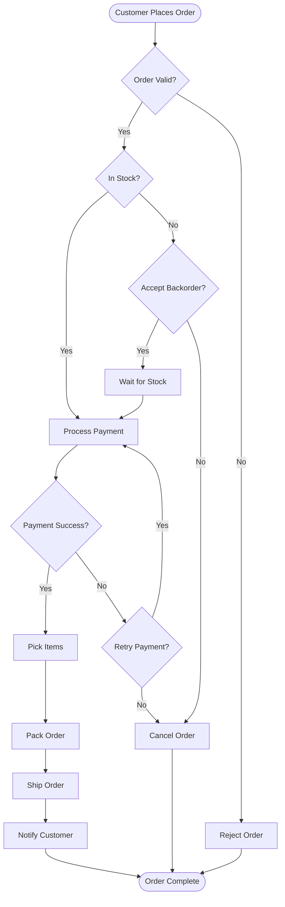
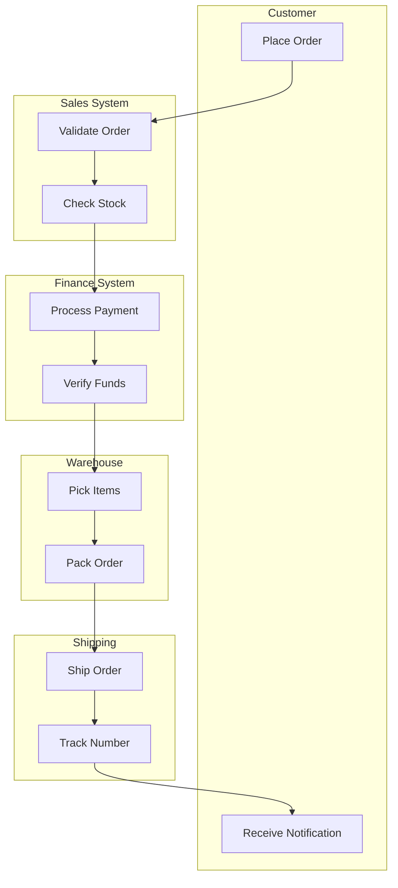
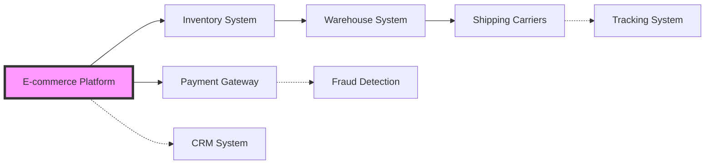

# Business Process Example: Customer Order Fulfillment

## Process Overview
- **Process Name**: Customer Order Fulfillment
- **Process Owner**: Operations Manager
- **Last Updated**: 2024-01-25
- **Version**: 2.1

## BPMN Diagram



## Swimlane View



## Detailed Process Steps

### 1. Order Reception
**Actor**: Customer  
**System**: E-commerce Platform  
**Description**: Customer places order through website/app  
**Inputs**: 
- Product selections
- Quantity
- Delivery address
- Payment information

**Outputs**: 
- Order ID
- Order confirmation email

**Business Rules**:
- Minimum order value: $25
- Maximum items per order: 50

### 2. Order Validation
**Actor**: Sales System (Automated)  
**Duration**: < 30 seconds  
**Validation Checks**:
- Customer account status
- Delivery address validity
- Product availability
- Pricing accuracy

**Decision Matrix**:
| Check | Pass Action | Fail Action |
|-------|-------------|-------------|
| Account Active | Continue | Hold for Review |
| Address Valid | Continue | Request Update |
| Products Available | Continue | Offer Alternatives |
| Price Current | Continue | Update & Notify |

### 3. Inventory Check
**System**: Inventory Management System  
**Integration**: Real-time API  
**Logic**:
```
IF all_items_in_stock THEN
    reserve_inventory()
    proceed_to_payment()
ELSE IF partial_stock THEN
    offer_partial_fulfillment()
ELSE
    offer_backorder_option()
END IF
```

### 4. Payment Processing
**System**: Payment Gateway  
**Security**: PCI DSS Compliant  
**Retry Logic**: 3 attempts with 5-minute intervals  

**Payment Methods**:
- Credit/Debit Card
- PayPal
- Store Credit
- Net Terms (B2B only)

### 5. Fulfillment
**Location**: Distribution Center  
**SLA**: 
- Pick: Within 2 hours
- Pack: Within 30 minutes of pick
- Ship: Same day if ordered before 2 PM

**Quality Checks**:
- [ ] Items match order
- [ ] Packaging appropriate
- [ ] Shipping label correct
- [ ] Include packing slip

## Metrics & KPIs

### Process Metrics
| Metric | Target | Measurement |
|--------|--------|-------------|
| Order Accuracy | 99.5% | Correct orders / Total orders |
| Fulfillment Time | < 24 hrs | Time from order to ship |
| Payment Success Rate | > 95% | Successful payments / Attempts |
| Customer Satisfaction | > 4.5/5 | Post-delivery survey |

### Volume Metrics
- Average daily orders: 1,000
- Peak hour: 2-4 PM (15% of daily volume)
- Seasonal peak: 3x normal volume

## Exception Handling

### Common Exceptions
1. **Payment Failure**
   - Retry up to 3 times
   - Send payment update request
   - Hold order for 24 hours
   - Auto-cancel if unresolved

2. **Stock Shortage**
   - Offer partial shipment
   - Provide restock timeline
   - Offer alternatives
   - Process refund if needed

3. **Shipping Issues**
   - Address correction service
   - Delivery exception handling
   - Customer notification
   - Reshipment process

## System Dependencies



## Integration Points

### API Integrations
| System | Method | Frequency | Critical |
|--------|--------|-----------|----------|
| Inventory | REST API | Real-time | Yes |
| Payment | REST API | Real-time | Yes |
| Shipping | REST/EDI | Batch (15 min) | Yes |
| CRM | Event Bus | Near real-time | No |

### Data Flows
```json
// Order Event Structure
{
  "orderId": "ORD-2024-001234",
  "timestamp": "2024-01-25T10:30:00Z",
  "status": "processing",
  "customer": {
    "id": "CUST-5678",
    "email": "customer@example.com"
  },
  "items": [
    {
      "sku": "PROD-001",
      "quantity": 2,
      "price": 29.99
    }
  ],
  "shipping": {
    "method": "standard",
    "address": { ... }
  }
}
```

## Automation Opportunities

### Current Automation
- Order validation (100%)
- Payment processing (100%)
- Inventory checks (100%)
- Shipping label generation (100%)
- Customer notifications (100%)

### Future Automation
- Intelligent order routing (Q2 2024)
- Predictive inventory allocation (Q3 2024)
- Dynamic pricing optimization (Q4 2024)

## Compliance & Audit

### Regulatory Requirements
- PCI DSS for payment data
- GDPR for EU customers
- SOX for financial reporting
- State sales tax compliance

### Audit Trail
All process steps logged with:
- Timestamp
- Actor/System
- Action taken
- Previous/New values
- IP address (where applicable)

## Change History

| Version | Date | Changes | Approved By |
|---------|------|---------|-------------|
| 2.1 | 2024-01-25 | Added fraud detection step | ops_manager |
| 2.0 | 2023-11-15 | Redesigned payment flow | cfo |
| 1.5 | 2023-08-20 | Added express shipping | ops_manager |
| 1.0 | 2023-01-10 | Initial process | coo |

## Related Documents
- [Inventory Management Process](./inventory-management.md)
- [Payment Processing Guidelines](./payment-processing.md)
- [Shipping and Logistics SOP](./shipping-logistics.md)
- [Customer Service Procedures](./customer-service.md)