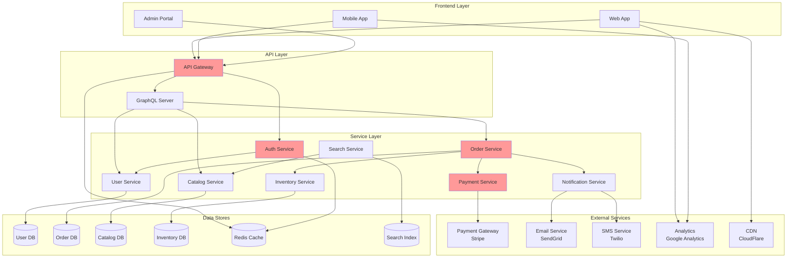
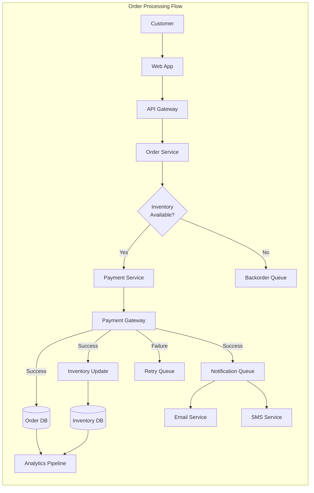
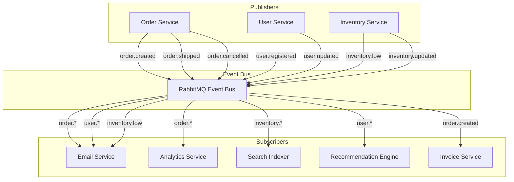
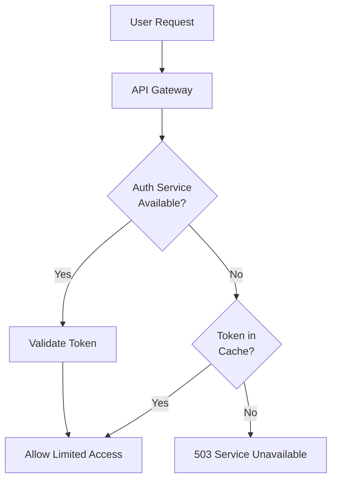
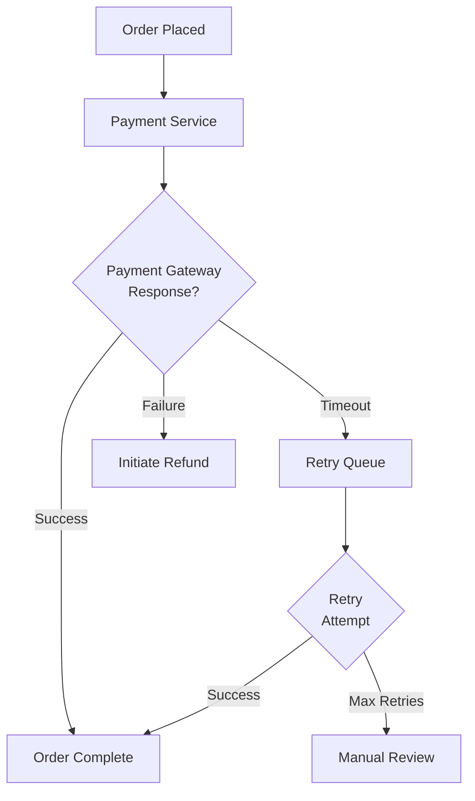

# System Dependencies: E-Commerce Platform

## Dependency Overview Matrix

| Service | Depends On | Type | Criticality | Fallback | SLA Required | Notes |
|---------|------------|------|-------------|----------|--------------|-------|
| Web Frontend | API Gateway | Runtime | Critical | Cache + Error Page | 99.9% | Must handle gateway failures |
| API Gateway | Auth Service | Runtime | Critical | None | 99.95% | Authentication required |
| Order Service | Payment Gateway | Runtime | Critical | Queue + Retry | 99.9% | Async processing possible |
| Order Service | Inventory Service | Runtime | High | Eventual Consistency | 99.5% | Can process with delay |
| Order Service | Email Service | Runtime | Medium | Queue + Retry | 99% | Non-blocking |
| Inventory Service | Order Service | Event | High | Event Replay | 99.5% | Bidirectional dependency |
| Search Service | Catalog Service | Data Sync | Medium | Stale Data | 99% | 15-min sync delay OK |
| Analytics Service | All Services | Event Stream | Low | Batch Processing | 95% | Can handle data loss |

## Detailed Dependency Diagrams

### System-Level Dependencies



### Data Flow Dependencies



### Event-Driven Dependencies



## Integration Specifications

### API Gateway → Backend Services

```yaml
# API Gateway Configuration
services:
  auth-service:
    url: http://auth-service:3000
    timeout: 5s
    retry:
      attempts: 3
      backoff: exponential
    circuit_breaker:
      threshold: 5
      timeout: 30s
    health_check:
      endpoint: /health
      interval: 10s
    
  order-service:
    url: http://order-service:3001
    timeout: 30s
    retry:
      attempts: 2
      backoff: linear
    circuit_breaker:
      threshold: 3
      timeout: 60s
```

### Order Service → Payment Gateway

```javascript
// Payment Integration Configuration
const paymentConfig = {
  provider: 'stripe',
  endpoints: {
    charge: 'https://api.stripe.com/v1/charges',
    refund: 'https://api.stripe.com/v1/refunds',
    webhook: 'https://api.example.com/webhooks/stripe'
  },
  timeout: 30000,
  retry: {
    maxAttempts: 3,
    delay: 1000,
    backoff: 2,
    retryableErrors: ['ETIMEDOUT', 'ECONNRESET', 'ENOTFOUND']
  },
  security: {
    apiKey: process.env.STRIPE_API_KEY,
    webhookSecret: process.env.STRIPE_WEBHOOK_SECRET,
    encryption: 'TLS 1.3'
  },
  monitoring: {
    logLevel: 'info',
    metrics: ['latency', 'errors', 'success_rate'],
    alerts: {
      errorRate: { threshold: 0.05, window: '5m' },
      latency: { threshold: 5000, window: '1m' }
    }
  }
};
```

### Service Mesh Configuration

```yaml
# Istio Service Mesh Configuration
apiVersion: networking.istio.io/v1beta1
kind: VirtualService
metadata:
  name: order-service
spec:
  hosts:
  - order-service
  http:
  - timeout: 30s
    retries:
      attempts: 3
      perTryTimeout: 10s
      retryOn: 5xx,refused-stream,cancelled,retriable-4xx
    fault:
      delay:
        percentage:
          value: 0.1
        fixedDelay: 5s
    route:
    - destination:
        host: order-service
        subset: v1
      weight: 90
    - destination:
        host: order-service
        subset: v2
      weight: 10
```

## Dependency Health Monitoring

### Health Check Endpoints

| Service | Health Endpoint | Response Format | Check Frequency |
|---------|----------------|-----------------|-----------------|
| API Gateway | `/health` | JSON | 10s |
| Auth Service | `/health/live` | JSON | 10s |
| Order Service | `/health/ready` | JSON | 15s |
| Payment Service | `/health` | JSON | 10s |
| Inventory Service | `/api/health` | JSON | 20s |

### Health Check Response Example

```json
{
  "status": "healthy",
  "timestamp": "2024-01-25T10:30:00Z",
  "version": "1.2.3",
  "dependencies": {
    "database": {
      "status": "healthy",
      "latency": 2,
      "details": "PostgreSQL 15.4"
    },
    "cache": {
      "status": "healthy",
      "latency": 1,
      "details": "Redis 7.2"
    },
    "payment_gateway": {
      "status": "degraded",
      "latency": 150,
      "details": "High latency detected"
    }
  },
  "metrics": {
    "uptime": 864000,
    "requests_processed": 1234567,
    "error_rate": 0.001
  }
}
```

## Failure Scenarios & Mitigation

### Critical Path Failures

#### Scenario 1: Auth Service Failure


**Mitigation Strategy:**
- Cache validated tokens for 5 minutes
- Implement circuit breaker
- Maintain 99.95% uptime SLA
- Multi-region deployment

#### Scenario 2: Payment Gateway Timeout


**Mitigation Strategy:**
- Implement idempotency keys
- Queue for async processing
- Exponential backoff retry
- Manual intervention workflow

### Cascade Failure Prevention

```yaml
# Circuit Breaker Configuration
resilience:
  circuit_breakers:
    - name: payment_service
      failure_threshold: 5
      success_threshold: 2
      timeout: 30s
      half_open_requests: 3
      
    - name: inventory_service
      failure_threshold: 10
      success_threshold: 5
      timeout: 15s
      half_open_requests: 5
      
  bulkheads:
    - name: critical_services
      max_concurrent: 100
      max_wait: 1s
      
    - name: background_services
      max_concurrent: 50
      max_wait: 5s
```

## Service Level Agreements (SLAs)

### Internal SLAs

| Service | Availability | Response Time (p99) | Error Rate |
|---------|--------------|--------------------|---------
| API Gateway | 99.95% | < 100ms | < 0.1% |
| Auth Service | 99.95% | < 50ms | < 0.1% |
| Order Service | 99.9% | < 500ms | < 0.5% |
| Payment Service | 99.9% | < 1000ms | < 0.5% |
| Inventory Service | 99.5% | < 200ms | < 1% |
| Search Service | 99% | < 300ms | < 2% |

### External Dependencies SLAs

| Provider | Service | Guaranteed Uptime | Support Response |
|----------|---------|------------------|------------------|
| Stripe | Payment API | 99.95% | < 1 hour (critical) |
| SendGrid | Email API | 99.95% | < 4 hours |
| CloudFlare | CDN | 99.95% | < 30 minutes |
| AWS | Infrastructure | 99.99% | < 15 minutes (business) |

## Dependency Version Management

### Service Compatibility Matrix

| Consumer | Provider | Min Version | Max Version | Breaking Changes |
|----------|----------|-------------|-------------|------------------|
| Web App v2.x | API Gateway | v1.5 | v2.x | None |
| API Gateway v2.x | Auth Service | v1.0 | v2.x | v2.0 auth flow |
| Order Service v3.x | Payment Service | v2.5 | v3.x | v3.0 new API |
| Mobile App v1.x | API Gateway | v1.0 | v1.x | v2.0 incompatible |

### API Versioning Strategy

```nginx
# API Gateway Routing Configuration
location ~ ^/api/v1/ {
    proxy_pass http://backend-v1;
}

location ~ ^/api/v2/ {
    proxy_pass http://backend-v2;
}

location /api/ {
    # Default to latest stable
    proxy_pass http://backend-v2;
}
```

## Monitoring & Alerting

### Dependency Metrics Dashboard

```json
{
  "dashboard": "System Dependencies",
  "panels": [
    {
      "title": "Service Dependency Map",
      "type": "graph",
      "metrics": ["service.calls", "service.errors", "service.latency"]
    },
    {
      "title": "Critical Path Availability",
      "type": "heatmap",
      "metrics": ["auth.availability", "payment.availability", "order.availability"]
    },
    {
      "title": "External Service Status",
      "type": "table",
      "metrics": ["stripe.status", "sendgrid.status", "twilio.status"]
    },
    {
      "title": "Circuit Breaker Status",
      "type": "status",
      "metrics": ["circuit.*.state", "circuit.*.failures"]
    }
  ]
}
```

### Alert Configuration

```yaml
alerts:
  - name: critical_dependency_down
    condition: service.availability < 99.5
    services: [auth-service, payment-service, order-service]
    severity: critical
    channels: [pagerduty, slack-critical]
    
  - name: external_service_degraded
    condition: external.latency > 2000ms for 5m
    services: [stripe, sendgrid]
    severity: warning
    channels: [slack-alerts, email]
    
  - name: cascade_failure_risk
    condition: circuit_breaker.open_count > 3
    severity: critical
    channels: [pagerduty, slack-critical, email-oncall]
```

## Documentation & Runbooks

### Dependency Change Process

1. **Impact Analysis**
   - Identify all consumers
   - Review contracts/APIs
   - Check version compatibility

2. **Testing Strategy**
   - Unit tests for contracts
   - Integration tests
   - Load tests for performance

3. **Rollout Plan**
   - Canary deployment
   - Feature flags
   - Rollback procedures

4. **Communication**
   - Notify all stakeholders
   - Update documentation
   - Schedule maintenance window

### Emergency Procedures

| Scenario | Immediate Action | Escalation | Recovery |
|----------|-----------------|------------|----------|
| Auth Service Down | Enable cache mode | Page on-call | Scale replicas |
| Payment Gateway Down | Queue transactions | Contact vendor | Process backlog |
| Database Connection Lost | Fail to read replica | Page DBA | Investigate primary |
| Message Queue Full | Throttle publishers | Page SRE | Scale consumers |

## Related Documentation

- [Service Architecture](./service-architecture.md)
- [API Documentation](./api-documentation.md)
- [Disaster Recovery Plan](./disaster-recovery.md)
- [Performance Tuning Guide](./performance-tuning.md)