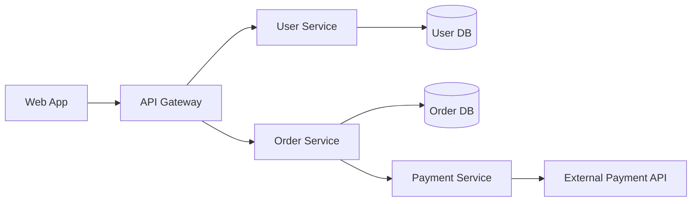
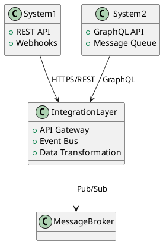

# Comprehensive Documentation Framework

## Executive Summary

This framework provides multiple approaches and methodologies for documenting:
- Business processes and workflows
- Technical infrastructure and architecture
- System dependencies and integrations

## 1. Business Process Documentation

### 1.1 Diagram Types

#### BPMN 2.0 (Business Process Model and Notation)
**Purpose**: Standardized notation for business processes
**Best For**: Complex workflows, cross-functional processes, compliance documentation
**Tools**: 
- Camunda Modeler (free, open-source)
- Bizagi Modeler
- draw.io/diagrams.net
- Lucidchart

**Example Structure**:
```xml
<bpmn:process id="order-fulfillment">
  <bpmn:startEvent id="order-received" />
  <bpmn:task id="validate-order" name="Validate Order" />
  <bpmn:exclusiveGateway id="order-valid" />
  <bpmn:task id="process-payment" name="Process Payment" />
  <bpmn:endEvent id="order-complete" />
</bpmn:process>
```

#### Flowcharts
**Purpose**: Simple, visual representation of process flow
**Best For**: High-level overviews, simple processes, stakeholder communication
**Tools**: draw.io, Miro, Visio, PlantUML

#### Swimlane Diagrams
**Purpose**: Shows process flow across different roles/departments
**Best For**: Cross-functional processes, responsibility mapping
**Tools**: draw.io, Lucidchart, Gliffy

#### Value Stream Mapping
**Purpose**: Identifies value-adding vs non-value-adding activities
**Best For**: Process optimization, lean initiatives
**Tools**: Miro, Lucidchart, specialized VSM tools

### 1.2 Documentation Templates

#### Process Documentation Template
```markdown
# Process: [Process Name]

## Overview
- **Purpose**: 
- **Owner**: 
- **Last Updated**: 
- **Version**: 

## Scope
- **Start Point**: 
- **End Point**: 
- **Included**: 
- **Excluded**: 

## Stakeholders
| Role | Responsibility | Contact |
|------|---------------|---------|
| | | |

## Process Steps
1. **[Step Name]**
   - Actor: 
   - Description: 
   - Inputs: 
   - Outputs: 
   - Tools/Systems: 
   - Duration: 

## Decision Points
- **[Decision Name]**
  - Criteria: 
  - Options: 
  - Escalation: 

## Metrics & KPIs
- 
- 

## Related Documents
- 
```

#### Standard Operating Procedure (SOP) Template
```markdown
# SOP: [Procedure Name]

## Header
- **SOP Number**: 
- **Effective Date**: 
- **Review Date**: 
- **Author**: 
- **Approver**: 

## Purpose

## Scope

## Responsibilities

## Procedure
### Pre-requisites

### Steps
1. 
2. 

### Quality Checks

### Error Handling

## References

## Revision History
| Version | Date | Changes | Author |
|---------|------|---------|--------|
```

## 2. Technical Infrastructure Documentation

### 2.1 Architecture Diagram Types

#### C4 Model (Context, Container, Component, Code)
**Purpose**: Hierarchical view of software architecture
**Best For**: Software systems, microservices architectures

**Level 1 - System Context**:
```plantuml
@startuml
!include https://raw.githubusercontent.com/plantuml-stdlib/C4-PlantUML/master/C4_Context.puml

Person(user, "User", "System user")
System(system, "Our System", "Main application")
System_Ext(ext_system, "External System", "Third-party service")

Rel(user, system, "Uses")
Rel(system, ext_system, "Integrates with")
@enduml
```

**Level 2 - Container**:
Shows applications, databases, file systems

**Level 3 - Component**:
Shows components within containers

**Level 4 - Code**:
Class diagrams, ER diagrams

#### Network Diagrams
**Purpose**: Physical and logical network topology
**Best For**: Infrastructure planning, troubleshooting
**Standards**: 
- Cisco network topology icons
- AWS/Azure/GCP architecture icons

**Tools**:
- draw.io with cloud provider stencils
- Lucidchart
- Microsoft Visio
- Python diagrams library

#### Deployment Diagrams
**Purpose**: Shows how software is deployed on hardware
**Best For**: DevOps documentation, infrastructure as code

Example using Python diagrams:
```python
from diagrams import Diagram, Cluster, Edge
from diagrams.aws.compute import EC2
from diagrams.aws.database import RDS
from diagrams.aws.network import ELB

with Diagram("Web Service", show=False):
    lb = ELB("lb")
    
    with Cluster("Web Tier"):
        web_servers = [EC2("web1"),
                      EC2("web2"),
                      EC2("web3")]
    
    with Cluster("DB Tier"):
        primary = RDS("primary")
        replica = RDS("replica")
    
    lb >> web_servers >> primary
    primary - Edge(style="dashed") - replica
```

### 2.2 Infrastructure Documentation Templates

#### System Architecture Document
```markdown
# System Architecture: [System Name]

## Executive Summary

## Architecture Overview
### High-Level Architecture
[Include C4 Context diagram]

### Key Components
- 
- 

## Technical Stack
| Layer | Technology | Version | Purpose |
|-------|------------|---------|---------|

## Infrastructure
### Compute
- 

### Storage
- 

### Network
- 

## Security Architecture
### Authentication & Authorization
### Data Protection
### Network Security

## Deployment Architecture
[Include deployment diagram]

## Monitoring & Observability
### Metrics
### Logging
### Alerting

## Disaster Recovery
### Backup Strategy
### Recovery Procedures

## Capacity Planning
### Current Usage
### Growth Projections

## Appendices
### A. Detailed Component Specifications
### B. Configuration Templates
```

#### Infrastructure as Code Documentation
```markdown
# Infrastructure Configuration

## Overview
- **IaC Tool**: Terraform/CloudFormation/Pulumi
- **Cloud Provider**: 
- **Environments**: Dev, Staging, Prod

## Architecture
[Include architecture diagram]

## Resources
### Compute
```yaml
# Example resource definition
resource "aws_instance" "web" {
  ami           = "ami-0c55b159cbfafe1f0"
  instance_type = "t3.medium"
  
  tags = {
    Name        = "WebServer"
    Environment = "Production"
  }
}
```

### Networking
[Network configuration details]

## Deployment Process
1. 
2. 

## Variables
| Variable | Description | Default | Required |
|----------|-------------|---------|----------|

## Outputs
| Output | Description | Usage |
|--------|-------------|-------|
```

## 3. System Dependencies Documentation

### 3.1 Dependency Diagram Types

#### Component Dependency Diagrams
**Purpose**: Shows dependencies between system components
**Best For**: Microservices, modular systems



#### Data Flow Diagrams (DFD)
**Purpose**: Shows how data moves through a system
**Best For**: Data processing systems, ETL pipelines

**Levels**:
- Level 0: Context diagram
- Level 1: Main processes
- Level 2+: Detailed sub-processes

#### Integration Architecture Diagrams
**Purpose**: Shows how different systems integrate
**Best For**: Enterprise architectures, API ecosystems



### 3.2 Dependency Documentation Templates

#### Service Dependency Matrix
```markdown
# Service Dependency Matrix

| Service | Depends On | Dependency Type | Criticality | Fallback Strategy |
|---------|------------|----------------|-------------|-------------------|
| Web App | API Gateway | Runtime | Critical | Cache + Degraded Mode |
| API Gateway | Auth Service | Runtime | Critical | None - Fail closed |
| Order Service | Payment Service | Runtime | High | Queue + Retry |
| Order Service | Inventory Service | Runtime | Medium | Eventual Consistency |

## Dependency Details

### Service: [Service Name]
**Dependencies**:
1. **[Dependency Name]**
   - Type: Runtime/Build/Deploy
   - Version: 
   - Purpose: 
   - SLA Required: 
   - Fallback: 
   - Monitoring: 
```

#### API Integration Documentation
```markdown
# API Integration: [System A] ← → [System B]

## Overview
- **Integration Type**: REST/GraphQL/gRPC/Message Queue
- **Direction**: Unidirectional/Bidirectional
- **Frequency**: Real-time/Batch/On-demand

## Technical Details
### Authentication
- Method: 
- Credentials Storage: 

### Endpoints
| Operation | Method | Endpoint | Purpose |
|-----------|--------|----------|---------|

### Data Contracts
```json
{
  "request": {
    // Request schema
  },
  "response": {
    // Response schema
  }
}
```

### Error Handling
| Error Code | Meaning | Retry Strategy |
|------------|---------|----------------|

### Rate Limits
- Requests per second: 
- Burst capacity: 

### Monitoring
- Health check endpoint: 
- Key metrics: 
- Alerts configured: 
```

## 4. Documentation Tools & Technologies

### 4.1 Diagramming Tools

#### For Technical Teams
1. **PlantUML**
   - Text-based diagrams
   - Version control friendly
   - Supports: UML, C4, network diagrams

2. **Mermaid**
   - Markdown-embedded diagrams
   - GitHub/GitLab native support
   - Supports: Flowcharts, sequence, Gantt

3. **Python Diagrams**
   - Code-based cloud architecture diagrams
   - Supports: AWS, Azure, GCP, Kubernetes

#### For Business Users
1. **draw.io/diagrams.net**
   - Free, browser-based
   - Extensive shape libraries
   - Export to multiple formats

2. **Lucidchart**
   - Collaborative features
   - Templates for business processes
   - Integration with Confluence/Slack

3. **Microsoft Visio**
   - Enterprise standard
   - Extensive stencils
   - SharePoint integration

### 4.2 Documentation Platforms

#### Developer-Focused
1. **Docusaurus**
   - React-based static site generator
   - Versioning support
   - Search functionality

2. **Sphinx**
   - Python documentation standard
   - reStructuredText/Markdown
   - Extensive plugins

3. **GitBook**
   - Git-based documentation
   - Clean UI
   - API documentation support

#### Enterprise Platforms
1. **Confluence**
   - Team collaboration
   - Rich formatting
   - Jira integration

2. **SharePoint**
   - Microsoft ecosystem
   - Document management
   - Workflow integration

3. **Notion**
   - Flexible structure
   - Database features
   - Real-time collaboration

### 4.3 Specialized Tools

#### API Documentation
- **Swagger/OpenAPI**: REST API documentation
- **GraphQL Playground**: GraphQL API exploration
- **Postman**: API testing and documentation

#### Database Documentation
- **SchemaSpy**: Database schema documentation
- **dbdocs.io**: Database documentation from DBML
- **DataGrip**: Database IDE with documentation features

#### Infrastructure Documentation
- **Terraform Docs**: Auto-generate Terraform documentation
- **CloudCraft**: AWS architecture diagrams
- **Hava.io**: Auto-generated cloud diagrams

## 5. Best Practices

### 5.1 Documentation Maintenance

#### Version Control
```yaml
documentation:
  version_control:
    - Store documentation as code
    - Use semantic versioning
    - Tag releases
    - Branch for major changes
  
  review_process:
    - Pull request reviews
    - Technical accuracy check
    - Business stakeholder approval
    - Style guide compliance
```

#### Update Triggers
1. **Automated Updates**
   - CI/CD pipeline changes
   - API schema changes
   - Infrastructure modifications

2. **Scheduled Reviews**
   - Quarterly architecture reviews
   - Annual process audits
   - Monthly dependency checks

3. **Event-Driven Updates**
   - Incident post-mortems
   - New feature releases
   - Regulatory changes

### 5.2 Documentation Standards

#### Naming Conventions
```
Business Processes: BP-[Department]-[Process]-v[Version]
Technical Docs: TECH-[System]-[Component]-v[Version]
APIs: API-[Service]-[Version]
Infrastructure: INFRA-[Environment]-[Component]
```

#### Metadata Requirements
Every document should include:
- Title and purpose
- Author and owner
- Creation date
- Last update date
- Review schedule
- Related documents
- Version history

#### Quality Checklist
- [ ] Clear purpose stated
- [ ] Target audience identified
- [ ] Diagrams included where helpful
- [ ] Examples provided
- [ ] Technical terms defined
- [ ] Contact information current
- [ ] Links validated
- [ ] Reviewed by stakeholder

### 5.3 Accessibility & Discoverability

#### Organization Structure
```
/documentation
  /business-processes
    /department-name
      /process-name
        README.md
        diagrams/
        templates/
  /technical
    /architecture
      /system-name
        overview.md
        components/
        deployment/
    /infrastructure
      /environment
        network/
        compute/
        storage/
    /apis
      /service-name
        openapi.yaml
        examples/
  /dependencies
    dependency-matrix.md
    integration-catalog/
    data-flows/
```

#### Search & Navigation
1. **Index/Catalog**
   - Master documentation index
   - Searchable metadata
   - Tag-based navigation

2. **Cross-References**
   - Link related documents
   - Dependency mappings
   - Impact analysis links

3. **Documentation Portal**
   - Central access point
   - Role-based access
   - Search functionality
   - Recently updated section

## 6. Implementation Roadmap

### Phase 1: Foundation (Months 1-2)
1. Select core tools
2. Create templates
3. Define standards
4. Train key users

### Phase 2: Migration (Months 3-4)
1. Audit existing documentation
2. Prioritize critical systems
3. Create initial documentation
4. Establish review processes

### Phase 3: Expansion (Months 5-6)
1. Roll out to all teams
2. Implement automation
3. Integrate with CI/CD
4. Measure adoption

### Phase 4: Optimization (Ongoing)
1. Gather feedback
2. Refine processes
3. Expand automation
4. Continuous improvement

## 7. Metrics & Success Criteria

### Documentation Coverage
- % of systems documented
- % of processes documented
- % of APIs documented

### Quality Metrics
- Documentation accuracy rate
- Update frequency
- Review compliance
- User satisfaction

### Usage Metrics
- Documentation views
- Search queries
- Time to find information
- Contribution rate

## Conclusion

This framework provides multiple approaches to documentation, allowing organizations to choose the methods that best fit their needs. The key to success is selecting the right combination of tools, templates, and processes for your specific context, and maintaining a culture of documentation as a first-class deliverable.

Remember: The best documentation is the one that gets used. Focus on clarity, accessibility, and continuous improvement.