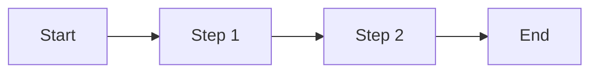
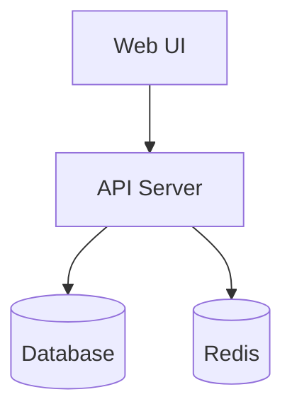
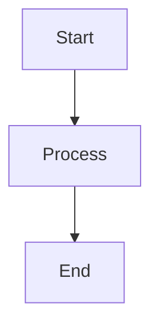
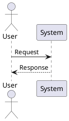

# Documentation Quick Start Guide

## Choosing the Right Documentation Approach

### Decision Matrix

| Need | Recommended Approach | Tools | Complexity |
|------|---------------------|-------|------------|
| Simple process flow | Flowchart | draw.io, Mermaid | Low |
| Complex business process | BPMN 2.0 | Camunda, Bizagi | Medium |
| Software architecture | C4 Model | PlantUML, draw.io | Medium |
| Cloud infrastructure | Cloud diagrams | Python diagrams, CloudCraft | Medium |
| API documentation | OpenAPI/Swagger | Swagger UI, Redoc | Low-Medium |
| System dependencies | Dependency matrix + diagrams | Mermaid, custom | Medium |
| Database schema | ER diagrams | dbdocs.io, SchemaSpy | Low |
| Network topology | Network diagrams | draw.io, Visio | Medium |

## Quick Start Templates

### 1. Business Process (Simple)

```markdown
# Process: [Name]

## Quick Overview
**What**: 
**Who**: 
**When**: 
**Why**: 

## Steps
1. [ ] Step 1
2. [ ] Step 2
3. [ ] Step 3

## Flow Diagram

```

### 2. Technical System (Simple)

```markdown
# System: [Name]

## Purpose
[One sentence description]

## Architecture


## Components
- **Web UI**: [Tech stack]
- **API**: [Tech stack]
- **Database**: [Type/Version]
- **Cache**: [Type/Version]

## Key Dependencies
- External Service 1
- External Service 2
```

### 3. API Documentation (Simple)

```yaml
# api-doc.yaml
openapi: 3.0.0
info:
  title: My API
  version: 1.0.0
paths:
  /users:
    get:
      summary: Get all users
      responses:
        '200':
          description: Success
          content:
            application/json:
              schema:
                type: array
                items:
                  type: object
                  properties:
                    id:
                      type: integer
                    name:
                      type: string
```

## Minimal Viable Documentation

### For a New Project
1. **README.md** - Project overview
2. **ARCHITECTURE.md** - High-level design
3. **API.md** - Endpoint documentation
4. **DEPLOYMENT.md** - How to deploy

### For an Existing System
1. **System context diagram** - Shows external dependencies
2. **Deployment diagram** - Shows infrastructure
3. **Data flow diagram** - Shows information flow
4. **Dependency matrix** - Lists all integrations

## Tool Setup (5 Minutes)

### Option 1: Mermaid (No Install)
Add to any Markdown file:
````markdown

````

### Option 2: draw.io (Browser-Based)
1. Go to https://app.diagrams.net
2. Choose storage location
3. Start with a template
4. Export as PNG/SVG

### Option 3: PlantUML (Text-Based)


## Documentation Checklist

### Essential Elements
- [ ] Title and purpose
- [ ] Date created/updated
- [ ] Author/owner
- [ ] Visual diagram
- [ ] Written description

### Quality Checks
- [ ] Can a new team member understand it?
- [ ] Are all acronyms defined?
- [ ] Are examples included?
- [ ] Is contact info current?

## Common Patterns

### Microservices Documentation
```
/documentation
  /services
    /service-a
      README.md          # Overview
      API.md            # API spec
      DEPENDENCIES.md   # What it needs
      DEPLOYMENT.md     # How to run
```

### Enterprise Documentation
```
/documentation
  /business-processes
    /sales
    /operations
    /finance
  /technical
    /applications
    /infrastructure
    /integrations
```

## Getting Started Today

### Week 1: Document Critical Path
1. Identify most critical system/process
2. Create context diagram
3. Document key workflows
4. List dependencies

### Week 2: Expand Coverage
1. Add detail to critical documentation
2. Document second priority system
3. Create templates for team
4. Set up documentation repository

### Week 3: Operationalize
1. Schedule review cycles
2. Assign documentation owners
3. Integrate with development process
4. Create documentation standards

### Week 4: Iterate
1. Gather feedback
2. Refine templates
3. Improve tooling
4. Plan next phase

## Resources

### Free Tools
- **draw.io**: https://app.diagrams.net
- **Mermaid Live**: https://mermaid.live
- **PlantUML Server**: http://www.plantuml.com/plantuml
- **dbdiagram.io**: https://dbdiagram.io

### Templates
- **C4 Model**: https://c4model.com
- **BPMN**: https://www.bpmn.org
- **OpenAPI**: https://swagger.io/specification

### Learning
- **Mermaid Tutorial**: https://mermaid-js.github.io/mermaid
- **PlantUML Guide**: https://plantuml.com/guide
- **C4 Model Guide**: https://c4model.com/#CoreDiagrams