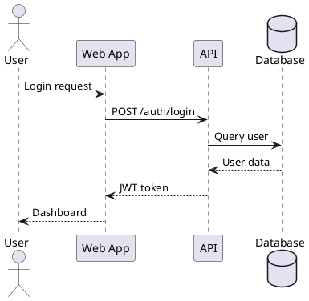
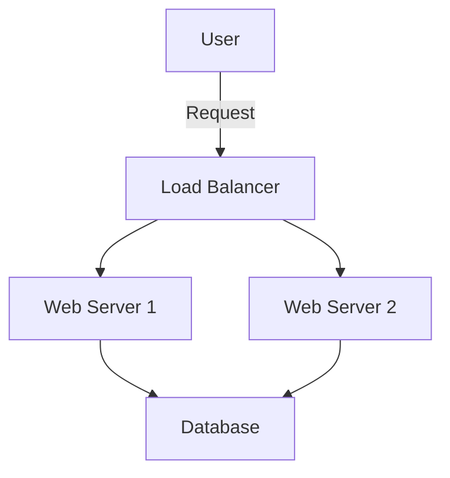
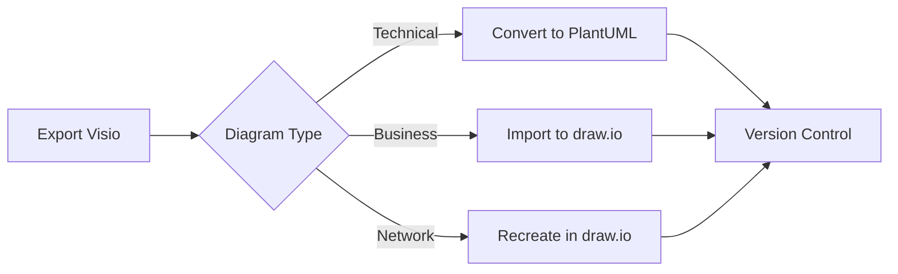
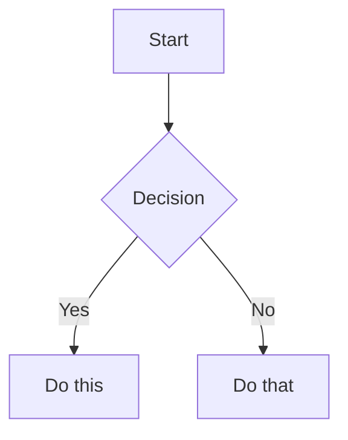
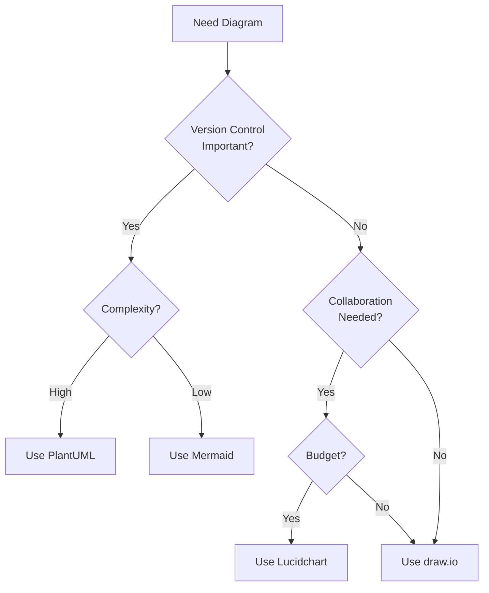

# Documentation Tools Comparison Guide

## Quick Decision Matrix

| Use Case | Best Tool | Runner-Up | Avoid |
|----------|-----------|-----------|-------|
| Developer diagrams (version control) | PlantUML | Mermaid | Binary formats |
| Business process diagrams | draw.io | Lucidchart | Complex UML tools |
| Cloud architecture | Python diagrams | draw.io + icons | Generic tools |
| Real-time collaboration | Miro/Lucidchart | draw.io | Desktop-only tools |
| API documentation | OpenAPI/Swagger | Postman | Word docs |
| Database schemas | dbdiagram.io | SchemaSpy | Manual diagrams |
| Network diagrams | draw.io | Visio | Text-based tools |
| Quick sketches | Excalidraw | draw.io | Heavy tools |

## Detailed Tool Comparison

### Text-Based Diagramming Tools

#### PlantUML
**Pros:**
- Version control friendly
- Extensive diagram types
- Precise layouts
- IDE integration
- CI/CD compatible

**Cons:**
- Learning curve
- Limited styling
- Requires Java
- No real-time collab

**Best For:**
- Software architecture
- Sequence diagrams
- State machines
- ER diagrams

**Example:**


#### Mermaid
**Pros:**
- Native GitHub/GitLab support
- No installation needed
- Growing ecosystem
- Good documentation

**Cons:**
- Limited diagram types
- Less control over layout
- Simpler than PlantUML

**Best For:**
- README diagrams
- Simple flowcharts
- Gantt charts
- Git graphs

**Example:**


#### Python Diagrams (Diagrams as Code)
**Pros:**
- Cloud provider icons
- Programmatic generation
- Beautiful output
- Python ecosystem

**Cons:**
- Python required
- Limited to architecture
- No interactive editing

**Best For:**
- Cloud architecture
- Infrastructure diagrams
- Automated documentation

**Example:**
```python
from diagrams import Diagram
from diagrams.aws.compute import EC2
from diagrams.aws.database import RDS
from diagrams.aws.network import ELB

with Diagram("Web Service", show=False):
    lb = ELB("lb")
    web = EC2("web")
    db = RDS("database")
    
    lb >> web >> db
```

### GUI-Based Tools

#### draw.io (diagrams.net)
**Pros:**
- Completely free
- No account needed
- Offline capable
- Many templates
- All diagram types

**Cons:**
- Manual positioning
- File management
- Limited automation

**Best For:**
- General purpose
- Business diagrams
- Network diagrams
- Quick mockups

#### Lucidchart
**Pros:**
- Professional templates
- Real-time collaboration
- Data import
- Integrations

**Cons:**
- Subscription cost
- Online only
- Proprietary format

**Best For:**
- Team collaboration
- Business processes
- Org charts
- Professional docs

#### Microsoft Visio
**Pros:**
- Industry standard
- Extensive stencils
- Office integration
- Professional output

**Cons:**
- Expensive
- Windows-centric
- Steep learning curve
- Heavy application

**Best For:**
- Enterprise use
- Complex diagrams
- Network topology
- Floor plans

### Specialized Tools

#### Swagger/OpenAPI (API Documentation)
**Pros:**
- Industry standard
- Auto-generation
- Interactive docs
- Many tools

**Cons:**
- APIs only
- YAML/JSON syntax
- Limited customization

**Best For:**
- REST APIs
- API testing
- Client generation
- API contracts

#### dbdiagram.io (Database Diagrams)
**Pros:**
- DBML syntax
- Clean output
- SQL generation
- Free tier

**Cons:**
- Databases only
- Limited features
- Online only

**Best For:**
- ER diagrams
- Schema design
- Database docs

#### C4 Model Tools
**Pros:**
- Hierarchical views
- Consistent notation
- Architecture focus
- Multiple tools

**Cons:**
- Learning curve
- Software only
- Specific methodology

**Best For:**
- Software architecture
- System documentation
- Technical reviews

## Tool Selection Criteria

### By Team Type

#### Development Teams
**Primary:** PlantUML, Mermaid
**Secondary:** draw.io, Python diagrams
**Why:** Version control, automation, CI/CD integration

#### Business Teams
**Primary:** draw.io, Lucidchart
**Secondary:** Visio, Miro
**Why:** Visual editing, templates, collaboration

#### DevOps Teams
**Primary:** Python diagrams, draw.io
**Secondary:** PlantUML
**Why:** Cloud icons, infrastructure focus

#### Enterprise Teams
**Primary:** Visio, Lucidchart
**Secondary:** draw.io
**Why:** Standards, compliance, integration

### By Documentation Type

#### Architecture Documentation
```
┌─────────────────────────────────────┐
│ Recommendation: PlantUML + C4 Model │
├─────────────────────────────────────┤
│ • Version controlled               │
│ • Consistent notation              │
│ • Multiple views                   │
│ • Tool agnostic                   │
└─────────────────────────────────────┘
```

#### Process Documentation
```
┌─────────────────────────────────────┐
│ Recommendation: draw.io + BPMN     │
├─────────────────────────────────────┤
│ • Standard notation               │
│ • Free tool                       │
│ • Template library                │
│ • Export options                  │
└─────────────────────────────────────┘
```

#### API Documentation
```
┌─────────────────────────────────────┐
│ Recommendation: OpenAPI + Redoc    │
├─────────────────────────────────────┤
│ • Auto-generation                 │
│ • Interactive docs                │
│ • Client SDKs                     │
│ • Industry standard               │
└─────────────────────────────────────┘
```

## Implementation Strategies

### Small Teams (1-10 people)
```yaml
strategy:
  primary_tool: draw.io
  secondary_tool: Mermaid
  storage: GitHub
  process:
    - Create in draw.io
    - Export as SVG
    - Embed in Markdown
    - Store source files
```

### Medium Teams (10-50 people)
```yaml
strategy:
  diagram_tools:
    - PlantUML (developers)
    - Lucidchart (business)
  storage: Confluence + Git
  process:
    - Developers use PlantUML
    - Business uses Lucidchart
    - Sync to Confluence
    - Review quarterly
```

### Large Teams (50+ people)
```yaml
strategy:
  tools:
    development: PlantUML
    business: Visio/Lucidchart
    architecture: C4 + PlantUML
    api: OpenAPI
  storage: 
    - Git (source)
    - Confluence (rendered)
    - SharePoint (business)
  governance:
    - Tool standards
    - Review process
    - Training program
```

## Cost Analysis

| Tool | Free Tier | Paid Plans | TCO Considerations |
|------|-----------|------------|-------------------|
| draw.io | Unlimited | None | Storage costs only |
| PlantUML | Unlimited | None | Server hosting |
| Mermaid | Unlimited | None | None |
| Lucidchart | 3 docs | $7.95+/user/mo | Training time |
| Visio | None | $5-15/user/mo | Windows only |
| Miro | 3 boards | $8+/user/mo | Collaboration value |
| CloudCraft | 1 region | $49+/mo | AWS specific |

## Migration Paths

### From Visio to Modern Tools


### From Screenshots to Maintainable Docs
1. **Audit** existing screenshots
2. **Categorize** by type
3. **Prioritize** by importance
4. **Recreate** in appropriate tool
5. **Archive** old versions
6. **Train** team on new tools

## Tool Combinations

### Recommended Stacks

#### Developer Stack
- **Diagrams:** PlantUML + Mermaid
- **API:** OpenAPI + Redoc
- **Database:** dbdiagram.io
- **Storage:** Git
- **Render:** CI/CD pipeline

#### Business Stack
- **Diagrams:** draw.io + Lucidchart
- **Process:** BPMN in draw.io
- **Collaboration:** Miro
- **Storage:** Confluence
- **Sharing:** PDF/PNG exports

#### Enterprise Stack
- **Standards:** PlantUML + Visio
- **Architecture:** C4 Model
- **API:** OpenAPI
- **Storage:** Git + SharePoint
- **Governance:** Review board

## Quick Start Templates

### PlantUML Starter
```bash
# Install PlantUML
brew install plantuml  # macOS
apt install plantuml   # Ubuntu

# Create first diagram
echo '@startuml
A -> B: Hello
@enduml' > diagram.puml

# Generate image
plantuml diagram.puml
```

### Mermaid in Markdown
```markdown
# My Documentation

## System Overview


```

### draw.io Setup
1. Visit https://app.diagrams.net
2. Choose storage (Google Drive/Local)
3. Select template or blank
4. Use shape libraries
5. Export as SVG/PNG

## Decision Framework



## Conclusion

The best documentation tool depends on:
- Team composition
- Documentation types
- Collaboration needs
- Budget constraints
- Technical requirements

Start simple, iterate based on needs, and remember: the best diagram is the one that gets created and maintained.