# Framework Visual Diagrams
## Architecture Visualization Using Mermaid

### Overview

This document provides comprehensive visual representations of the SMB Technology Transformation Framework using Mermaid diagrams. These diagrams illustrate framework structure, relationships, flows, and patterns.

---

## 1. Framework Overview Architecture

### High-Level Framework Structure

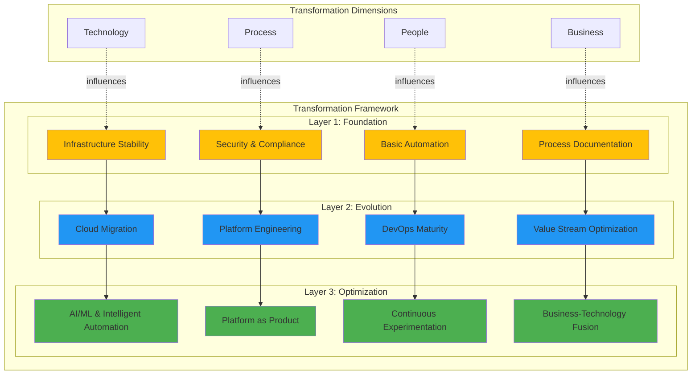

### Four Dimensions Interaction Model

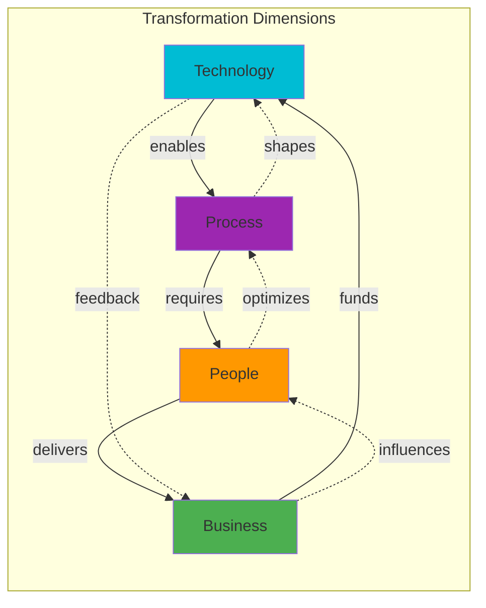

---

## 2. Maturity Model Visualizations

### Maturity Progression Paths

```mermaid
graph LR
    subgraph "Technology Dimension"
        T1[Level 1:<br/>Ad-hoc] --> T2[Level 2:<br/>Managed]
        T2 --> T3[Level 3:<br/>Defined]
        T3 --> T4[Level 4:<br/>Optimized]
    end

    subgraph "Process Dimension"
        P1[Level 1:<br/>Ad-hoc] --> P2[Level 2:<br/>Managed]
        P2 --> P3[Level 3:<br/>Defined]
        P3 --> P4[Level 4:<br/>Optimized]
    end

    subgraph "People Dimension"
        PE1[Level 1:<br/>Ad-hoc] --> PE2[Level 2:<br/>Managed]
        PE2 --> PE3[Level 3:<br/>Defined]
        PE3 --> PE4[Level 4:<br/>Optimized]
    end

    subgraph "Business Dimension"
        B1[Level 1:<br/>Ad-hoc] --> B2[Level 2:<br/>Managed]
        B2 --> B3[Level 3:<br/>Defined]
        B3 --> B4[Level 4:<br/>Optimized]
    end

    style T1 fill:#FF5252
    style T2 fill:#FFC107
    style T3 fill:#2196F3
    style T4 fill:#4CAF50
    style P1 fill:#FF5252
    style P2 fill:#FFC107
    style P3 fill:#2196F3
    style P4 fill:#4CAF50
    style PE1 fill:#FF5252
    style PE2 fill:#FFC107
    style PE3 fill:#2196F3
    style PE4 fill:#4CAF50
    style B1 fill:#FF5252
    style B2 fill:#FFC107
    style B3 fill:#2196F3
    style B4 fill:#4CAF50
```

### Maturity Assessment Spider Chart (Conceptual)

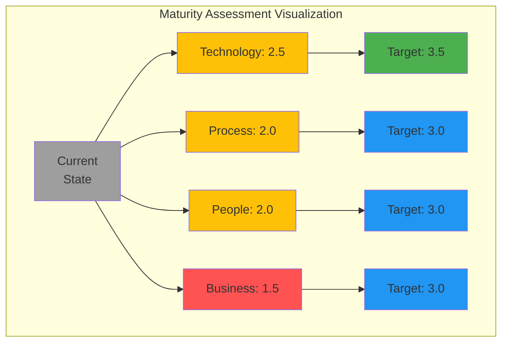

---

## 3. Transformation Roadmap Timeline

### Phased Implementation Timeline

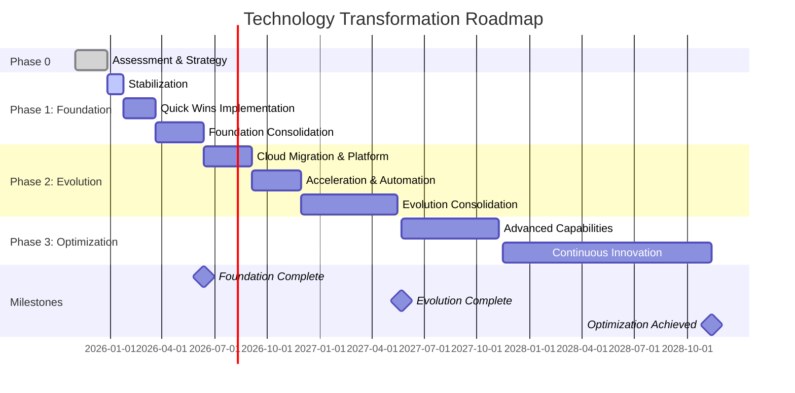

### Parallel Workstreams

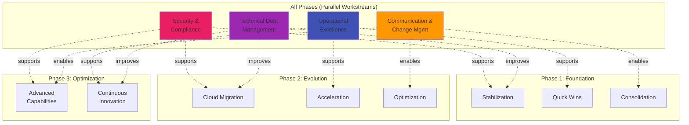

---

## 4. Technology Dimension Architecture

### Technology Evolution Journey

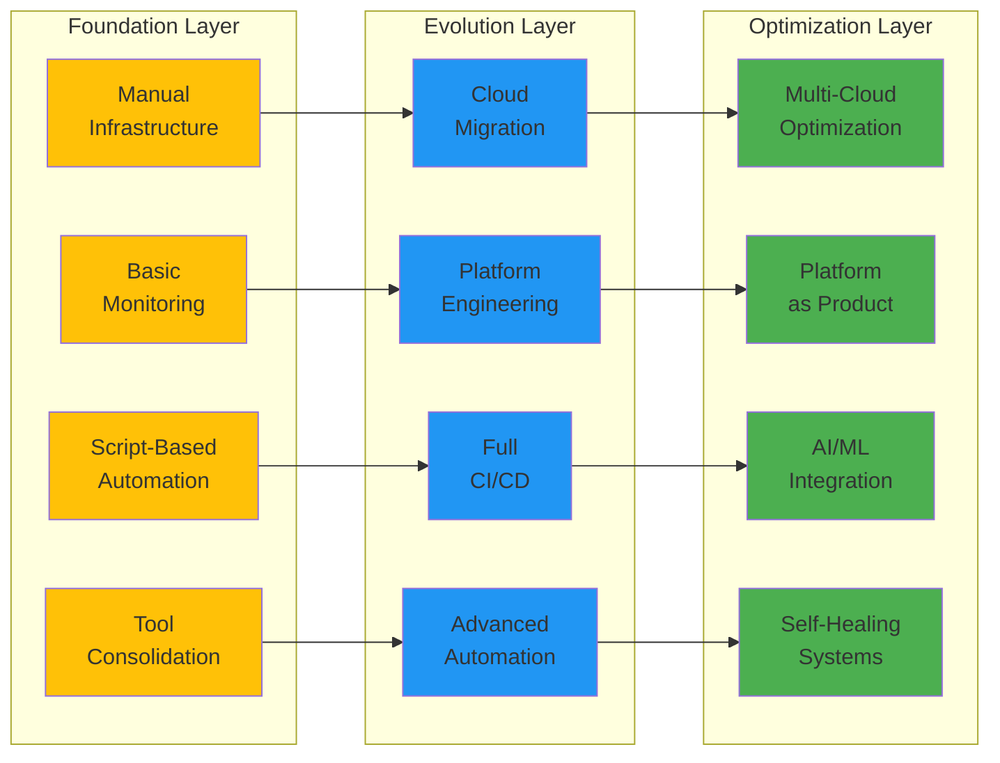

### Cloud Adoption Journey

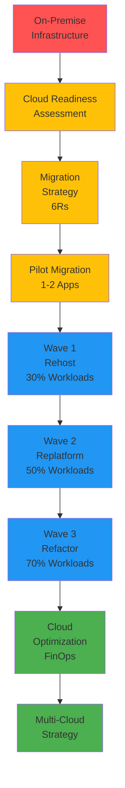

### Platform Engineering Evolution

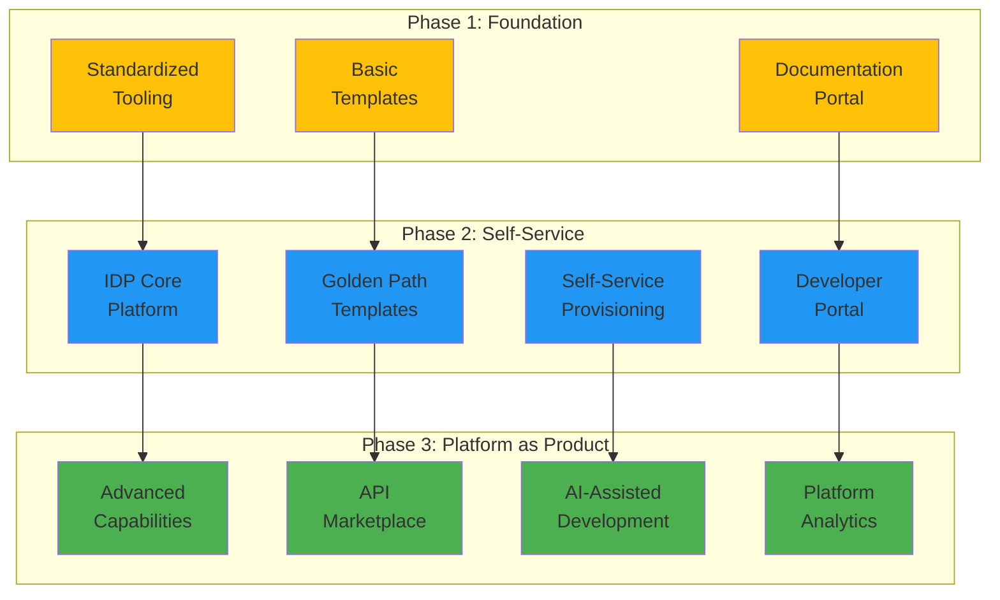

---

## 5. Process Dimension Architecture

### Agile Transformation Journey

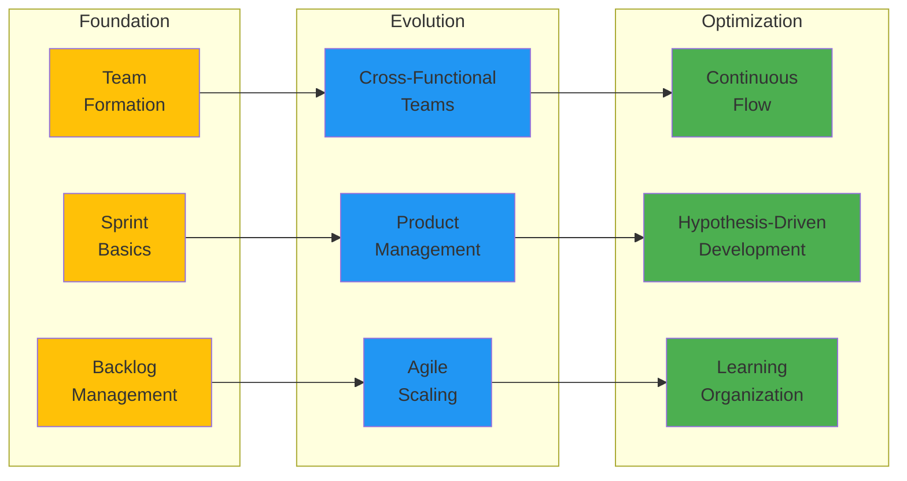

### DevOps Maturity Progression

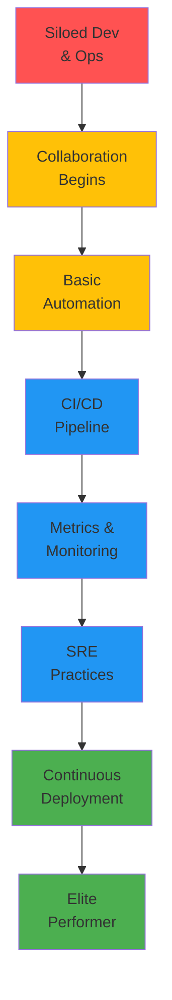

### Value Stream Optimization

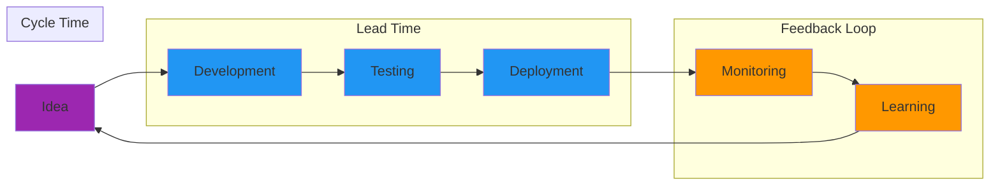

---

## 6. Integration Architecture Patterns

### Integration Evolution: Point-to-Point to Event-Driven

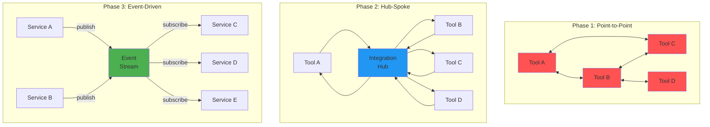

### Developer Platform Integration Architecture

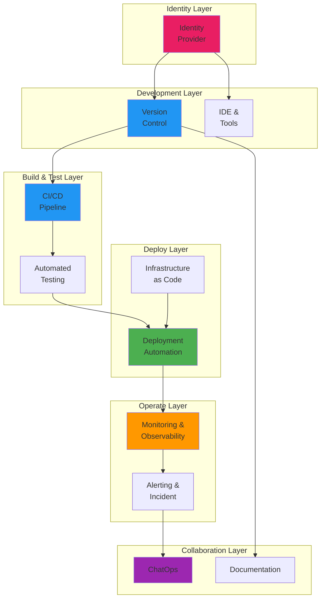

### Event-Driven DevOps Architecture

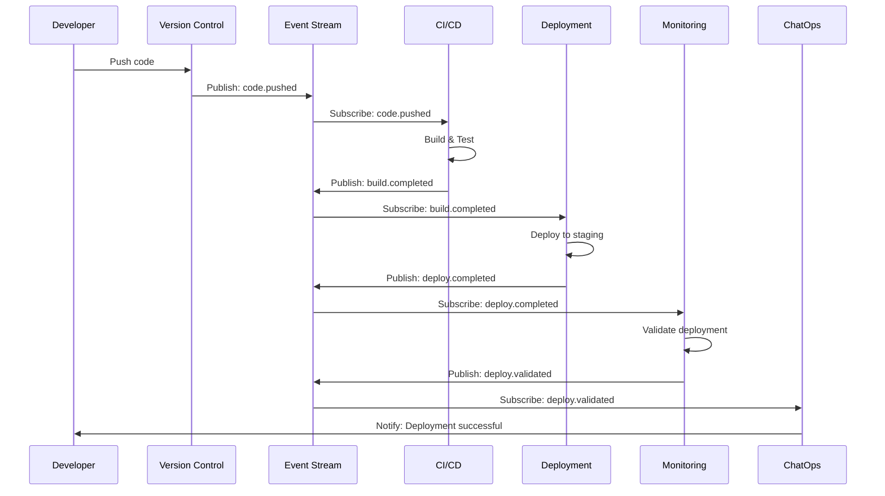

---

## 7. People & Organization Architecture

### Team Topology Evolution

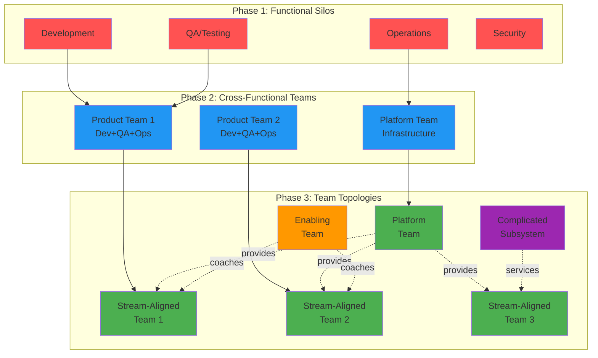

### Skills Development Journey

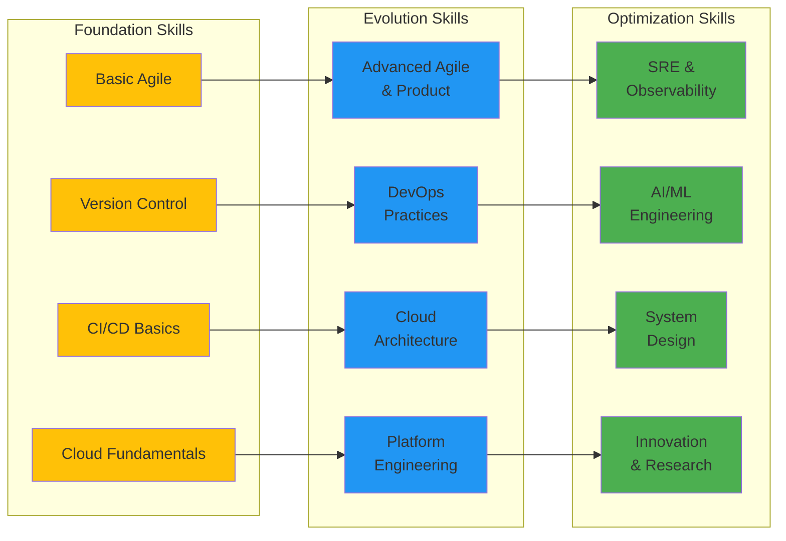

---

## 8. Business Value Architecture

### ROI Progression Timeline

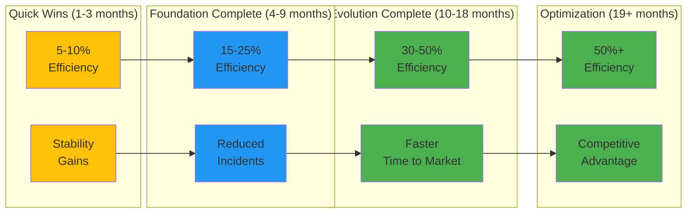

### Value Stream Flow

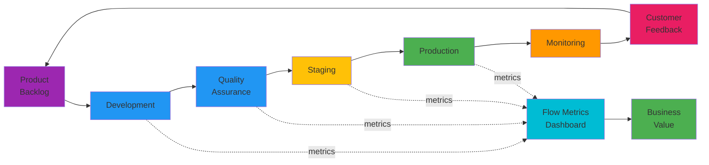

---

## 9. Decision Flow Diagrams

### Technology Decision Framework

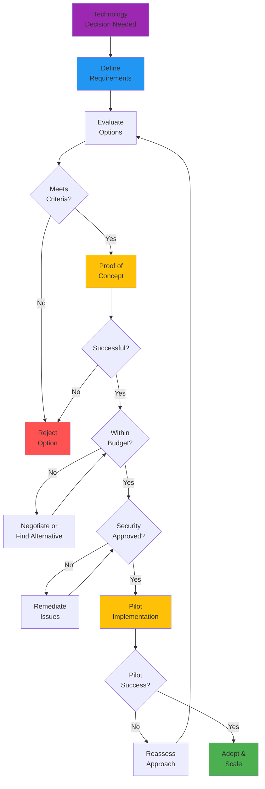

### Cloud Migration Decision Tree

```mermaid
graph TB
    App[Application<br/>Assessment] --> Critical{Mission<br/>Critical?}

    Critical -->|Yes| Complexity{High<br/>Complexity?}
    Critical -->|No| Quick[Quick Win<br/>Candidate]

    Complexity -->|Yes| Refactor[Refactor<br/>Recommended]
    Complexity -->|No| Replatform[Replatform<br/>Candidate]

    Quick --> License{License<br/>Portable?}

    License -->|Yes| Rehost[Rehost<br/>Lift & Shift]
    License -->|No| Repurchase[Repurchase<br/>SaaS Option]

    Refactor --> ROI{ROI<br/>Justifiable?}

    ROI -->|Yes| Prioritize[High Priority<br/>Refactor]
    ROI -->|No| Retain[Retain<br/>On-Premise]

    Replatform --> Dependencies{Complex<br/>Dependencies?}

    Dependencies -->|Yes| Phase[Phased<br/>Migration]
    Dependencies -->|No| Standard[Standard<br/>Migration]

    style App fill:#9C27B0
    style Rehost fill:#FFC107
    style Replatform fill:#2196F3
    style Refactor fill:#4CAF50
    style Repurchase fill:#FF9800
    style Retain fill:#FF5252
```

---

## 10. Risk & Mitigation Architecture

### Risk Management Flow

```mermaid
graph TB
    Identify[Identify<br/>Risks] --> Assess[Assess<br/>Impact & Likelihood]

    Assess --> Priority{Risk<br/>Priority}

    Priority -->|High| Mitigate[Develop<br/>Mitigation Plan]
    Priority -->|Medium| Monitor[Monitor<br/>& Review]
    Priority -->|Low| Accept[Accept<br/>& Document]

    Mitigate --> Implement[Implement<br/>Controls]

    Implement --> Verify[Verify<br/>Effectiveness]

    Verify --> Effective{Effective?}

    Effective -->|No| Revise[Revise<br/>Approach]
    Effective -->|Yes| Track[Track &<br/>Report]

    Monitor --> Escalate{Escalating?}

    Escalate -->|Yes| Mitigate
    Escalate -->|No| Track

    Revise --> Mitigate
    Accept --> Track

    Track --> Review[Quarterly<br/>Review]

    Review --> Identify

    style Identify fill:#2196F3
    style Mitigate fill:#FFC107
    style Implement fill:#FFC107
    style Verify fill:#4CAF50
    style Accept fill:#9E9E9E
```

---

## 11. Continuous Improvement Cycle

### PDCA Cycle in Transformation

```mermaid
graph TB
    Plan[Plan<br/>Define Objectives<br/>Identify Changes] --> Do[Do<br/>Implement Changes<br/>Measure Results]

    Do --> Check[Check<br/>Analyze Data<br/>Compare to Goals]

    Check --> Act[Act<br/>Standardize Success<br/>Identify Next Improvements]

    Act --> Plan

    subgraph "Support Activities"
        Train[Training &<br/>Communication]
        Tools[Tools &<br/>Automation]
        Culture[Culture &<br/>Mindset]
    end

    Train -.enables.-> Do
    Tools -.enables.-> Do
    Culture -.enables.-> Act

    style Plan fill:#2196F3
    style Do fill:#FFC107
    style Check fill:#FF9800
    style Act fill:#4CAF50
    style Train fill:#9C27B0
    style Tools fill:#9C27B0
    style Culture fill:#9C27B0
```

---

## 12. Complete Transformation Journey

### End-to-End Transformation Visualization

```mermaid
graph TB
    Start[Current State<br/>Assessment] --> Vision[Define<br/>Vision & Strategy]

    Vision --> Found[Phase 1:<br/>Foundation<br/>3-6 months]

    Found --> Evol[Phase 2:<br/>Evolution<br/>6-12 months]

    Evol --> Opt[Phase 3:<br/>Optimization<br/>12+ months]

    Opt --> Sustain[Continuous<br/>Improvement]

    subgraph "Parallel Workstreams"
        Security[Security &<br/>Compliance]
        OpEx[Operational<br/>Excellence]
        Change[Change<br/>Management]
        Debt[Technical<br/>Debt]
    end

    Security -.continuous.-> Found
    Security -.continuous.-> Evol
    Security -.continuous.-> Opt

    OpEx -.continuous.-> Found
    OpEx -.continuous.-> Evol
    OpEx -.continuous.-> Opt

    Change -.continuous.-> Found
    Change -.continuous.-> Evol
    Change -.continuous.-> Opt

    Debt -.continuous.-> Found
    Debt -.continuous.-> Evol
    Debt -.continuous.-> Opt

    Found -.feedback.-> Vision
    Evol -.feedback.-> Vision
    Opt -.feedback.-> Vision

    style Start fill:#9C27B0
    style Vision fill:#9C27B0
    style Found fill:#FFC107
    style Evol fill:#2196F3
    style Opt fill:#4CAF50
    style Sustain fill:#4CAF50
    style Security fill:#E91E63
    style OpEx fill:#00BCD4
    style Change fill:#FF9800
    style Debt fill:#673AB7
```

---

## Usage Guidelines

### How to Use These Diagrams

1. **Executive Presentations**: Use high-level framework and ROI diagrams
2. **Technical Planning**: Reference detailed architecture and integration patterns
3. **Team Communication**: Share maturity models and transformation journey
4. **Decision Making**: Leverage decision flow diagrams
5. **Progress Tracking**: Use timeline and phase progression diagrams

### Customization Tips

- **Colors**: Adjust fill colors to match corporate branding
- **Detail Level**: Add or remove detail based on audience
- **Tool Support**: Render with Mermaid Live Editor or integrate into docs
- **Interactive**: Consider tools like Miro or Lucidchart for collaborative editing

### Diagram Maintenance

- **Version Control**: Store diagrams in version control (markdown)
- **Review Cycle**: Update quarterly or after major milestones
- **Stakeholder Input**: Gather feedback and iterate
- **Documentation**: Keep aligned with written framework documents

---

**Document Version**: 1.0
**Last Updated**: 2025-11-10
**Maintained By**: Enterprise Architecture Team
**Rendering**: Use Mermaid CLI, GitHub, or Mermaid Live Editor
