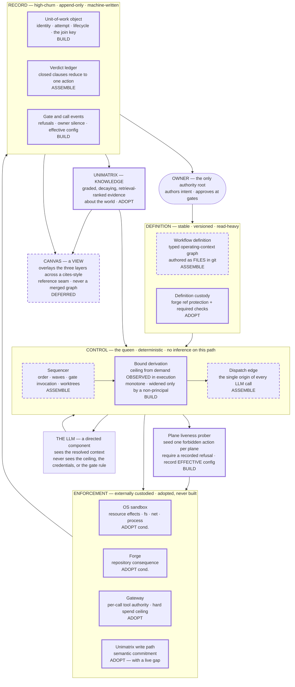
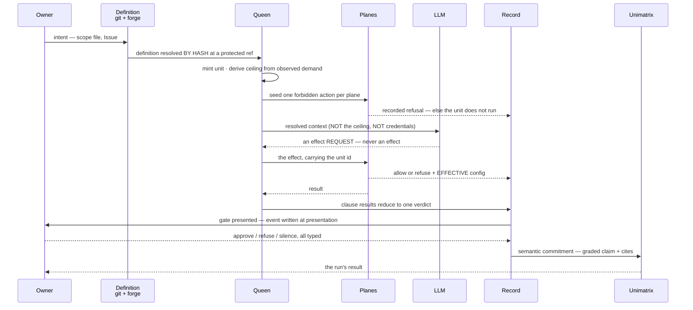

# The substrate map — where Unimatrix fits, what Jurati is, and how work is bounded

**Status:** proposal · specification author: `factory-architect` · 2026-08-28 · theme `workflow-harness`
**Standing:** **`claimed`.** This is a map and a narrative. It does **not** ratify `jurati-arch-002`,
authorize implementation, commit spend, advance any grade, or amend `themes.md`. Nothing here is
demonstrated-by-us. Zero graph writes were made by its author.
**Evidence base (reconciled, not re-derived):** `#183` `#185` `#192` `#196` `#200` `#256` `#263` `#264`
`#269` `#271` `#273` `#277` `#286` `#297` `#316`–`#321`; `product/research/wfh-008/REPORT.md`;
`product/research/wfh-004/W6-DISTILLED.md` §5 §7 §8; `product/research/wfh-002` ontology line;
`proposals/workflow-harness-scope-recut.md`; `proposals/workflow-harness-delivery-model-paths.md`;
JURATI issue #12 (via `themes.md`).

---

## 0. The objective, restated in my own words

You cannot commit to a direction because you cannot see the thing. Two questions block you: **where does
Unimatrix sit**, and **is Jurati one thing or several**. A third has been open since the theme was seeded:
**does the workflow-definition layer ride on Unimatrix's graph engine or on its own substrate.**

So the deliverable is not a research report and not an inventory. It is **a picture you can orient from,
and a story of how one piece of work moves through it and where it gets stopped.** You have said you will
accept a map that implies too many parts, because not having the map is costing more. I have taken that
literally: I have drawn every boundary the evidence forces, and marked the ones that are only my opinion
so you can delete them without touching the rest.

**Read this first, because the whole map depends on it:** a component here is a **boundary of
responsibility**, not a deployable unit, a service, a repository, or a process. Two components may live in
one file. The map is silent on deployment on purpose — deployment is the P1–P14 decision and it is a
different document.

---

## 1. The map

**Legend.**

| Device | Meaning |
|---|---|
| **Solid, thick border** | The evidence forces this boundary. Deleting it contradicts a recorded finding. |
| **Dashed border** | One architect's judgement. You can move or delete it without contradicting anything we hold. |
| `ADOPT` / `ASSEMBLE` / `BUILD` | Default is adopt. `BUILD` is a **flag for you**, not a decision by me; §5 names what forced each. |
| `cond.` | Adopt is real but has a named, unclosed falsifier — see the control register, §4. |
| A box | A boundary of responsibility. **Not** a service, process, repo, or deployable. |
| An arrow | Work or authority flowing. Not a network call. |

**What the picture says in one sentence.** Definitions flow down from the owner under forge custody; the
queen turns them into a bounded unit of work and calls the model exactly once per step across a single
edge; **the model can ask for effects but cannot cause them** — every effect leaves through one of four
planes that hold credentials the model does not; each plane must have proved it refuses *before* the run
starts; everything the planes decide lands in an append-only record keyed by the unit; and only at a gate
does anything become a graded claim in Unimatrix.

---

## 2. The narrative — one unit of work, end to end

The unit I follow is real and happened this month: **"read `wfh-008`'s seven findings files, write one
synthesis report, write four Unimatrix nodes, commit path-scoped."** It exercises every boundary on the
map, and it exposes one live failure in our own house, which is why I chose it over a toy.

The two hops that carry the whole design are **the dispatch** — the model receives context and never the
thing that governs it — and **the effect** — the model asks, the queen carries, the plane decides. The
table below walks the same trace and names the enforcement point at each step.

| # | Hop | What crosses | What does **not** cross | Authority | Enforcement point |
|---|---|---|---|---|---|
| 1 | Owner states intent | a scope file + an Issue, in git | nothing executable | Owner | Forge ref protection on the scope path. **Nothing checks this today.** |
| 2 | Sequencer resolves the definition | definition bytes **at a content hash pinned to a protected ref** | runtime state, telemetry, credentials | Whoever can push to the protected ref | Forge pre-receive. **Gap: reading the local worktree instead of the protected ref bypasses this entirely — see clause D-2.** |
| 3 | Unit minted | nothing outward | — | Queen | None needed; the unit id becomes the join key every later record carries |
| 4 | Bound derived | the ceiling, into the queen only | **the ceiling never enters the model's context** | Queen, from observed prior demand | The ceiling is data the planes consume; it is not enforced by holding it |
| 5 | **Liveness probe** | one deliberately forbidden action per plane | — | The prober | **Each plane.** If a plane cannot produce a refusal, the unit does not run. This is the only hop that can detect a control that is present, believed and inert. |
| 6 | Dispatch | instructions, file contents, tool schemas — into the model | the ceiling · credentials · the gate rule · other units' state | Queen | None. **This is a trust boundary, not a control point** — and saying so is the point. |
| 7 | Model asks for an effect | a tool request, out of the model's context | the effect itself | Queen's tool broker | In-process with the queen. **Passes the custody predicate against the model; fails it against the queen. Do not call this a gate.** |
| 8 | Effect lands | the syscall / the push / the API call / the token spend | — | The plane | **OS kernel** (fs/net) · **forge** (refs) · **gateway** (spend, tool authority) · **Unimatrix API** (semantic commitment). Each holds a credential the acting party does not. |
| 9 | Record appended | decision, refusal, elapsed, **effective** config — keyed by unit id | the model's narration of what it did | Record plane | Append-only. The record must never consume self-report as fact. |
| 10 | Gate | clause results → one verdict → one predeclared action | an assessor-invented transition | Reducer, then Owner | **Fails the predicate today** — the reducer, where it exists at all, runs inside the proposing process. |
| 11 | Commitment | `context_store` / `context_correct` / a grade tag | — | Unimatrix write path | **The firewall's own rule — no `proven` without an artifact — is checked by no code.** `proven_by` is supplied by the writing agent. See §4 control 6. |
| 12 | Return | a report file, four graded nodes, one commit | the definition is unchanged | Owner | — |

### How work is bounded, stated as an invariant

> Work enters as a definition under external custody, crosses the dispatch edge **exactly once per step**,
> and leaves through **exactly four effect planes**. There is no fifth exit. Nothing the model says is
> ever consumed as fact about what happened; only what a plane recorded is.

The **first half of that invariant is a design intention**, and the second half is the part that is
mechanically checkable. The sole-path claim — *there is no fifth exit* — is not demonstrated for any plane
in this repository today, and every authority claim in this map rests on it. That is stated again as
open question OQ-2 and it is the single most expensive unknown on the page.

### Where the live failure is

Hops 10 and 11, in our own garage, right now. The curator is the single writer; the rule that stops it
writing `grade:proven` without an artifact is prose in a role file; the `proven_by` field is authored by
the same agent the rule governs; `agent_id` is a self-asserted string (`.claude/rules/unimatrix-access.md`
D6). **That is the custody predicate (`#320`) firing inside our own toolchain, on the control the whole
methodology is named after.** wfh-008 found seven instances of the same shape in someone else's
repository. This is the eighth, and it is ours.

---

## 3. The components, with provenance

| # | Component (responsibility) | Route | Provenance | Basis |
|---|---|---|---|---|
| D1 | Workflow definition — the typed operating-context vocabulary, authored as files | ASSEMBLE | **authored** | `#183` specifies 5 node / 4 edge types, stress-tested 3×, no artifact. That the source of truth is *files* is my fork resolution (§6.3), resting on `#185` and wfh-002 W3 §4. |
| D2 | Definition custody — forge ref protection, required checks, credential-reachability audit | ADOPT | **derived** | `#271` verbatim, including its falsifier. |
| C1 | Sequencer — order, waves, gate invocation, branch/worktree discipline | ASSEMBLE | **adapted** | `#192` ADOPTs `gh-aw` as incumbent baseline; I route it ASSEMBLE rather than ADOPT because **nobody has run it** (`#192`'s own caveat). Changed: the verdict's confidence, not its content. |
| C2 | Bound derivation — ceiling from demand observed during execution; monotone; widening approved by a non-principal | **BUILD** | **derived** | `#192` amendment 1: the two surviving build legs, verbatim. |
| C3 | Dispatch edge — the single origin of all LLM calls | ASSEMBLE | **authored** | Value-target #1 asserts the single edge. Separating it from C1 as its own boundary is my call: it is the only place the *content* of the model's context is decided, and that is a different job from deciding order. |
| PROBE | Plane liveness — seeded refusal per plane per run; records the **effective** configuration | **BUILD** | **derived** | `#192` amendment 2 makes it a `done_when` precondition; `#196` says nothing in this theme detects an inert control; `#275` already exists as a specified probe. |
| E1 | OS sandbox — resource effects | ADOPT (cond.) | **derived** | `#269`, `#277`, `#297`. Condition: whether project-writable settings can widen the boundary is unverified. |
| E2 | Forge — repository consequence | ADOPT (cond.) | **derived** | `#271`, `#277`. Condition: whether the executing principal can alter protections. |
| E3 | Gateway — per-call tool authority and hard spend ceiling | ADOPT | **derived** | `#202` `#203` `#204`. Cost enforcement is explicitly adopt-not-build (recut §4). |
| E4 | Unimatrix write path — semantic commitment | ADOPT | **derived** | `#277` assigns it the semantic-commitment leg; wfh-004 C-104 establishes that a substrate *may refuse at its own API boundary* without orchestrating. |
| R1 | Unit-of-work object — identity, attempt, lifecycle, join key | **BUILD** | **derived** | wfh-004 §5, residual face F1 (43 of 128 abilities). "The unit of work does not exist as an object anywhere a switch can see it." |
| R2 | Verdict ledger — closed blocking clauses reducing to one predeclared action | ASSEMBLE | **derived** | `#256` (the capability), `#263` (**`grade:partial`** — the only demonstrated artifact anywhere in the Jurati line), `#258`. |
| R3 | Gate and call events — refusals, owner silence, effective config | **BUILD** | **derived** | `#273` verbatim, including the bias argument: missing refusal records bias trust-graduation in the agent's favour. |
| K | Unimatrix — knowledge | ADOPT | **derived** | We own it. Boundary set by JURATI #12 via `themes.md`. |
| V | Canvas — read-only overlay across a reference seam | DEFERRED | **authored** | Recut §3: the visual-authoring category was deprecated at the top of the market. A *view* is downstream of the record existing, so it cannot be first. |

**Provenance tally:** 10 derived · 1 adapted · 4 authored. The four authored boxes are exactly the four
dashed ones. If you disagree with me, disagree there first.

---

## 4. The control register — where "smallest defensible" gets its stopping rule

Method: `#320`. Every control names **who supplies its input**, **who holds its custody**, **who enumerates
its call sites**. A control naming the governed party in any of the three is **refused at admission**.
Custody is the first test; **sole-path mediation is a second, independent one** — a control must pass both.

| # | Control | Input supplied by | Custody held by | Call sites enumerated by | Verdict |
|---|---|---|---|---|---|
| 1 | Definition integrity | Git object hashes + forge protection state | Forge server | Forge pre-receive — **for pushes only** | **CONDITIONAL PASS.** Fails if the executing token can alter protections (`#271`). **Fails outright at read time** unless the queen resolves the definition by hash against the protected ref rather than reading the working tree. |
| 2 | Resource ceiling (fs / net / process) | Sandbox configuration | OS kernel | Kernel, by construction — every syscall | **CONDITIONAL PASS.** Custody and call-site enumeration are ideal. **Input is contested:** if project-writable settings widen the boundary, the governed party supplies the input and it fails. `#269` gap; `#275` is the probe. |
| 3 | Repository consequence | Ref protection state | Forge server | Forge | **CONDITIONAL PASS** — same falsifier as 1. |
| 4 | Per-call tool authority (the broker) | The derived ceiling | **The queen process** | The queen's tool loop | **PASSES against the model. FAILS against the queen.** In-process with the party we will eventually want to govern. **Rename it: it is a broker, not a gate.** |
| 5 | Spend ceiling | Token counts **observed** by the gateway | Gateway | The gateway — **only if it is the sole egress** | **PASSES ONLY WHEN COMPOSED WITH CONTROL 2.** Alone it fails sole-path: any unsandboxed egress route is an unmetered one. This composition dependency is not optional and is easy to miss. |
| 6 | Semantic-commitment firewall — no `proven` without an artifact | **`proven_by`, authored by the writing agent** | Unimatrix server | Unimatrix API (single path if MCP is the only client) | **FAILS ON INPUT.** The governed party writes the evidence reference and nothing dereferences it. This is our own live instance of the predicate. |
| 7 | Actor identity (`agent_id`) | **The caller** | Nobody | — | **FAILS. Not a control.** Reliable for reconstructing what happened, useless for establishing who is accountable (D6). Must be labelled that way wherever it appears. |
| 8 | Gate independence (proposer ≠ evaluator) | Clause results | **The proposing process** | Whoever invokes the reducer | **FAILS** unless the reducer runs under an identity the proposer cannot assume. Today it exists only inside `jurati-001`'s artifact envelope (`#263`). |
| 9 | Bound derivation from observed demand | **The observed exec / tool / syscall surface** | The observer — which must not be the observed | The dispatch edge + the planes' own logs | **PASSES ON INPUT BY CONSTRUCTION.** This is the entire reason "observed, not declared" is the differentiating leg. Custody passes only if the observation is taken *at a plane*, never from the agent's own report. |
| 10 | Plane liveness | **A real refusal emitted by the plane** | The plane | The prober — once per plane per run | **PASSES.** The only control here that can detect a control that is present, configured, believed and inert. |

**The minimum defensible set is what survives: controls 1, 2, 3, 5, 9, 10** — four externally-custodied
planes, one derivation whose input the governed party cannot author, and one prober. Four of the ten are
refused at admission, and **two of those four (6 and 8) are ours and fixable**; 7 is unfixable and must be
relabelled; 4 must be renamed.

**Self-test against `#321`.** wfh-008 found ~7 in-process gate classes and zero demonstrated boundaries.
This map has **two** in-process controls (4 and 8) and **names both as failing**. It does not reproduce the
documented failure — but note `#321`'s own limit 2: "one" is a claim about *custody*, not about component
count. Four externally-custodied planes, each sole-path for its own leg, is consistent with that
inference; four gates inside the queen would not be.

**Where nothing checks anything today, stated plainly.** Controls 1, 5, 6, 8, 9 and 10 have **no
implementation in this repository at all**. Controls 2 and 3 exist as configuration whose effective value
has never been measured. Zero of the ten have ever produced a recorded refusal we generated ourselves.

---

## 5. The `BUILD` markers, and what forced each

A `BUILD` on this map means: **no plausible adopt or assemble route was found, or a custody requirement
nothing available satisfies.** Four boxes carry it. That is more than I would like and I say so.

1. **C2 — bound derivation from observed demand.** Forced by `#192` amendment 1. Every component on the
   shelf assumes the principal is a program with a statically declared interface — Bazel has `srcs`, WASI
   a WIT world, in-toto a layout, OPA a schema, `gh-aw` frontmatter, ruflo a parsed objective string. An
   LLM agent has none. The assumption is invisible because it is universal. **This is the only box on the
   map that is differentiated rather than merely necessary.**
2. **R1 — the unit-of-work object.** Forced by wfh-004's falsification test: SDLC had *more* configured
   than research, and every available switch is a predicate over the wrong noun — tool calls, pipelines,
   sessions, files, branches. This is not a missing feature; it is a missing noun, and 43 of 128 canonical
   abilities are faces of it. *Caveat carried forward: 11 of the 128 have their absence contested by an
   unflipped switch. Flip those before building.*
3. **PROBE — plane liveness.** Forced by `#196`: nothing in this theme detects a control that is present,
   configured, believed and inert. No product ships a seeded-refusal preflight. It is also the **cheapest**
   box on the map and the only one runnable against our existing setup at zero external cost.
4. **R3 — write-time gate events.** Forced by `#273`: refusals and owner silence are presently not
   artifacts and cannot be reconstructed, and their absence biases trust-graduation counts in the agent's
   favour.

**If you build one thing, build PROBE.** It is small, it attacks the failure mode this theme has now
documented three times independently, it can run against the garage as it stands, and it would be this
theme's **first demonstrated-by-us artifact** — the theme currently has zero. That is a recommendation
about sequence, not a request for authorization.

---

## 6. The three questions, answered

### 6.1 Where does Unimatrix fit?

**In two places, and it must never occupy a third.**

- **As the knowledge layer** — graded, decaying, retrieval-ranked evidence *about the world*. That is the
  box marked `K`.
- **As one of the four enforcement planes** — the **semantic-commitment** leg (`#277`). A write to
  Unimatrix is where a claim becomes committed, and the substrate is permitted to *refuse at its own API
  boundary*. wfh-004's C-104 establishes this is physics, not preference: the rate limiter already refuses
  writes mid-run, deterministically, and refusing is not orchestrating.
- **Never as the workflow-definition store, and never as the event sink.** Both would make it the
  orchestrator that JURATI #12 forbids, and both fight its read/write/version profile (H7). Definitions
  are stable, versioned and read-heavy; events are high-churn streams; knowledge is graded and decaying.
  Three profiles, three stores.

**The sharp part of the answer, which the boundary statement in `themes.md` does not yet say:** *Unimatrix
is today an enforcement plane that does not enforce.* Its custody is real (the server holds the write
path) but its **input is authored by the governed party** and its identity is self-asserted. Until
`proven_by` is dereferenced by something the writer cannot author, control 6 is a label. **This does not
weaken the workflow ≠ knowledge boundary; it is a defect *inside* the layer the boundary assigns to
Unimatrix,** and it is cheap to attack.

### 6.2 Is Jurati one capability or several?

**Several — and the strongest evidence that the decomposition has never been done is in the graph
itself.** wfh-004 §7, verbatim: the `theme:workflow-harness` namespace holds 22 `technology` nodes and
**zero `capability` nodes** — *"the theme has a supply side and no demand side."* I re-checked live on
2026-08-28: the namespace **still** holds no capability node, and Jurati holds **exactly one anywhere**
(`#256`, `grade:missing`, created after wfh-004 measured).

But it is not N independent capabilities either. wfh-004's residual map settles the shape: the residual
after full configuration is **not five independent gaps but one missing object model with five faces**.
So the honest answer is **one object, six capabilities, and only four of them ours**:

| | Capability | Face | Route | Seam that forces it |
|---|---|---|---|---|
| **J1** | Definition integrity — the run executes the definition the owner approved, provably | — | ADOPT/ASSEMBLE | **Custody.** The definition must be held by a party the executing agent is not. |
| **J2** | Deterministic sequencing — control flow with no inference on the enforcement path | F1 | ASSEMBLE | **Determinism.** A guarantee is statable only over a path with no inference on it; inference on the enforcement path demotes a guarantee to a tendency. |
| **J3** | Observed-demand bound derivation | F3 | **BUILD** | **Input custody.** The bound's input must be something the bounded party cannot author. |
| **J4** | The unit-of-work record — identity, attempt, lifecycle, join key | F1 | **BUILD** | **Altitude.** Enforcement exists but is attached to nouns adjacent to the one that fails. |
| **J5** | Plane admission and liveness | — | **BUILD** | **Effectiveness.** A vacuous guarantee passes every test a real one passes. |
| **J6** | Evidence-bound decision evaluation → one verdict, one predeclared action | F2 | ASSEMBLE | **Independence.** The party proposing must not be the party evaluating. Already `#256`; `#263` is `grade:partial`. |

**The seams are cut by custody and by rate-of-change, not by feature grouping.** That is the load-bearing
claim of this answer, and it is what makes the list terminate. Two further faces — **F4** an obligation
ledger with external discharge, and **F5** a comparison substrate — are real in the evidence (34 of 128
abilities) and I have deliberately left them off the map; see §8.

*One tension you should know I did not resolve:* wfh-004 §8.10 records "one product or two" — the
evidence models differ in kind (SDLC's is an executable predicate that re-runs; research's is an attested
artifact of a past demonstration). The third position, which neither lens could see, is to make **evidence
kind a typed queryable field**: one product in which the fault line is *named data*. I have assumed that
third position on the map. It is untested.

### 6.3 The open fork: Unimatrix's graph engine, or a separate substrate?

**Resolved — by rejecting the fork.** As posed, the question conflates three separable ones, and the
answer to the only one that matters is neither branch.

- **Where definitions are authored and are the source of truth:** **git files.** `#185`'s secondary
  result, which the graph already holds and which nothing since has contested: *"storage is not the real
  decision variable. Graph vs relational is a storage detail, not an architecture: git-native FILES remain
  the source of truth… the store is a derived index either way."* wfh-002 W3 §4 adds the reason — a store
  that makes users edit rows instead of files fights the ecosystem exactly the way a 25th rules format
  would.
- **Which engine indexes them for query:** a decision with **no architectural weight**, reversible at any
  time, because the index is rebuildable from git. It should be deferred until a query profile exists to
  choose against. Choosing it now buys nothing and calcifies a file-shaped schema (delivery-paths seam 8).
- **Who holds custody of the mutation path:** **the real question — and neither branch answers it.** A
  hard-isolated Unimatrix plane does not give the definition external custody, because Unimatrix's
  identity is self-asserted (D6) and the queen would be both its sole client and the governed party. A
  separate substrate has exactly the same problem. **The custody predicate refuses both branches
  identically.** What supplies custody is the *forge* — ref protection plus required checks, held by a
  server whose credential the executing agent should not hold (`#271`, `#277`).

> **The resolution:** the definition plane's source of truth is the git repository; its enforcement point
> is the forge; any store — Unimatrix plane or otherwise — is a **derived, rebuildable index with no
> authority**. The fork was asked one altitude below where the decision lives.

**Mechanically checkable, which is what makes this a resolution rather than an opinion:** rebuild the index
from the pinned git ref and diff it against the live index. If they differ in any field the queen reads,
the store was holding authority it was not supposed to have. That check is cheap, it is repeatable, and it
is the falsifier for this whole section.

**What would overturn it:** (a) a definition-layer datum that provably cannot live in a file — an approval
bound to a specific attempt is the candidate — or (b) a measured query profile at fleet scale where
rebuild-from-git is operationally infeasible. Neither is evidenced today. See OQ-5.

---

## 7. A conforming reading and a non-conforming reading

Because a map can be misread, and both of these misreadings have already happened in this theme.

**Conforming.** *"We will implement the sequencer, the bound-deriver and the dispatch edge as three
modules in one Python process, shipped as one binary, and we will run the prober as a subcommand of it."*
Conforming: a component is a responsibility boundary; co-location is a deployment choice the map does not
constrain. The controls that matter (1, 2, 3, 5, 9, 10) are all still held outside that process.

**Non-conforming, three ways, each a real failure mode:**

1. *"The tool broker is our authorization gate, so the agent is bounded."* — **Fails control 4.** The
   broker is in-process with the queen. It bounds the model; it does not bound the queen. Calling it a
   gate purchases exactly the misplaced trust that `#321` documents.
2. *"We will store the workflow definitions as Unimatrix nodes with `grade:` tags so everything is in one
   graph."* — **Violates the workflow ≠ knowledge boundary** (JURATI #12) and makes the substrate an
   orchestrator. Definitions are not graded, decaying, retrieval-ranked evidence.
3. *"The sandbox is configured, so resource effects are bounded."* — **Fails control 10 and reproduces
   wfh-008's central finding.** A configured control that has never produced a refusal is indistinguishable
   from an inert one, and a fail-open isolation gate is net negative — worse than no gate.

---

## 8. What I deliberately left out

- **Deployment topology and tenancy.** No service count, no hosting, no P1–P14 selection. Value prop and
  delivery model are on different axes (delivery-paths, fact 2) and merging them into one picture is the
  error that has been making this decision feel unmakeable.
- **Two of the five residual faces: F4 the obligation ledger and F5 the comparison substrate** (34 of 128
  abilities). Both are real. F4's discharge is external and therefore *interesting*; F5 is the recut's
  goal 2 — honest cross-model comparison — which the recut itself says is the differentiated half. I left
  them off because the map is already at the edge of legibility and neither is on the enforcement path.
  **This is the largest thing I cut and the most likely place I am under-reaching.**
- **The ontology's field-level schema.** Already specified (`#183`, wfh-002 W1); re-specifying it here
  would be filing a rival.
- **The canvas design.** Deferred, not dismissed — but a view is downstream of a record, and the record
  does not exist.
- **The multi-repo fleet (H3/H6) and SaaS (H8).** Owner decisions, live and unsettled since the recut.
- **Any grade movement, any capability node text, any edge.** Not mine to write.

---

## 9. The strongest objection I can find to this map

**It is this, and I cannot fully answer it.**

The map treats "the queen" as a single trust boundary while simultaneously arguing that in-process
controls fail the custody predicate. But **from the owner's point of view the queen is also a governed
party** — it can be prompt-injected, mis-configured, or simply wrong. Under that adversary model, controls
4 and 8 fail, control 9's observer is inside the observed if the queen takes its own observations, and the
four external planes become the *only* real controls on the page. If that reading is correct, then the
honest smallest defensible substrate is **four adopted planes plus a prober, and no Jurati at all** until
definition-integrity is externally custodied — and this map has drawn a control plane that is assurance
surface rather than authority.

**What I can answer:** the queen buys **sequencing determinism** and **the join key**. Neither is an
authority claim, and neither should ever be described as one. That is why the map labels the dispatch edge
a *trust boundary, not a control point*, and why I insist the broker be renamed.

**What I cannot answer:** whether a queen that is itself unattested can carry control 9's observation
without the observer collapsing into the observed. The fix — take the observation at the *plane*, not in
the queen — is stated in the register, but no plane we have adopted emits a demand set in a form the
derivation can consume. **That is a genuine hole in the differentiating build leg, found by writing this
document, and it is not recorded anywhere in the graph.**

---

## 10. Open questions — yours to answer, with what would settle each

Travelling with the map, not behind it.

| | Question | What would resolve it | Cost |
|---|---|---|---|
| **OQ-1** | Is the sequencer ADOPT `gh-aw` or ASSEMBLE? | **Nobody has run it** (`#192`'s own caveat: `[demonstrated]` appears nowhere). Stand up one `gh-aw` workflow and record which of its mechanisms in seven concerns actually fire. `#192` prices this at about one day. | ~1 day, zero external |
| **OQ-2** | Is any plane actually sole-path? | The seeded-refusal admission test (`#286`, `#321`): seed a violation, require a recorded refusal from a plane whose credential the actor does not hold, **and** show the protected operation cannot reach its effect by another route. **Every authority claim on this map rests on this and none of it is demonstrated.** | Low, local |
| **OQ-3** | Can the executing principal alter forge protections, or widen the sandbox? | The credential-reachability audit (`#271`'s named falsifier) and the sandbox self-lift test (`#275`, already specified). Both are one-time and local. | Low, local |
| **OQ-4** | One product or two — is the evidence model one interface with two sources, or a fault line? | Express one research evidence record and one SDLC evidence record in the same typed field and measure what either loses (wfh-004 §8.10, position C-108). | Low |
| **OQ-5** | Does the derived index ever need to be authoritative? | The rebuild-and-diff check in §6.3, run once the definition corpus is real. Until then the fork stays resolved as written. | Low |
| **OQ-6** | Does the SaaS-from-start premise in `themes.md` still stand against the recut's open-source-first framing? | **Owner decision, not evidence.** It decides whether Anchor-B is foundational-now or deferred, which changes the map's custody story materially. Unresolved since 2026-08-01. | — |
| **OQ-7** | Can any adopted plane emit an observed demand set in a form C2 can consume? | Named in §9. Nothing in the graph answers it. A one-plane spike against the OS sandbox's audit surface would. | Low |

---

## 11. Limits

Everything here is `claimed`. No component is `proven`, no `done_when` clears, no grade moves, and the map
introduces no obligation. Its evidence base is directional research plus two static-inspection runs; the
one artifact anywhere in the Jurati line (`#263`) is `grade:partial` and demonstrates a checker/reducer
inside its own envelope only. **Every enforcement point named on this page is a design intention until a
plane of ours has refused something and we recorded it.** The theme has produced zero such records.
