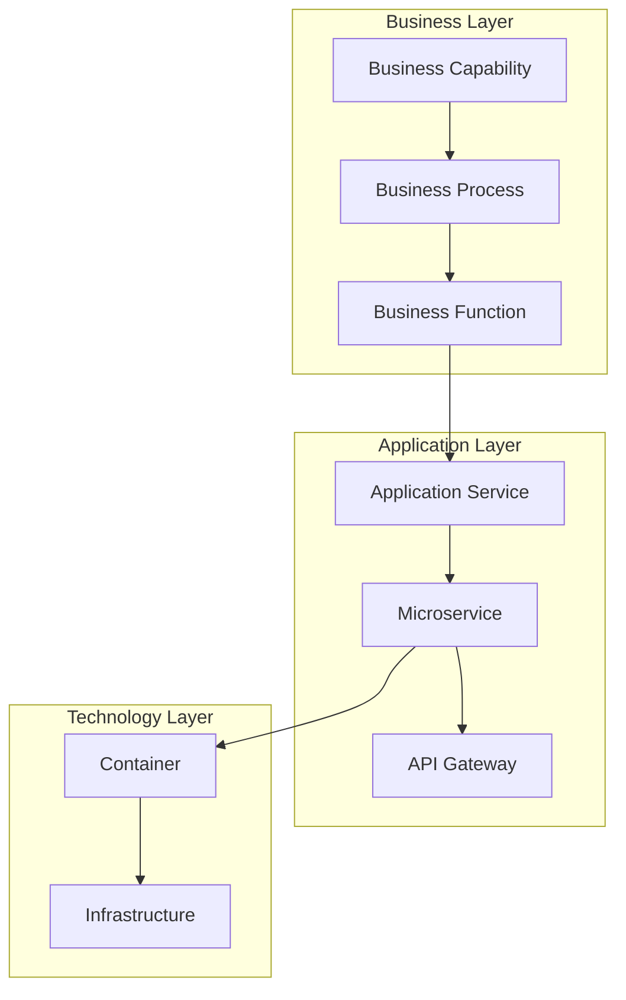
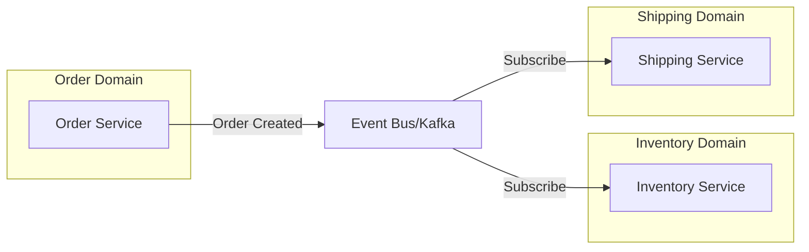
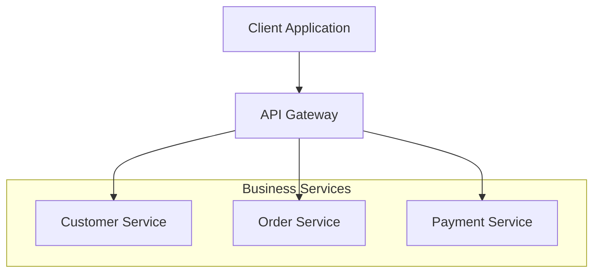
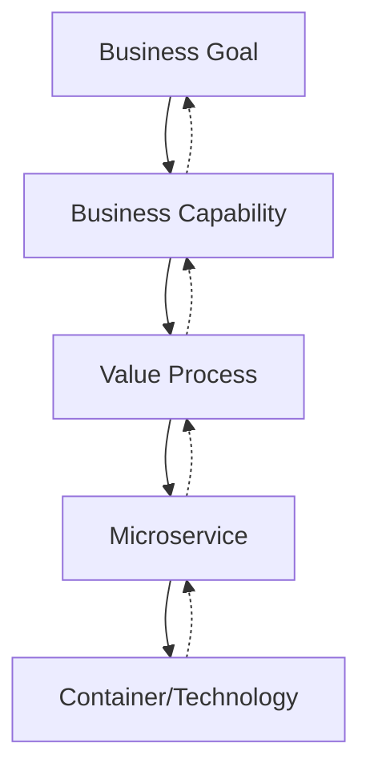

# ArchiMate-C4 Integration for Business-to-Infrastructure Mapping

## Executive Summary

This research explores the integration of ArchiMate enterprise architecture modeling with the C4 model, focusing on how to map business processes to infrastructure patterns and align business capabilities with microservices architectures. Based on current industry practices from companies like Amazon, Netflix, and Spotify, this document provides patterns and approaches for maintaining business-IT alignment at scale.

## Table of Contents

1. [ArchiMate and C4 Model Integration](#archimate-and-c4-model-integration)
2. [Business Capability Mapping](#business-capability-mapping)
3. [Value Stream to Technology Stack Alignment](#value-stream-to-technology-stack-alignment)
4. [Service Dependency Visualization](#service-dependency-visualization)
5. [Data Flow and Integration Patterns](#data-flow-and-integration-patterns)
6. [Cross-Functional Team Boundaries](#cross-functional-team-boundaries)
7. [Real-World Implementation Examples](#real-world-implementation-examples)
8. [Best Practices and Recommendations](#best-practices-and-recommendations)

## ArchiMate and C4 Model Integration

### Mapping Between Models

The integration between ArchiMate and C4 models follows a systematic mapping approach:

#### Element Mapping
- **C4 Person** → **ArchiMate Business Actor**
  - Represents end users or external systems interacting with the system
  - Maintains business context in technical diagrams

- **C4 Software System** → **ArchiMate Application Component**
  - High-level system boundaries map to enterprise application components
  - Preserves system-of-systems view

- **C4 Container** → **ArchiMate Application Component** (more granular)
  - Deployable units map to specific application components
  - Technology choices are preserved in ArchiMate properties

- **C4 Component** → **ArchiMate Application Function**
  - Internal components map to specific application functions
  - Provides detailed functional decomposition

#### Relationship Mapping
- **C4 Relationships** → **ArchiMate Triggering/Serving Relationships**
  - API calls map to triggering relationships
  - Data flows map to flow relationships
  - Dependencies map to serving or access relationships

### Integration Benefits

1. **Comprehensive Coverage**: ArchiMate provides business and motivation layers that C4 lacks
2. **Developer-Friendly Detail**: C4 provides implementation detail that ArchiMate abstracts
3. **Stakeholder Communication**: Combined approach addresses both business and technical audiences
4. **Traceability**: Full business-to-implementation traceability chain

## Business Capability Mapping

### Business Capability Definition

A business capability represents what a business does to achieve its objectives, independent of how it's implemented. This forms the foundation for service decomposition.

### Mapping Process



### Amazon's Approach

Amazon uses a systematic domain-driven design approach:

1. **Event Storming**: Business and technical teams collaborate to identify domain events
2. **Bounded Contexts**: Clear boundaries around business domains
3. **Service Ownership**: Each team owns specific business capabilities
4. **API-First Design**: Services expose capabilities through well-defined APIs

### Key Principles

1. **Business Alignment First**: Start with business capabilities, not technical components
2. **Bounded Context Definition**: Use DDD principles to define service boundaries
3. **Capability Granularity**: Balance between too coarse (monolithic) and too fine (chatty)
4. **Evolution Support**: Design for capability evolution and versioning

## Value Stream to Technology Stack Alignment

### Value Stream Mapping

Value streams represent the end-to-end flow of value delivery to customers. Each value stream should map to specific technology components.

### Alignment Pattern

```yaml
Value Stream: Customer Order Fulfillment
  Business Capabilities:
    - Order Management
    - Inventory Management
    - Payment Processing
    - Shipping Coordination
    
  Microservices:
    - order-service (Spring Boot, PostgreSQL)
    - inventory-service (Node.js, MongoDB)
    - payment-service (Java, Oracle)
    - shipping-service (Python, Redis)
    
  Infrastructure:
    - AWS ECS for containerization
    - API Gateway for service mesh
    - RDS for transactional data
    - DynamoDB for session state
```

### Netflix Example

Netflix aligns their technology stack to content delivery value streams:

1. **Content Discovery**: Recommendation engine microservices
2. **Content Delivery**: CDN and streaming services
3. **User Experience**: Personalization and UI services
4. **Content Production**: Studio and production services

## Service Dependency Visualization

### Dependency Mapping Patterns

#### ArchiMate Service Dependencies

```xml
<relationship xsi:type="Serving" 
  source="id-order-service" 
  target="id-shipping-service">
  <property key="protocol" value="REST/JSON"/>
  <property key="sla" value="99.9%"/>
</relationship>
```

#### C4 Container Dependencies

```plantuml
@startuml
!include C4_Container.puml

Container(order, "Order Service", "Spring Boot", "Manages orders")
Container(inventory, "Inventory Service", "Node.js", "Tracks inventory")
Container(shipping, "Shipping Service", "Python", "Coordinates shipping")

Rel(order, inventory, "Checks availability", "REST/JSON")
Rel(order, shipping, "Initiates shipping", "Event/Kafka")
@enduml
```

### Dependency Types

1. **Synchronous Dependencies**: Direct API calls requiring immediate response
2. **Asynchronous Dependencies**: Event-driven communication via message brokers
3. **Data Dependencies**: Shared data stores or data replication needs
4. **Infrastructure Dependencies**: Shared infrastructure services

## Data Flow and Integration Patterns

### Integration Patterns by Business Domain

#### 1. Event-Driven Integration



#### 2. API Gateway Pattern



#### 3. Data Integration Patterns

- **Database per Service**: Each microservice owns its data
- **Shared Database Anti-pattern**: Avoided for loose coupling
- **Event Sourcing**: State changes as events for audit and replay
- **CQRS**: Separate read and write models for optimization

### Spotify's Data Flow Architecture

Spotify uses a sophisticated data flow architecture:

1. **Event Streaming**: All state changes published as events
2. **Data Pipeline**: Real-time and batch processing pipelines
3. **Feature Stores**: Centralized feature data for ML models
4. **Service Mesh**: Envoy-based service communication

## Cross-Functional Team Boundaries

### Team Topology Patterns

#### 1. Business Capability Teams

```mermaid
graph TB
    subgraph Payment Team
        PM[Product Manager]
        DE[Backend Developer]
        FE[Frontend Developer]
        QA[QA Engineer]
        DO[DevOps Engineer]
    end
    
    subgraph Payment Services
        PS[Payment Service]
        PG[Payment Gateway]
        FR[Fraud Detection]
    end
    
    Payment Team --> Payment Services
```

#### 2. Platform Teams

- **API Platform Team**: Manages API gateway and standards
- **Data Platform Team**: Manages data infrastructure and pipelines
- **Security Platform Team**: Manages security services and policies

### Conway's Law Application

Organizations design systems that mirror their communication structures. Best practices:

1. **Team Autonomy**: Teams own full stack of their services
2. **Clear Interfaces**: Well-defined APIs between teams
3. **Minimal Dependencies**: Reduce inter-team dependencies
4. **Shared Platforms**: Common platforms reduce duplication

### Team Boundary Definition

Using ArchiMate to define team boundaries:

```xml
<element xsi:type="BusinessActor" identifier="id-payment-team">
  <name>Payment Team</name>
  <property key="responsibilities" value="Payment processing, fraud detection"/>
  <property key="size" value="8 engineers"/>
</element>

<relationship xsi:type="Assignment" 
  source="id-payment-team" 
  target="id-payment-service"/>
```

## Real-World Implementation Examples

### Amazon's Microservices Journey

1. **Two-Pizza Teams**: Small autonomous teams owning services
2. **Service Ownership**: Full lifecycle ownership including operations
3. **API Mandate**: All communication through service APIs
4. **Decentralized Governance**: Teams choose their technology stack

### Netflix's Architecture Evolution

1. **Monolith to Microservices**: Gradual decomposition based on scaling needs
2. **Circuit Breakers**: Hystrix for fault tolerance
3. **Service Discovery**: Eureka for dynamic service location
4. **Edge Services**: Zuul for API gateway functionality

### Spotify's Autonomous Squads

1. **Squad Model**: Cross-functional teams owning features
2. **Tribes**: Collections of squads working on related areas
3. **Chapters and Guilds**: Knowledge sharing across squads
4. **Infrastructure as a Service**: Platform teams provide common services

## Best Practices and Recommendations

### 1. Start with Business Understanding

- Conduct business capability mapping workshops
- Use event storming to discover domain boundaries
- Create value stream maps before designing services

### 2. Maintain Bidirectional Traceability



### 3. Use Layered Architecture Views

- **Business View**: For executives and business stakeholders
- **Application View**: For architects and team leads
- **Technology View**: For developers and operations
- **Infrastructure View**: For platform teams

### 4. Implement Governance Patterns

- **API Standards**: Consistent API design across services
- **Service Catalog**: Central registry of services and capabilities
- **Architecture Review Board**: Review significant changes
- **Fitness Functions**: Automated architecture compliance checks

### 5. Evolution and Migration Strategies

- **Strangler Fig Pattern**: Gradual replacement of monolithic functions
- **Branch by Abstraction**: Parallel development of new services
- **Feature Toggles**: Safe rollout of new capabilities
- **Canary Deployments**: Gradual traffic shifting

### 6. Tooling Recommendations

#### Modeling Tools
- **Archi**: Open-source ArchiMate modeling
- **draw.io**: C4 diagrams with custom libraries
- **Structurizr**: Diagram as code for C4 models

#### Integration Tools
- **API Gateways**: Kong, Apigee, AWS API Gateway
- **Service Mesh**: Istio, Linkerd, AWS App Mesh
- **Event Streaming**: Kafka, AWS Kinesis, Azure Event Hub

#### Monitoring Tools
- **Distributed Tracing**: Jaeger, Zipkin, AWS X-Ray
- **Service Dependencies**: AppDynamics, Dynatrace, New Relic

### 7. Common Pitfalls to Avoid

1. **Technology-First Design**: Always start with business capabilities
2. **Over-Decomposition**: Avoid creating too many fine-grained services
3. **Shared Databases**: Maintain service autonomy with separate data stores
4. **Synchronous Everything**: Use asynchronous patterns where appropriate
5. **Missing Governance**: Establish standards and review processes early

## Conclusion

The integration of ArchiMate and C4 models provides a comprehensive approach to mapping business processes to infrastructure patterns. By following domain-driven design principles and learning from successful implementations at companies like Amazon, Netflix, and Spotify, organizations can create architectures that maintain strong business-IT alignment while supporting the agility and scalability benefits of microservices.

Key success factors include:
- Starting with business capabilities, not technology
- Maintaining clear traceability from business goals to implementation
- Organizing teams around business domains
- Using appropriate integration patterns for different scenarios
- Implementing proper governance and evolution strategies

This approach enables organizations to build systems that are both technically sound and aligned with business objectives, supporting long-term sustainability and competitive advantage.