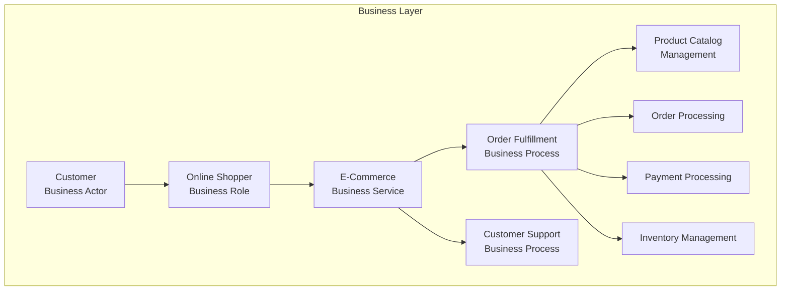
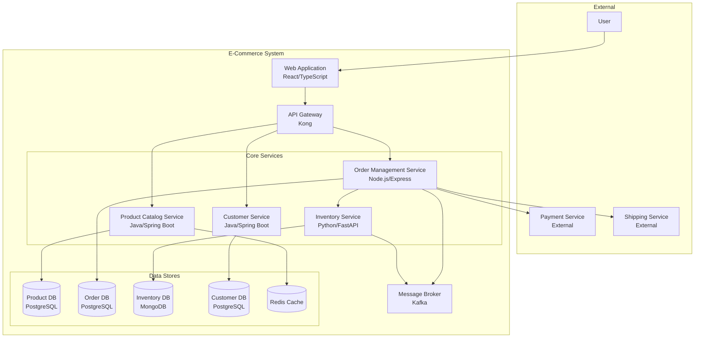
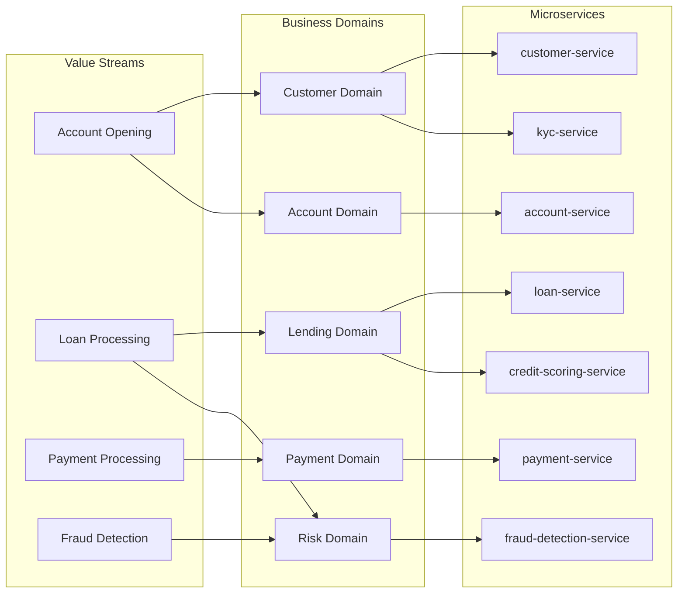
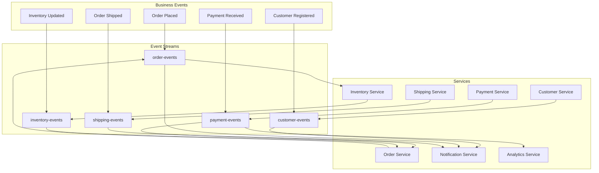
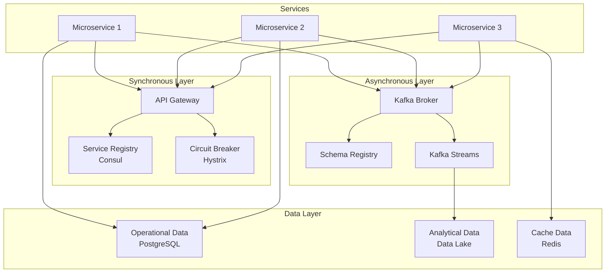
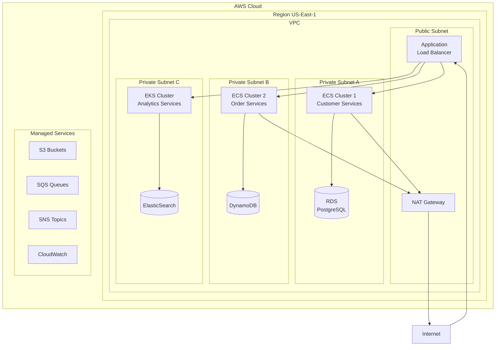
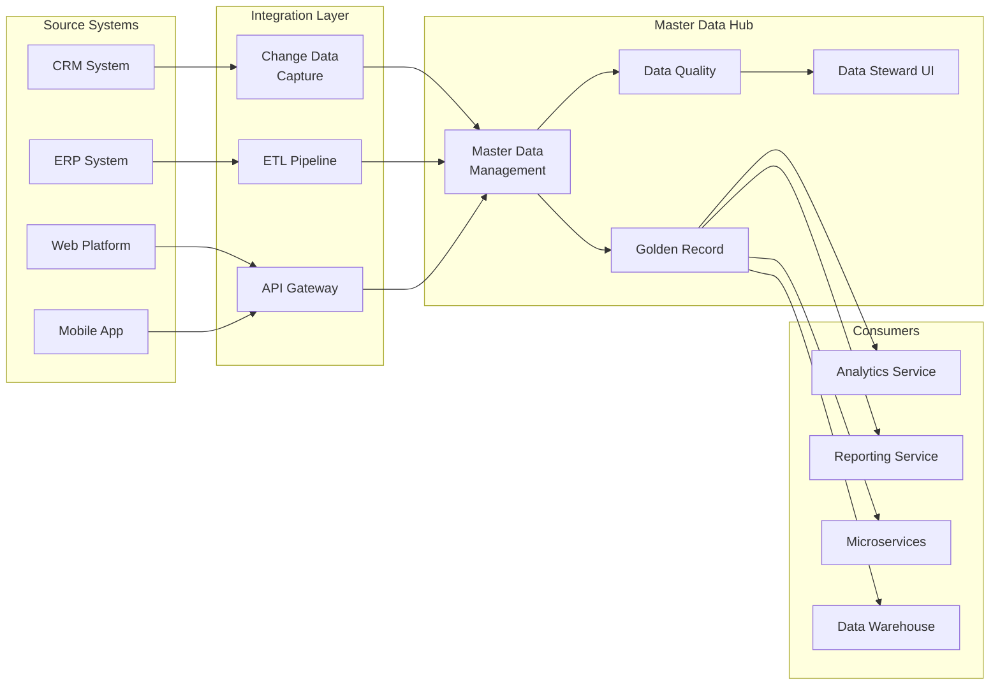
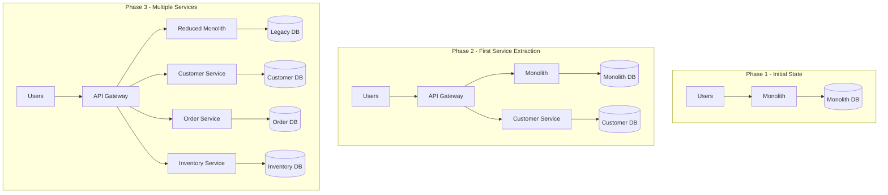
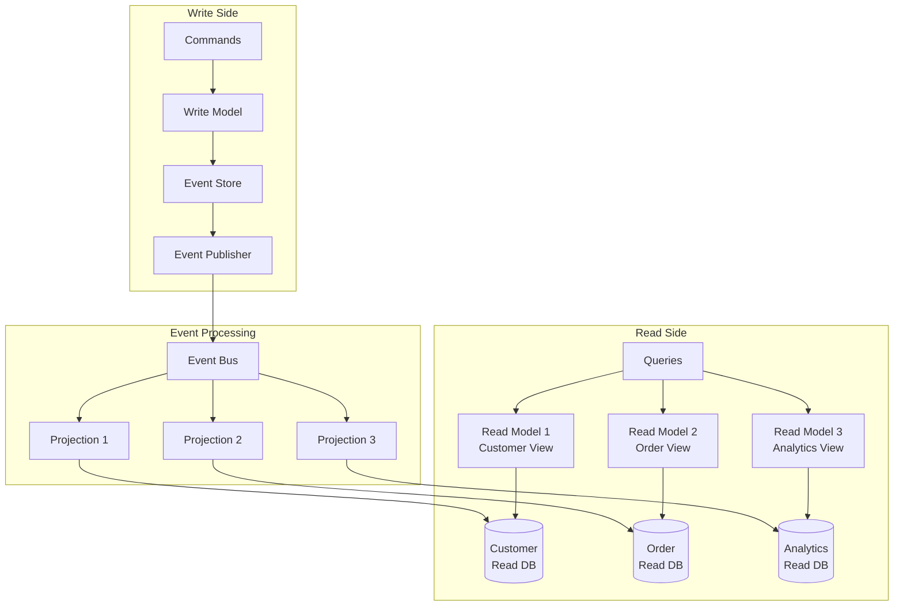
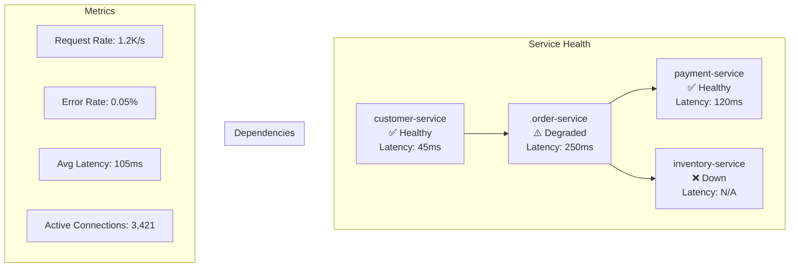

# Business to Infrastructure Mapping Examples

## Visual Mapping Patterns for ArchiMate-C4 Integration

### Example 1: E-Commerce Platform Business-to-Infrastructure Mapping

#### Business Capability View (ArchiMate)



#### Application Component Mapping (C4 Level 2 - Containers)



#### Traceability Matrix

| Business Capability | Business Process | Application Service | Microservice | Technology Stack |
|-------------------|------------------|-------------------|--------------|------------------|
| Product Catalog Management | Browse Products | Product Search API | product-catalog-service | Java/Spring Boot, PostgreSQL, ElasticSearch |
| Order Processing | Order Fulfillment | Order Management API | order-management-service | Node.js, PostgreSQL, Redis |
| Payment Processing | Payment Validation | Payment Gateway API | payment-service (external) | 3rd Party Integration |
| Inventory Management | Stock Control | Inventory API | inventory-service | Python/FastAPI, MongoDB |
| Customer Support | Issue Resolution | Support API | customer-service | Java/Spring Boot, PostgreSQL |

### Example 2: Banking System Domain Mapping

#### Value Stream to Service Mapping



#### Cross-Functional Team Structure

```mermaid
graph TB
    subgraph Platform Teams
        PT1[API Platform Team]
        PT2[Data Platform Team]
        PT3[Security Platform Team]
        PT4[DevOps Platform Team]
    end
    
    subgraph Domain Teams
        subgraph Customer Domain Team
            CDT1[Product Owner]
            CDT2[Tech Lead]
            CDT3[3 Backend Devs]
            CDT4[2 Frontend Devs]
            CDT5[1 QA Engineer]
            CDT6[1 DevOps Engineer]
        end
        
        subgraph Payment Domain Team
            PDT1[Product Owner]
            PDT2[Tech Lead]
            PDT3[4 Backend Devs]
            PDT4[1 Frontend Dev]
            PDT5[2 QA Engineers]
            PDT6[1 DevOps Engineer]
        end
    end
    
    subgraph Services Owned
        CS[customer-service]
        KS[kyc-service]
        PS[payment-service]
        FS[fraud-detection-service]
    end
    
    Customer Domain Team --> CS
    Customer Domain Team --> KS
    Payment Domain Team --> PS
    Payment Domain Team --> FS
    
    Platform Teams -.-> Domain Teams
```

### Example 3: Event-Driven Architecture Pattern

#### Business Event Flow



#### Integration Architecture



### Example 4: Technology Stack Alignment

#### Business to Technology Mapping

```yaml
Business_Domain: Customer_Experience
  Business_Capabilities:
    - Customer_Onboarding:
        Services:
          - registration-service
          - kyc-service
          - document-service
        Technology:
          Frontend: React, TypeScript, Next.js
          Backend: Node.js, Express, GraphQL
          Database: PostgreSQL, S3
          Infrastructure: AWS ECS, ALB
          
    - Customer_Profile_Management:
        Services:
          - profile-service
          - preferences-service
          - notification-service
        Technology:
          Frontend: React Native (Mobile)
          Backend: Java, Spring Boot
          Database: DynamoDB, ElasticSearch
          Infrastructure: AWS Lambda, API Gateway
          
    - Customer_Support:
        Services:
          - ticketing-service
          - chat-service
          - knowledge-base-service
        Technology:
          Frontend: Vue.js, Tailwind CSS
          Backend: Python, FastAPI
          Database: MongoDB, Redis
          Infrastructure: Kubernetes, Istio
```

#### Infrastructure Topology



### Example 5: Data Flow Architecture

#### Master Data Management Pattern



## Implementation Patterns

### Pattern 1: Strangler Fig Migration



### Pattern 2: CQRS Implementation



## Governance and Compliance Mapping

### Service Ownership Matrix

| Service | Business Owner | Technical Owner | Domain Team | SLA | Compliance |
|---------|---------------|-----------------|-------------|-----|------------|
| customer-service | VP Customer Experience | Tech Lead - Customer | Customer Domain Team | 99.9% | GDPR, CCPA |
| payment-service | CFO | Tech Lead - Payments | Payment Domain Team | 99.99% | PCI-DSS |
| order-service | VP Operations | Tech Lead - Commerce | Commerce Domain Team | 99.9% | SOX |
| inventory-service | VP Supply Chain | Tech Lead - Inventory | Supply Chain Team | 99.5% | ISO 27001 |

### Architecture Decision Records (ADR) Template

```markdown
# ADR-001: Microservice Decomposition Strategy

## Status
Accepted

## Context
Need to decompose monolithic e-commerce platform into microservices

## Decision
Use business capability mapping with bounded contexts from DDD

## Consequences
- Clear service boundaries aligned with business
- Each team owns specific business capabilities
- Requires investment in service mesh and monitoring
- Initial complexity increase, long-term maintainability improvement
```

## Monitoring and Observability

### Service Dependency Dashboard



This comprehensive set of examples demonstrates how to effectively map business capabilities to technical infrastructure using ArchiMate and C4 models, following patterns successfully implemented by leading technology companies.